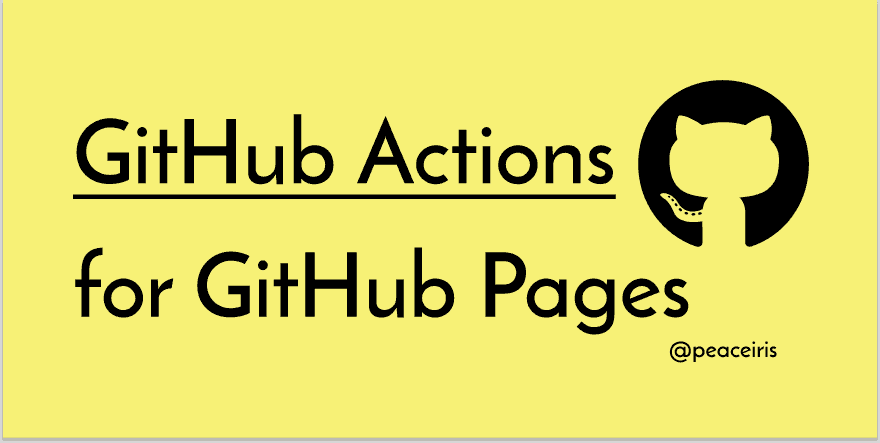

# 使用静态站点生成器的 GitHub 操作部署到 GitHub 页面

> 原文：<https://dev.to/peaceiris/deploy-to-github-pages-with-github-actions-for-static-site-generator-1mo6>

## 部署到 GitHub 页面的 GitHub 动作

使用下面的工作流，你可以用[静态站点生成器](https://www.staticgen.com/) (Hugo，MkDocs，Gatsby，GitBook 等)将你的静态站点部署到 GitHub 页面。)

```
- uses: peaceiris/actions-gh-pages@v3
  with:
    github_token: ${{ secrets.GITHUB_TOKEN }}
    publish_dir: ./public 
```

Enter fullscreen mode Exit fullscreen mode

*   GitHub 动作英雄:上田-GitHub 博客

这个 GitHub 页面操作、Hugo 操作和 mdBook 操作在 GitHub 博客上有特别介绍。谢谢大家！

更多详情，请访问[https://github.com/peaceiris/actions-gh-pages](https://github.com/peaceiris/actions-gh-pages)👇

##  [ peaceiris ](https://github.com/peaceiris) / [行动-GH-页面](https://github.com/peaceiris/actions-gh-pages)

### GitHub 页面的 GitHub 操作🚀轻松部署静态文件并发布您的站点。静态站点生成器友好。

<article class="markdown-body entry-content container-lg" itemprop="text">

## GitHub 页面的 GitHub 操作

[](https://raw.githubusercontent.com/peaceiris/actions-gh-pages/mainimg/ogp.svg)

[](https://github.com/peaceiris/actions-gh-pages/blob/main/LICENSE)[](https://github.com/peaceiris/actions-gh-pages/releases/latest)[](https://github.com/peaceiris/actions-gh-pages/releases)[](https://github.com/peaceiris/actions-gh-pages/workflows/Test/badge.svg?branch=main&event=push)[](https://github.com/peaceiris/actions-gh-pages/workflows/Code%20Scanning/badge.svg?event=push)[](https://www.codefactor.io/repository/github/peaceiris/actions-gh-pages)

这是一个 **GitHub 动作**将你的静态文件部署到 **GitHub 页面**这个部署动作可以简单自由地与[静态站点生成器](https://www.staticgen.com/)结合。(雨果，MkDocs，盖茨比，mdBook，Next，Nuxt，等等。)

下一个示例步骤将把`./public`目录部署到远程`gh-pages`分支。

```
- name: Deploy
  uses: peaceiris/actions-gh-pages@v3
  with:
    github_token: ${{ secrets.GITHUB_TOKEN }}
    publish_dir: ./public
```

Enter fullscreen mode Exit fullscreen mode

对于 GitHub 动作的新手:注意`GITHUB_TOKEN`是**而不是**个人访问令牌。GitHub Actions runner 会自动创建一个`GITHUB_TOKEN`秘密，以便在您的工作流程中进行身份验证。因此，您可以立即开始部署，无需任何配置。

## 支持的令牌

支持三种令牌。

| 代币 | 私人回购 | 公开回购 | 草案 | 设置 |
| --- | :-: | :-: | --- | --- |
| `github_token` |  |  | HTTPS | 不必要的 |
| `deploy_key` |  |  | 嘘 | 必要的 |
| `personal_token` |  |  | HTTPS | 必要的 |

注意:实际上，`GITHUB_TOKEN`适用于部署到 GitHub 页面，但是…

</article>

[View on GitHub](https://github.com/peaceiris/actions-gh-pages)

## 入门

一个 YAML 文件(`.github/workflows/gh-pages.yml`)与雨果行动的例子。

*   [peaceiris/actions-hugo:针对 hugo 的 GitHub Actions】](https://github.com/peaceiris/actions-hugo)

##  [ peaceiris ](https://github.com/peaceiris) / [动作——雨果](https://github.com/peaceiris/actions-hugo)

### GitHub Actions for Hugo ⚡️快速安装 Hugo 并快速建立您的网站。支持 Hugo extended、Hugo Modules、Linux (Ubuntu)、macOS 和 Windows。

<article class="markdown-body entry-content container-lg" itemprop="text">

## GitHub 为雨果采取的行动

[](https://raw.githubusercontent.com/peaceiris/actions-hugo/mainimg/ogp.svg)

[](https://github.com/peaceiris/actions-hugo/blob/main/LICENSE)[](https://github.com/peaceiris/actions-hugo/releases/latest)[](https://github.com/peaceiris/actions-hugo/releases)[](https://github.com/peaceiris/actions-hugo/releases.atom)[](https://github.com/peaceiris/actions-hugo/workflows/Test/badge.svg?branch=main&event=push)[](https://github.com/peaceiris/actions-hugo/workflows/Code%20Scanning/badge.svg?event=push)

[](https://www.codefactor.io/repository/github/peaceiris/actions-hugo)[](https://codecov.io/gh/peaceiris/actions-hugo)[](https://codeclimate.com/github/peaceiris/actions-hugo/maintainability)

这个 **Hugo 安装动作**可以将 [Hugo](https://github.com/gohugoio/hugo) 安装到一个虚拟机上 **GitHub 动作** **Hugo 扩展**版本， **Hugo 模块**，支持 Linux (Ubuntu)、macOS、Windows。

从`v2`开始，这个 Hugo Setup 动作已经迁移到一个 JavaScript (TypeScript)动作，我们不再构建或拉取 Hugo docker 映像。由于这个变化，我们可以在不到几秒钟的时间内完成这个动作。(一个基于 docker 操作需要大约 1 分钟或更长的执行时间来构建和提取 docker 映像。)

| 操作系统(持续运行) | ubuntu-18.04，ubuntu-20.04 | MAC OS-最新 | windows-2019 |
| --- | :-: | :-: | :-: |
| 支持 |  |  |  |

| 雨果类型 | 雨果扩展 | Hugo 模块 | 最新雨果 |
| --- | :-: | :-: | :-: |
| 支持 |  |  |  |

## 目录

*   [入门](https://raw.githubusercontent.com/peaceiris/actions-hugo/main/#getting-started)
    *   [<g-emoji class="g-emoji" alias="star" fallback-src="https://github.githubassets.cimg/icons/emoji/unicode/2b50.png">⭐️</g-emoji> 创建你的工作流程](https://raw.githubusercontent.com/peaceiris/actions-hugo/main/#%EF%B8%8F-create-your-workflow)
*   [选项](https://raw.githubusercontent.com/peaceiris/actions-hugo/main/#options)
    *   [<g-emoji class="g-emoji" alias="star" fallback-src="https://github.githubassets.cimg/icons/emoji/unicode/2b50.png">⭐️</g-emoji> 使用雨果扩展](https://raw.githubusercontent.com/peaceiris/actions-hugo/main/#%EF%B8%8F-use-hugo-extended)
    *   [<g-emoji class="g-emoji" alias="star" fallback-src="https://github.githubassets.cimg/icons/emoji/unicode/2b50.png">⭐️</g-emoji> 使用最新版本的雨果](https://raw.githubusercontent.com/peaceiris/actions-hugo/main/#%EF%B8%8F-use-the-latest-version-of-hugo)
*   [提示](https://raw.githubusercontent.com/peaceiris/actions-hugo/main/#tips)
    *   [<g-emoji class="g-emoji" alias="star" fallback-src="https://github.githubassets.cimg/icons/emoji/unicode/2b50.png">缓存 Hugo 模块</g-emoji>](https://raw.githubusercontent.com/peaceiris/actions-hugo/main/#%EF%B8%8F-caching-hugo-modules)
    *   [<g-emoji class="g-emoji" alias="star" fallback-src="https://github.githubassets.cimg/icons/emoji/unicode/2b50.png">⭐️</g-emoji> 从文件中读取雨果版本](https://raw.githubusercontent.com/peaceiris/actions-hugo/main/#%EF%B8%8F-read-hugo-version-from-file)
    *   [<g-emoji class="g-emoji" alias="star" fallback-src="https://github.githubassets.cimg/icons/emoji/unicode/2b50.png">⭐️</g-emoji> 自动修复程序和](https://raw.githubusercontent.com/peaceiris/actions-hugo/main/#%EF%B8%8F-workflow-for-autoprefixer-and-postcss-cli)的工作流程…

</article>

[View on GitHub](https://github.com/peaceiris/actions-hugo)

```
name: github pages

on:
  push:
    branches:
      - main
  pull_request:

jobs:
  deploy:
    runs-on: ubuntu-20.04
    concurrency:
      group: ${{ github.workflow }}-${{ github.ref }}
    steps:
      - uses: actions/checkout@v2
        with:
          submodules: true  # Fetch Hugo themes
          fetch-depth: 0    # Fetch all history for .GitInfo and .Lastmod

      - name: Setup Hugo
        uses: peaceiris/actions-hugo@v2
        with:
          hugo-version: '0.85.0'

      - name: Build
        run: hugo --minify

      - name: Deploy
        uses: peaceiris/actions-gh-pages@v3
        if: ${{ github.ref == 'refs/heads/main' }}
        with:
          github_token: ${{ secrets.GITHUB_TOKEN }}
          publish_dir: ./public 
```

Enter fullscreen mode Exit fullscreen mode

* * *

### 选项

很多选项可用！转到[存储库(peaceiris/actions-gh-pages)](https://github.com/peaceiris/actions-gh-pages) 并查看最新的自述文件。

* * *

## 其他例子

### ⭐静止站点发电机用 Node.js

next.js，nuxt.js，gatsby，hexo，gitbook，vuepress，react-static，gridsome 等。(JavaScript 项目)

前提:依赖关系由`package.json`和`package-lock.json`
管理

```
name: github pages

on:
  push:
    branches:
      - main
  pull_request:

jobs:
  deploy:
    runs-on: ubuntu-20.04
    concurrency:
      group: ${{ github.workflow }}-${{ github.ref }}
    steps:
      - uses: actions/checkout@v2

      - name: Setup Node
        uses: actions/setup-node@v2
        with:
          node-version: '14'

      - name: Cache dependencies
        uses: actions/cache@v2
        with:
          path: ~/.npm
          key: ${{ runner.os }}-node-${{ hashFiles('**/package-lock.json') }}
          restore-keys: |
            ${{ runner.os }}-node-

      - run: npm ci
      - run: npm run build

      - name: Deploy
        uses: peaceiris/actions-gh-pages@v3
        if: ${{ github.ref == 'refs/heads/main' }}
        with:
          github_token: ${{ secrets.GITHUB_TOKEN }}
          publish_dir: ./public 
```

Enter fullscreen mode Exit fullscreen mode

### ⭐️静态站点生成器与 Python

[鹈鹕](https://github.com/getpelican/pelican)、 [MkDocs](https://github.com/mkdocs/mkdocs) 、[斯芬克斯](https://github.com/sphinx-doc/sphinx)等等。

前提:依赖关系由`requirements.txt`
管理

```
name: github pages

on:
  push:
    branches:
      - main
  pull_request:

jobs:
  deploy:
    runs-on: ubuntu-20.04
    concurrency:
      group: ${{ github.workflow }}-${{ github.ref }}
    steps:
      - uses: actions/checkout@v2

      - name: Setup Python
        uses: actions/setup-python@v2
        with:
          python-version: '3.8'
          architecture: 'x64'

      - name: Cache dependencies
        uses: actions/cache@v2
        with:
          path: ~/.cache/pip
          key: ${{ runner.os }}-pip-${{ hashFiles('**/requirements.txt') }}
          restore-keys: |
            ${{ runner.os }}-pip-

      - name: Install dependencies
        run: |
          python3 -m pip install --upgrade pip
          python3 -m pip install -r ./requirements.txt

      - run: mkdocs build

      - name: Deploy
        uses: peaceiris/actions-gh-pages@v3
        if: ${{ github.ref == 'refs/heads/main' }}
        with:
          github_token: ${{ secrets.GITHUB_TOKEN }}
          publish_dir: ./site 
```

Enter fullscreen mode Exit fullscreen mode

### ⭐️ mdBook(铁锈)

将 [rust-lang/mdBook](https://github.com/rust-lang/mdBook) 站点部署到 GitHub 页面的 GitHub 操作工作流示例。

*   [peaceiris/actions-mdbook:针对 mdbook 的 GitHub 操作(rust-lang/mdBook)](https://github.com/peaceiris/actions-mdbook)

```
name: github pages

on:
  push:
    branches:
      - main
  pull_request:

jobs:
  deploy:
    runs-on: ubuntu-20.04
    concurrency:
      group: ${{ github.workflow }}-${{ github.ref }}
    steps:
      - uses: actions/checkout@v2

      - name: Setup mdBook
        uses: peaceiris/actions-mdbook@v1
        with:
          mdbook-version: '0.4.10'
          # mdbook-version: 'latest'

      - run: mdbook build

      - name: Deploy
        uses: peaceiris/actions-gh-pages@v3
        if: ${{ github.ref == 'refs/heads/main' }}
        with:
          github_token: ${{ secrets.GITHUB_TOKEN }}
          publish_dir: ./book 
```

Enter fullscreen mode Exit fullscreen mode

### ⭐️ Flutter Web

颤振网络项目的示例工作流程。

```
name: github pages

on:
  push:
    branches:
      - main
  pull_request:

jobs:
  deploy:
    runs-on: ubuntu-20.04
    concurrency:
      group: ${{ github.workflow }}-${{ github.ref }}
    steps:
      - uses: actions/checkout@v2

      - name: Setup Flutter
        run: |
          git clone https://github.com/flutter/flutter.git --depth 1 -b beta _flutter
          echo "::add-path::${GITHUB_WORKSPACE}/_flutter/bin"

      - name: Install
        run: |
          flutter config --enable-web
          flutter pub get

      - name: Build
        run: flutter build web

      - name: Deploy
        uses: peaceiris/actions-gh-pages@v3
        if: ${{ github.ref == 'refs/heads/main' }}
        with:
          github_token: ${{ secrets.GITHUB_TOKEN }}
          publish_dir: ./build/web 
```

Enter fullscreen mode Exit fullscreen mode

### ⭐️榆树

[Elm](https://elm-lang.org) 的示例工作流。

```
name: github pages

on:
  push:
    branches:
      - main
  pull_request:

jobs:
  deploy:
    runs-on: ubuntu-20.04
    concurrency:
      group: ${{ github.workflow }}-${{ github.ref }}
    steps:
      - uses: actions/checkout@v2

      - name: Setup Node
        uses: actions/setup-node@v2
        with:
          node-version: '14'

      - name: Setup Elm
        run: npm install elm --global

      - name: Make
        run: elm make --optimize src/Main.elm

      - name: Move files
        run: |
          mkdir ./public
          mv ./index.html ./public/
        # If you have non-minimal setup with some assets and separate html/js files,
        # provide --output=<output-file> option for `elm make` and remove this step

      - name: Deploy
        uses: peaceiris/actions-gh-pages@v3
        if: ${{ github.ref == 'refs/heads/main' }}
        with:
          github_token: ${{ secrets.GITHUB_TOKEN }}
          publish_dir: ./public 
```

Enter fullscreen mode Exit fullscreen mode

### ⭐️github/个人-网站

*   github/personal-website -代码将帮助你启动一个个人网站，展示你作为软件开发人员的工作。

```
# .github/workflows/github-pages.yml

name: GitHub Pages

on:
  push:
    branches:
      - master
  schedule:
    - cron: '24  */24  *  *  *'  # Once a day

jobs:
  deploy:
    runs-on: ubuntu-20.04
    concurrency:
      group: ${{ github.workflow }}-${{ github.ref }}
    steps:
      - uses: actions/checkout@v2
      - name: Deploy to GitHub Pages
        uses: peaceiris/actions-gh-pages@v3
        with:
          github_token: ${{ secrets.GITHUB_TOKEN }}
          publish_dir: ./
          allow_empty_commit: true
          enable_jekyll: true
          cname: github.peaceiris.com 
```

Enter fullscreen mode Exit fullscreen mode

### ⭐️ Swift Publish

[JohnSundell/Publish](https://github.com/JohnSundell/Publish) 的工作流示例。

```
name: GitHub Pages

on:
  push:
    branches:
      - main
  pull_request:

jobs:
  deploy:
    runs-on: ubuntu-20.04
    concurrency:
      group: ${{ github.workflow }}-${{ github.ref }}
    steps:
      - uses: actions/checkout@v2

      - name: Setup JohnSundell/Publish
        run: |
          cd ${HOME}
          git clone --depth=1 https://github.com/JohnSundell/Publish.git
          cd ./Publish
          swift build -c release
          echo "::add-path::${HOME}/Publish/.build/release"

      - run: publish-cli generate

      - name: Deploy to GitHub Pages
        uses: peaceiris/actions-gh-pages@v3
        if: ${{ github.ref == 'refs/heads/main' }}
        with:
          github_token: ${{ secrets.GITHUB_TOKEN }}
          publish_dir: ./Output 
```

Enter fullscreen mode Exit fullscreen mode

* * *

在 GitHub 上查看更多选项和示例。[peace iris/actions-GH-pages](https://github.com/peaceiris/actions-gh-pages)

仅此而已！享受 GitHub 动作和静态站点生成器！