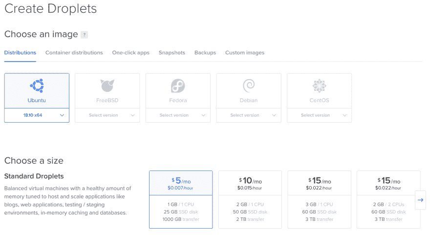

# 部署您的 Adonis 网站

> 原文：<https://dev.to/romainlanz/deploy-your-adonis-website-17ec>

人们通常认为任何开发人员都必须知道如何将应用程序部署到远程服务器上。真实的情况是，很多人不愿意将网站投入生产。

本文使用 Node.js 框架 [AdonisJs](https://adonisjs.com/) 作为例子，但是您将学到的概念对于任何类似 Node 的语言或框架都是一样的。

## 第一步:创建服务器

首先要做的是创建一个服务器。让我们假设你没有任何 VPS(虚拟专用服务器)可用，需要得到一个。我使用服务 [Digital Ocean](https://digitalocean.com/) 来托管我的服务器，但是任何副总裁都可以这样做。

在“数字海洋”*创建一个 Droplet* 页面，我选择了最新版本的 Ubuntu 和我能拥有的最小的服务器。**这台服务器将足以运行多个 Adonis 应用程序。**

[](https://res.cloudinary.com/practicaldev/image/fetch/s--nd5hy6LI--/c_limit%2Cf_auto%2Cfl_progressive%2Cq_auto%2Cw_880/https://raw.githubusercontent.com/RomainLanz/slynova.io/master/content/posimg/create-droplets.png)

默认情况下，您可以保留其他设置，确保选择靠近您的目标受众的区域。

## 第二步:保护您的服务器

当您的 VPS 被创建并可用时，使用 **SSH** 连接到它。

```
> ssh root@IP_OF_YOUR_DROPLET 
```

Enter fullscreen mode Exit fullscreen mode

一旦连接上，我们要做的第一件事就是保护服务器。

### 更改 root 密码

键入命令`passwd`并将密码改为长而复杂的形式。当你在你的服务器上工作时，你不需要记住它。把它存放在安全的地方。

### 更新你的服务器

即使您刚刚创建了服务器，它也可能不是最新的。简单运行以下命令:

```
> apt update
> apt upgrade 
```

Enter fullscreen mode Exit fullscreen mode

### 启用自动安全更新

安全更新至关重要，并且可以自动化。没有必要每天连接到所有的服务器来运行一个简单的`apt update` & `apt upgrade`命令来修复安全漏洞。

```
> apt install unattended-upgrades
> vim /etc/apt/apt.conf.d/10periodic 
```

Enter fullscreen mode Exit fullscreen mode

更新配置文件，如下所示:

```
APT::Periodic::Update-Package-Lists "1";
APT::Periodic::Download-Upgradeable-Packages "1";
APT::Periodic::AutocleanInterval "7";
APT::Periodic::Unattended-Upgrade "1"; 
```

Enter fullscreen mode Exit fullscreen mode

### 安装故障 2 班

[fail2ban](https://www.fail2ban.org/) 是一种扫描你的服务器日志的服务，禁止显示恶意行为的 IP(像太多的密码失败，端口扫描等。).

```
> apt install fail2ban 
```

Enter fullscreen mode Exit fullscreen mode

默认配置对大多数人来说很好，但是如果你想修改它，请随意遵循他们的文档。

### 创建您的用户

你不应该和`root`用户一起工作；它有完全的控制权，没有任何限制，可能会把你的系统置于危险之中。我用的是用户名`romain`，随便改。

```
> useradd -m -s /bin/bash -G sudo romain
> passwd romain
> mkdir /home/romain/.ssh
> chmod 700 /home/romain/.ssh 
```

Enter fullscreen mode Exit fullscreen mode

上面的命令创建了一个用户名为`romain`的新用户，创建了其主目录并将其添加到了`sudo`组中。现在，我们可以添加 SSH 密钥，以便能够使用该用户连接到服务器。

```
> vim /home/romain/.ssh/authorized_keys
> chmod 400 /home/romain/.ssh/authorized_keys
> chown romain:romain /home/romain -R 
```

Enter fullscreen mode Exit fullscreen mode

继续之前，请验证您可以使用此用户连接到您的服务器。

```
> exit  # Quit the SSH session
> ssh romain@IP_OF_YOUR_DROPLET 
```

Enter fullscreen mode Exit fullscreen mode

然后运行以下命令，验证您是否有权访问 root 命令。

```
> sudo whoami # Should display root 
```

Enter fullscreen mode Exit fullscreen mode

### 锁定 SSH

默认情况下，SSH 允许任何人通过他们的密码连接，并以 root 用户身份连接。一个好的做法是禁用它，只使用 SSH 密钥。

```
> sudo vim /etc/ssh/sshd_config 
```

Enter fullscreen mode Exit fullscreen mode

搜索并修改以下行以更改配置。

```
PermitRootLogin no
PasswordAuthentication no 
```

Enter fullscreen mode Exit fullscreen mode

### 更改 SSH 端口

我想改变 SSH 服务的默认端口。我们有`fail2ban`来保护我们免受登录暴力，但是如果我们能避免它们，那就更好了。

几乎所有试图暴力破解登录系统的僵尸工具都会使用其默认端口`22`访问 SSH。如果他们没有检测到这个端口是打开的，他们就会离开你的服务器。

仍然在`/etc/ssh/sshd_config`文件中修改下面一行:

```
Port XXXXX 
```

Enter fullscreen mode Exit fullscreen mode

从 49152 到 65535 之间选择一个端口。这是可用端口的动态专用范围。

然后，您可以重新启动 SSH 守护进程，退出当前会话并再次与您的用户连接。

```
> sudo service ssh restart
> exit # If you aren't disconnected
> ssh romain@IP_OF_YOUR_DROPLET -p XXXXX 
```

Enter fullscreen mode Exit fullscreen mode

**更新:**由于某些原因，更改默认 SSH 端口似乎不是个好主意。你可以在[这篇文章](https://www.adayinthelifeof.nl/2012/03/12/why-putting-ssh-on-another-port-than-22-is-bad-idea)中了解更多。

### 安装防火墙

Ubuntu 捆绑了防火长城`ufw`。我们来配置一下。

```
> sudo ufw default allow outgoing
> sudo ufw default deny incoming
> sudo ufw allow XXXXX  # It's the port you used for your SSH configuration
> sudo ufw allow 80
> sudo ufw allow 443 
```

Enter fullscreen mode Exit fullscreen mode

**确保已经正确地允许了 SSH 端口。否则，它会将您锁定在服务器之外！**

最后，使用以下命令启用防火墙:

```
sudo ufw enable 
```

Enter fullscreen mode Exit fullscreen mode

## 第三步:创建部署用户

现在，您的服务器已得到保护，并且您在其上拥有个人帐户，我们可以创建一个部署用户，您的服务器的任何管理员都可以使用该用户来部署和运行您的网站。

```
> sudo useradd -m -s /bin/bash deploy 
```

Enter fullscreen mode Exit fullscreen mode

我们不需要为这个用户设置 SSH 密钥，因为没有人会直接连接到它。您将能够使用以下命令访问该用户:

```
> sudo -i -u deploy 
```

Enter fullscreen mode Exit fullscreen mode

## 第四步:安装所需的依赖项

### Nginx

Nginx 将成为我们的网络服务器。我们使用它将任何传入的 HTTP(S)请求代理到本地端口。

```
> sudo apt install nginx 
```

Enter fullscreen mode Exit fullscreen mode

### 数据库管理系统

应用程序通常使用 DBMS 来存储数据。我们将在本文中使用 [MariaDB](https://mariadb.org/) 。运行以下命令进行安装，然后按照配置向导进行操作。

```
> sudo apt install mariadb-server 
```

Enter fullscreen mode Exit fullscreen mode

### NVM

**此时需要作为你的`deploy`用户连接。**

[NVM](https://github.com/creationix/nvm) 是一个节点版本管理器。它将帮助我们安装和更新我们使用的 Node.js 版本。

```
> curl -o- https://raw.githubusercontent.com/creationix/nvm/v0.33.11/install.sh | bash 
```

Enter fullscreen mode Exit fullscreen mode

然后将下列行添加到您的个人资料中(`~/bash_profile`、`~/.zshrc`、`~/profile`或`~/.bashrc` ):

```
export NVM_DIR="${XDG_CONFIG_HOME/:-$HOME/.}nvm"
[ -s "$NVM_DIR/nvm.sh" ] && \. "$NVM_DIR/nvm.sh" # This loads nvm 
```

Enter fullscreen mode Exit fullscreen mode

这样做之后，您需要重启您的 shell 来访问`nvm`命令。完成后，您可以使用下面的命令安装 Node.js 的最新版本:

```
> nvm install node 
```

Enter fullscreen mode Exit fullscreen mode

### PM2

[PM2](https://github.com/Unitech/pm2) 是一个节点进程管理器，它将用于保持我们的应用程序永远活着。

```
> npm install pm2 -g 
```

Enter fullscreen mode Exit fullscreen mode

## 步骤 5:部署您的应用程序

是时候克隆您的存储库，让我们的应用程序在服务器上运行了！我强烈建议您使用一个[部署键](https://developer.github.com/v3/guides/managing-deploy-keys/#deploy-keys)来部署您的应用程序。它将允许您的服务器拉代码，但永远不会推它。

按照 git 提供者的文档设置好 SSH 部署密钥后，在`/home/deploy/www`中克隆存储库。

```
> cd ~  # This takes us the the home folder of the current user
> mkdir www
> cd www
> git clone https://github.com/adonisjs/adonis-fullstack-app.git example.com
> cd example.com
> npm i --production 
```

Enter fullscreen mode Exit fullscreen mode

克隆您的`.env.example`文件，并根据您的设置更改值。

```
> cp .env.example .env
> vim .env 
```

Enter fullscreen mode Exit fullscreen mode

是时候运行您的迁移和种子了。

```
> node ace migration:run --force
> node ace seed --force 
```

Enter fullscreen mode Exit fullscreen mode

使用以下命令测试您的应用程序运行是否没有任何问题:

```
> node server.js  # Followed by Ctrl+C to kill it 
```

Enter fullscreen mode Exit fullscreen mode

## 第六步:配置 Nginx

您可以在您的服务器本地网络中访问您的应用程序，但最好允许外部访问！这就是[反向代理](https://docs.nginx.com/nginx/admin-guide/web-server/reverse-proxy/)进入舞池的地方。

**这需要你的用户来完成，在我的例子中是`romain`。**

首先，删除默认配置，并为您的网站创建一个配置文件。我喜欢用它们的 URL 来命名，这里是`example.com`。

```
> sudo rm /etc/nginx/sites-available/default
> sudo rm /etc/nginx/sites-enabled/default
> sudo vim /etc/nginx/sites-available/example.com 
```

Enter fullscreen mode Exit fullscreen mode

该配置将告诉 Nginx 监听传入的域，并将所有请求转发到本地端口，即您的应用程序。

```
server {
  listen 80 default_server;
  listen [::]:80 default_server;

  server_name example.com;

  # Our Node.js application
  location / {
    proxy_pass http://localhost:3333;
    proxy_http_version 1.1;
    proxy_set_header Connection "upgrade";
    proxy_set_header Host $host;
    proxy_set_header Upgrade $http_upgrade;
    proxy_set_header X-Real-IP $remote_addr;
    proxy_set_header X-Forwarded-For $proxy_add_x_forwarded_for;
  }
} 
```

Enter fullscreen mode Exit fullscreen mode

最后要做的是启用这个配置并启动您的应用程序。

```
> sudo ln -s /etc/nginx/sites-available/example.com /etc/nginx/sites-enabled/example.com
> sudo service nginx restart
> sudo -i -u deploy
> pm2 start /home/deploy/www/example.com/server.js --name app 
```

Enter fullscreen mode Exit fullscreen mode

如果您已经正确设置了 DNS，您应该可以访问您的应用程序。否则，由于我们在我们的`listen`命令中使用了`default_server`指令，当点击您的服务器的 IP 时，您的应用程序将默认显示。

## 步骤 7:通过脚本自动化部署

既然我们的应用程序已经在生产环境中运行，我们希望创建一个脚本来自动化未来的部署。

```
> vim /home/deploy/www/deploy-example.sh 
```

Enter fullscreen mode Exit fullscreen mode

这个脚本将简单地做我们以前做过的事情:

1.  从存储库中提取新的变更；
2.  安装新的依赖项；
3.  运行迁移；
4.  重新启动应用程序。

```
# Content of your script
cd ~/www/example.com
git pull
npm i --production
node ace migration:run --force
pm2 restart app 
```

Enter fullscreen mode Exit fullscreen mode

添加`x`标志来运行它。

```
> chmod +x /home/deploy/www/deploy-example.sh 
```

Enter fullscreen mode Exit fullscreen mode

现在，当您想要发布一个新版本时，使用用户`deploy`运行脚本`deploy-example.sh`。

## 第八步:添加 SSL 证书

最后要做的是添加一个 SSL 证书来保护客户端和我们的服务器之间的连接。我们将使用 [certbot](https://certbot.eff.org/) ，它将自动在您的网站上启用 HTTPS，部署[让我们加密](https://letsencrypt.org/)证书。

```
> sudo add-apt-repository universe
> sudo add-apt-repository ppa:certbot/certbot
> sudo apt update
> sudo apt install python-certbot-nginx 
```

Enter fullscreen mode Exit fullscreen mode

然后，运行`certbot`并按照向导生成和设置您的证书。

```
> sudo certbot --nginx 
```

Enter fullscreen mode Exit fullscreen mode

-

感谢艾蒂安·拿破仑的校对。