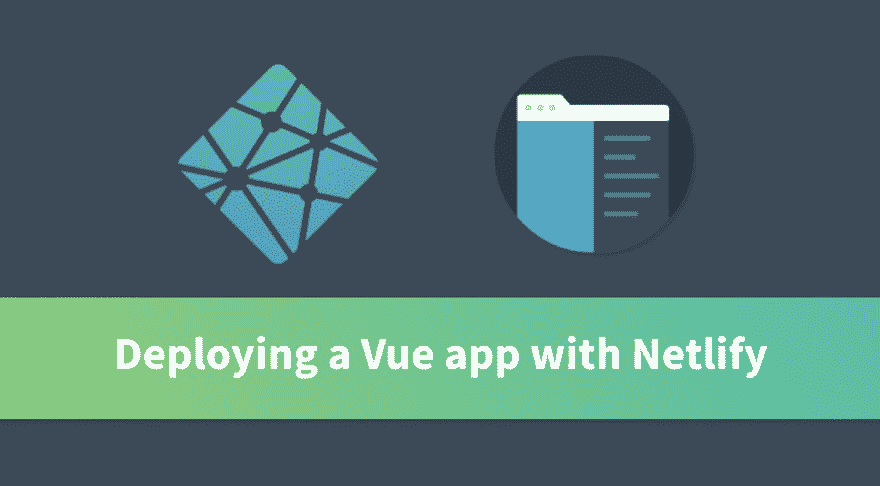
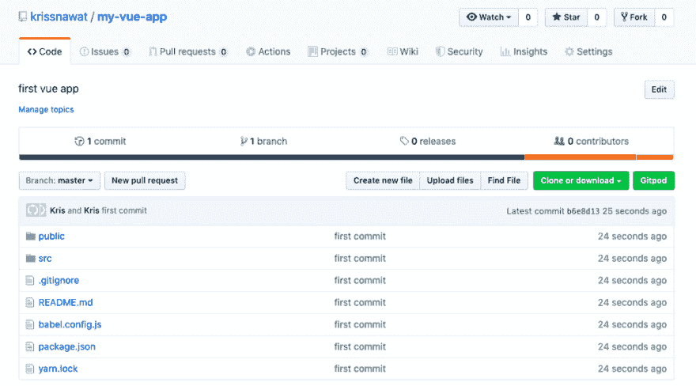
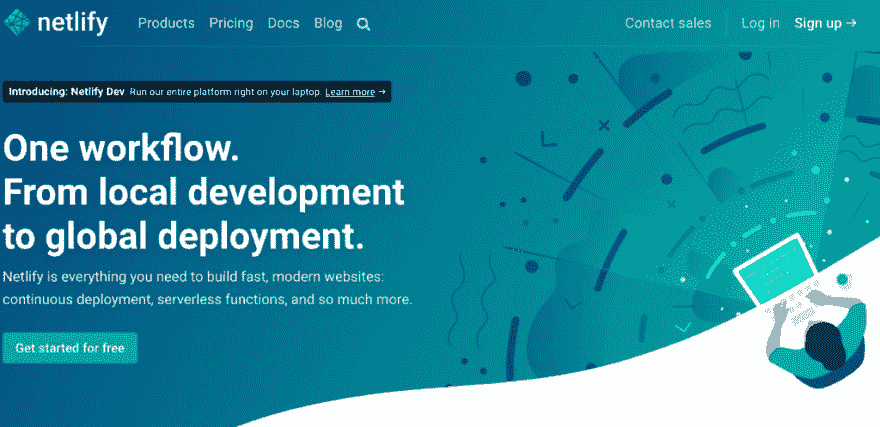
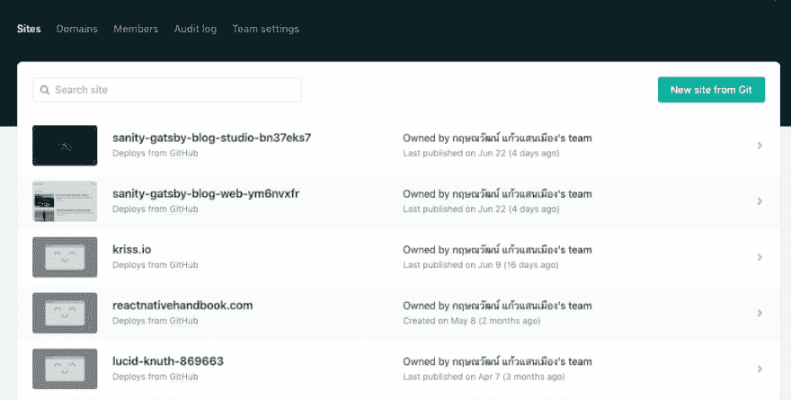
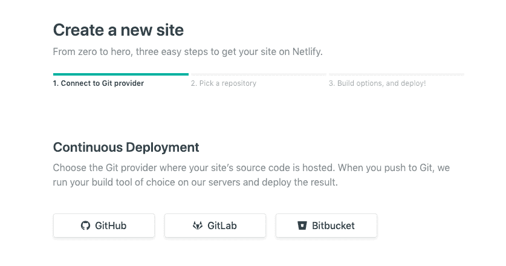
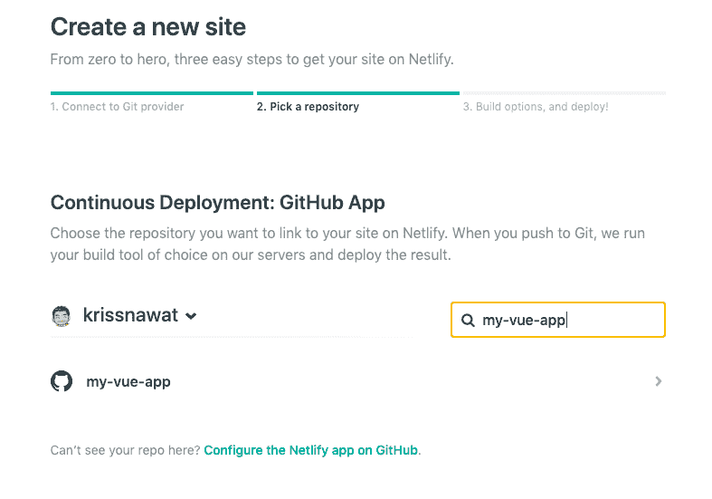
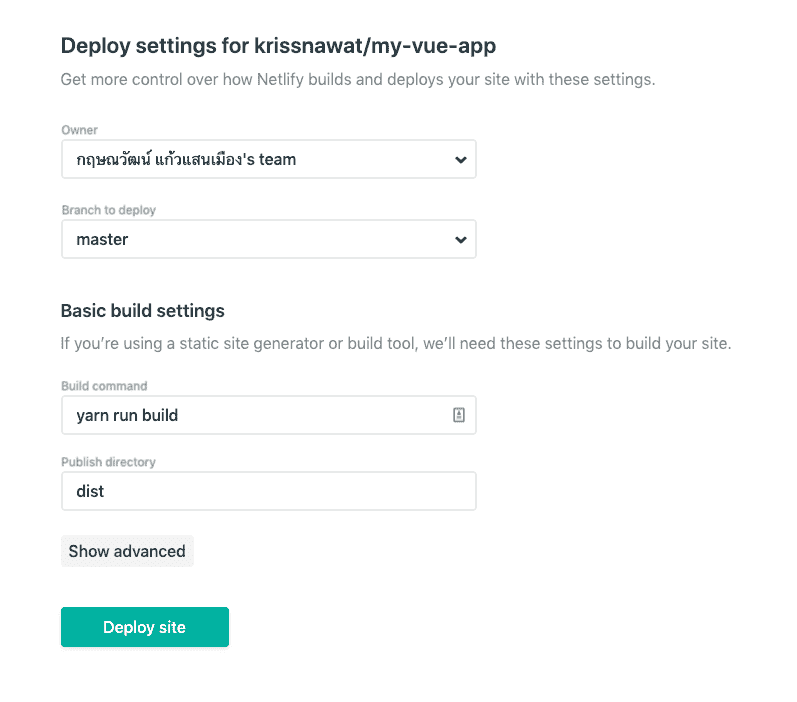
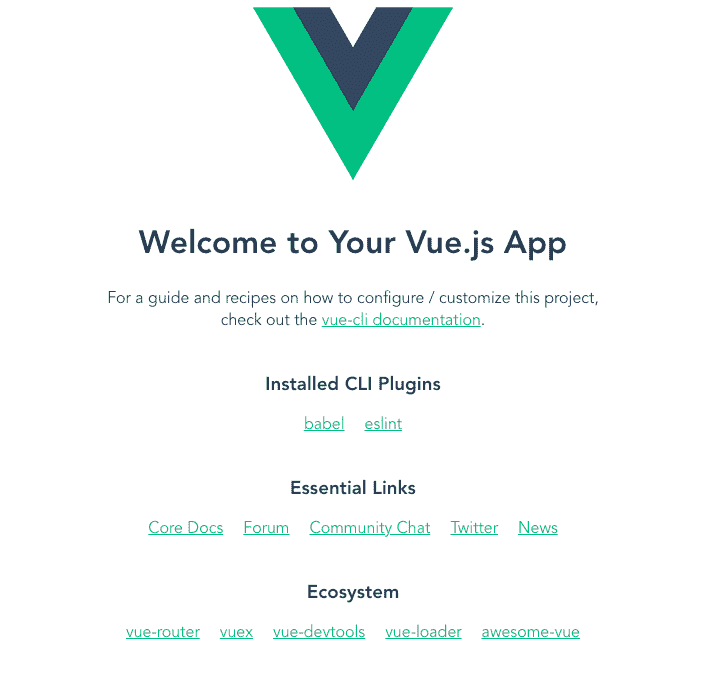

# 将 Vue 应用部署到 Netlify

> 原文：<https://dev.to/kris/deploying-a-vue-app-to-netlify-3jeo>

### 使用 Netlify 部署 Vue 应用

当你准备好让你的 Vue.js 应用在互联网上运行时，你有几个部署选项，从 Heroku 到 Firebase 到 Netlify。在本 Vue Mastery 教程中，我们将了解使用 Netlify 部署您的 Vue 应用程序有多简单。

### 第一步:创建 Vue app

首先，我们将使用 [Vue CLI](https://cli.vuejs.org/) 快速创建一个 Vue 应用程序。如果您还没有安装 CLI，可以使用 yarn 或 npm 来安装:

npm 安装-g @ view/CLI

# 或

yarn 全局添加@vue/cli

然后，我们将使用以下命令创建一个简单的 Vue 应用程序:

视图创建 my-view-app

当出现提示时，选择默认设置和您的包管理器(我们使用 npm)。一旦应用程序被创建，我们将 cd 到它，并在本地运行项目。

CD my-view-app

npm 运行服务

### 第二步:用 Netlify 连接 Vue App

因为 Netlify 提供从 Github、Bitbucket 或 GitLab 的部署，我们能够使用这些版本化工具之一将我们的应用程序连接到 Netlify。为了用 Github 做到这一点，我们将简单地为我们的应用程序创建一个新的 github repo，并将我们的代码推送到它上面。

然后我们将前往[Netlify.com](https://www.netlify.com/)创建一个免费账户。

### 用 Netlify 创建新站点

在 [Netlify](https://www.netlify.com/) 主页上，我们将点击**注册**，并使用 Github 进行注册。

这将允许我们访问我们的应用程序回购。注册后，我们将被重定向到这个**站点**页面:

在这里，我们将从 Git 中点击**新站点并选择 Github**

现在我们已经创建了我们的网站，我们可以选择我们的回购，然后继续主要设置。

### 配置您的设置

我们几乎准备好建立我们的网站。但是首先，我们将配置我们的设置。

我们需要确保我们的目录设置为 dist，我们的构建命令是 yarn run build。然后我们可以点击**部署站点**。瞧啊。按下这个按钮，我们的网站将会在[上线](https://priceless-elion-9050e8.netlify.com/)。

现在，每当我们推送到 Github repo 的主分支时，我们的应用程序的新版本将通过 Netlify 自动部署。

### 网址呢？

您的站点将使用 Netlify 创建的 URL，但如果需要，您也可以配置自定义 URL。此外，Github 存储库中有多少分支，就可以有多少 URL。当您在每个分支都有不同版本的应用程序(例如，具有不同的特性)时，这可以帮助您进行项目管理。

### 让我们来回顾一下

希望您现在看到使用 Netlify 部署您的 Vue 应用程序是多么简单。

* * *