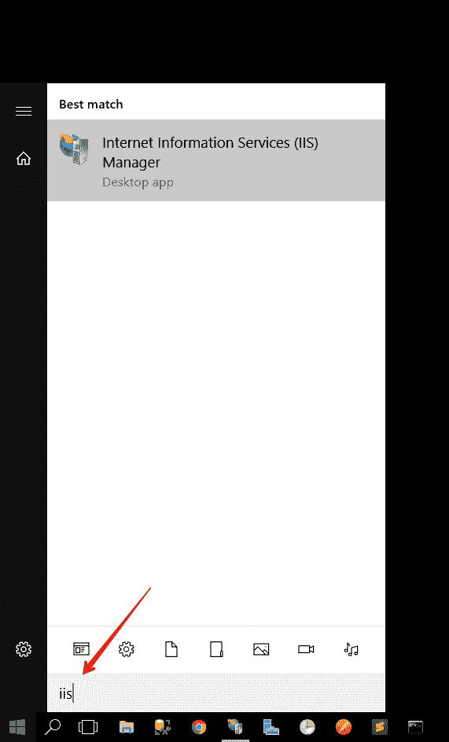
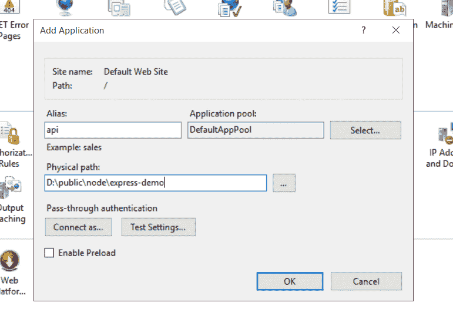
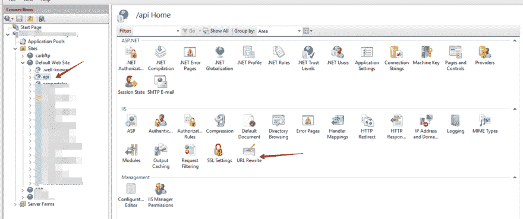
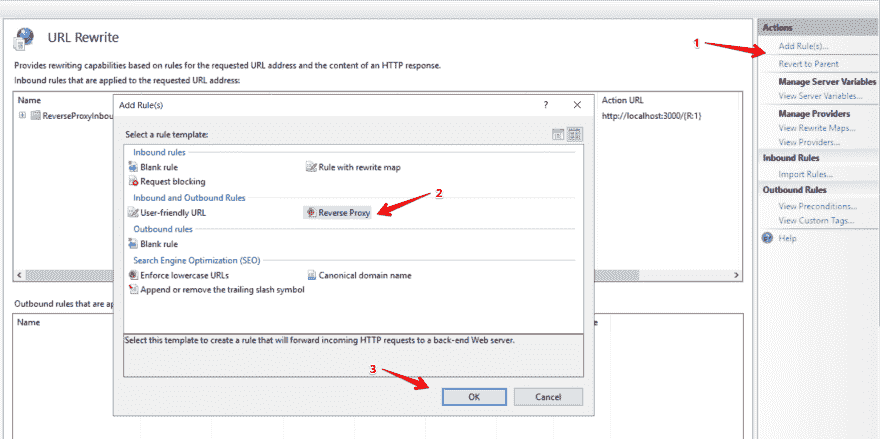
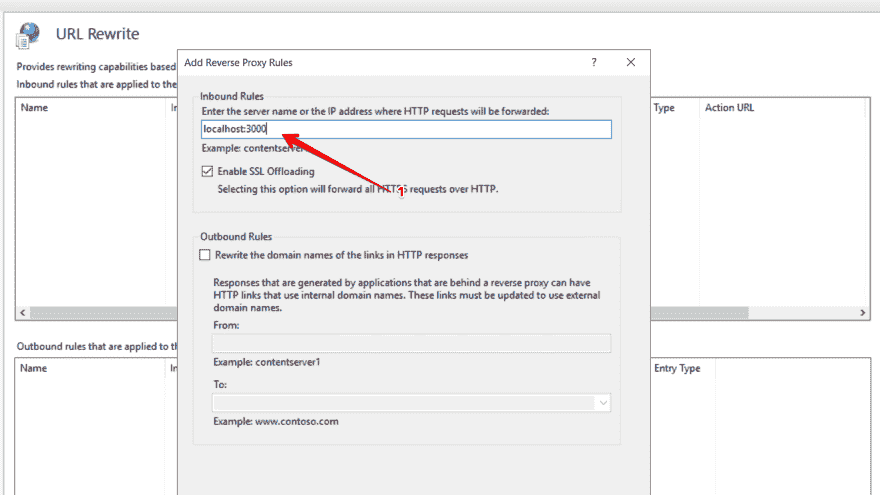

# 在 Windows 服务器上部署 Node/Express 应用

> 原文：<https://dev.to/massivebrains/deploying-node-express-app-on-a-windows-server-2l5c>

我有一个周末为客户做的小项目，它是一个简单的 express API。在部署之前，一切都运转良好！这是我和客户的对话..

我:酷，应用程序已经准备好了，你能把你的临时服务器的详细信息发给我吗，这样我就可以为你部署了？
*客户端*:耶酷，我给你发一个 RDP 凭证到我们的 Windows VM
*Me* :等什么？ [](https://res.cloudinary.com/practicaldev/image/fetch/s--Fiu3uZCf--/c_limit%2Cf_auto%2Cfl_progressive%2Cq_auto%2Cw_880/https://thepracticaldev.s3.amazonaws.com/i/o4si5el1jpz9cxxe6p41.jpg)

好了，玩笑归玩笑，让我们直入主题吧！

在我们继续之前，您应该对设置一个简单的 [Express App](https://expressjs.com/) 和使用 [Nodemon](https://nodemon.io/) 或任何其他节点流程管理器有一个基本的了解。

为了加快速度，我为这个演示设置了一个简单的带有单个端点的 express 应用程序，请注意，目标不一定是介绍 Express，而是如何在 Windows 上部署基于 Express 的应用程序。

## /[快速演示](https://github.com/massivebrains/express-demo)

### 快速演示应用程序

<article class="markdown-body entry-content container-lg" itemprop="text">

# 快速演示

快速演示应用程序

</article>

[View on GitHub](https://github.com/massivebrains/express-demo)

您可以克隆回购来跟进。

## 在服务器上设置快递 app

如果您使用的是克隆的示例应用程序，运行`yarn`，然后运行`yarn start`。该应用程序现在应该以`nodemon`开始。假设您没有更改默认端口，请在 [http://localhost:3000](http://localhost:3000) 打开您的浏览器。您应该会看到如下的 json 响应示例

```
{  status:  true,  data:  "Api Works"  } 
```

## 用 IIS 设置代理

现在，该应用程序在本地运行，但在服务器之外不可用。我们希望公众能够在`http://yourdomain.com/app`访问该应用，其中`http://yourdomain.com`是我们的域名。

### 第一步

搜索并打开互联网信息服务(IIS)
[](https://res.cloudinary.com/practicaldev/image/fetch/s--BI591aux--/c_limit%2Cf_auto%2Cfl_progressive%2Cq_auto%2Cw_880/https://thepracticaldev.s3.amazonaws.com/i/aiitjluhal1o2qghm2gv.png)

### 第二步

展开站点->默认网站

[](https://res.cloudinary.com/practicaldev/image/fetch/s--0RTehONw--/c_limit%2Cf_auto%2Cfl_progressive%2Cq_auto%2Cw_880/https://thepracticaldev.s3.amazonaws.com/i/bx8hjft0roovya37xc19.png)

右键点击*默认网站*，选择*添加应用*

[](https://res.cloudinary.com/practicaldev/image/fetch/s--0kBpVbbP--/c_limit%2Cf_auto%2Cfl_progressive%2Cq_auto%2Cw_880/https://thepracticaldev.s3.amazonaws.com/i/1g023u4vfzlvs07jejib.png)

### 添加 URL 重写

确保在*默认网站*下选择新创建的应用程序，从右侧的 IIS 仪表板中点击 *URL 重写*。

[](https://res.cloudinary.com/practicaldev/image/fetch/s--V0Sy1Rbw--/c_limit%2Cf_auto%2Cfl_progressive%2Cq_auto%2Cw_880/https://thepracticaldev.s3.amazonaws.com/i/19kk6nuxqcs65ffznyyh.png)

在右侧，点击*添加规则*，然后选择*反向代理*

[](https://res.cloudinary.com/practicaldev/image/fetch/s--AcUOQ008--/c_limit%2Cf_auto%2Cfl_progressive%2Cq_auto%2Cw_880/https://thepracticaldev.s3.amazonaws.com/i/6vi0d3ichu777enpfk8p.png)

在入站规则对话框中，输入`localhost:3000`，如下图所示。

[](https://res.cloudinary.com/practicaldev/image/fetch/s--Rxc4MCmw--/c_limit%2Cf_auto%2Cfl_progressive%2Cq_auto%2Cw_880/https://thepracticaldev.s3.amazonaws.com/i/0b7ay2r4qogmgp2urgxy.png)

> 如果您更改了当前运行 express 应用程序的端口号，请确保您使用了`localhost:{port_number}`

之后点击*确定*。

现在打开浏览器(在你的服务器之外)，试着访问*[【http://yourdomain.com/api】](http://yourdomain.com/api)*(其中*[【http://yourdomain.com】](http://yourdomain.com)*)是你实际的域名。