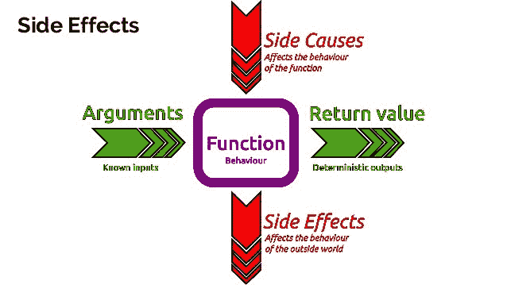
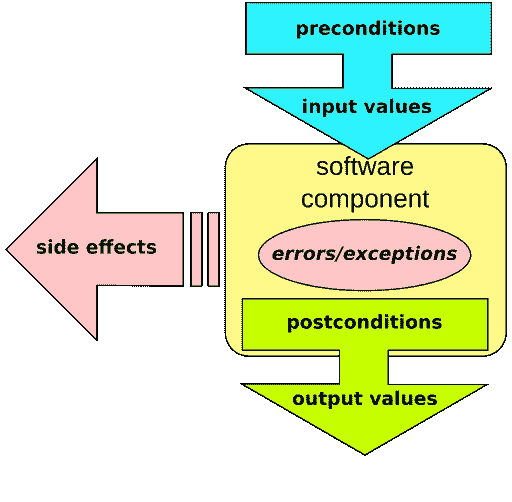

# 契约设计、不变性、副作用和古拉格

> 原文：<https://dev.to/juancarlospaco/design-by-contract-immutability-side-effects-and-gulag-44fk>

# 虫子的世界

> 每个人有 14 亿只昆虫，大部分都在你的代码里

这篇文章中的概念对任何语言都有用，例子来自[尼姆](https://nim-lang.org)。

[防御性编程](https://en.wikipedia.org/wiki/Defensive_programming)通常采用单元测试的形式，
单元测试检查一个“单元”代码，在特殊的测试运行中使用断言进行验证，
运行一个代码块并断言结果等于预定义的“样本”结果。

这很好，但也有一些限制，
输入、数据和上下文经常是伪造的(被嘲笑)，
输入通常不被断言，因为它是固定的，
输出是输入的结果，所以它们都不是完全真实的，
它运行在“专用的”自动化测试运行中。

*   如何让测试更加集成，更加贴近 bug 所在的代码？

# 副作用

[](https://res.cloudinary.com/practicaldev/image/fetch/s--RGevzpz_--/c_limit%2Cf_auto%2Cfl_progressive%2Cq_auto%2Cw_880/https://image.slidesharecdn.com/getfunctionalprogrammingwithclojure-cebit-160315080400/95/get-into-functional-programming-with-clojure-6-638.jpg)

> Bugs 是宇宙的熵，它试图在你还在写代码的时候对你的代码进行逆向工程

无副作用编程关注于消除对代码的副作用，并在你不能消除它们的地方监视或控制它们。

[函数式编程](https://en.wikipedia.org/wiki/Functional_programming)试图减少副作用，
没有副作用 bug 就不会在代码上传播，有助于减少 bug。

副作用示例:

*   写入终端或文件，从终端、文件或用户输入中读取。
*   变量、全局变量、对象、类型、数据结构的变异。
*   日期/时间函数、Win32 API/注册表、数据库、HTTP、GUI、异常。

[Nim](https://nim-lang.org) 有[副作用跟踪](https://nim-lang.github.io/Nim/manual.html#procedures-func)，功能优势同时还在使用 OOP。
只需将`proc`更改为`func`即可检查对您功能的副作用！。

# 永恒性

> 不变性改变一切！

[变量的不变性](https://en.wikipedia.org/wiki/Immutable_object)通过不允许不必要的突变来帮助对抗错误，
尽可能使用不变性是非常受鼓励的。

默认情况下，Nim 是不可变的，有 3 种变量:

*   `let`它是一个运行时**不可变的**变量。
*   `const`它的编译期**不可变**变量。
*   `var`其运行时可变变量。

# 合同

[](https://res.cloudinary.com/practicaldev/image/fetch/s--YfHe5zT4--/c_limit%2Cf_auto%2Cfl_progressive%2Cq_auto%2Cw_880/https://upload.wikimedia.org/wikipedia/commons/thumb/e/ea/Design_by_contract.svg/512px-Design_by_contract.svg.png)

> TDD 是穷人的合同

一些编程语言使用不同的方式来处理这一切，像 [Ada](https://en.wikipedia.org/wiki/Ada_(programming_language)) 或 [Eiffel](https://en.wikipedia.org/wiki/Eiffel_(programming_language)) 这样的
语言使用[契约式设计](https://en.wikipedia.org/wiki/Design_by_contract)。应用[霍尔逻辑](https://en.wikipedia.org/wiki/Hoare_logic#Hoare_triple)。

契约可以在代码块的开头断言输入、数据和上下文，
也可以在代码块的结尾断言结果，
它存在于尽可能靠近它的代码块中，它运行一个真正的实际运行，
一切都是真实的输入、数据、上下文等等，
在支持编译时代码执行的编程语言中，如果需要，所有这些都可以在编译时发生。

# 魂斗罗

[https://www.youtube.com/embed/DRVoh5XiAZo](https://www.youtube.com/embed/DRVoh5XiAZo)

> 黑夜是黑暗的，充满了错误

[Contra](https://github.com/juancarlospaco/nim-contra#contra) 以现代的 [KISS](https://en.wikipedia.org/wiki/KISS_principle) 方式重新构想契约式设计，
静态类型编译语言上[断言编程](http://stackoverflow.com/questions/787643/benefits-of-assertive-programming)的所有好处，
像 [Nim](https://nim-lang.org) 上的所有东西一样，它非常关心性能，
它允许在运行时以舒适的 API 实现零成本的快速契约，
需要对现有代码进行最小的修改，只需 2 行代码来添加一个契约。

让我们举一个有问题的示例代码，并给它添加一个契约:

```
proc myFunction(mustBePositive: int): int =
  result = mustBePositive - 1 
```

Enter fullscreen mode Exit fullscreen mode

记住`mustBePositive`必须是正数，让我们使用函数:

```
proc myFunction(mustBePositive: int): int =
  result = mustBePositive - 1

echo myFunction(0) 
```

Enter fullscreen mode Exit fullscreen mode

这是一个 Bug，`mustBePositive`不是正(`0 - 1`是`-1`)，让我们加上魂斗罗，
并确保有[没有副作用](https://en.wikipedia.org/wiki/Side_effect_(computer_science)) [使用`func`](https://nim-lang.github.io/Nim/manual.html#procedures-func) :

```
import contra

func myFunction(mustBePositive: int): int =
  preconditions mustBePositive > 0 # Require 
  postconditions result > 0        # Ensure
  result = mustBePositive - 1

echo myFunction(0) 
```

Enter fullscreen mode Exit fullscreen mode

合同保护我们的代码不受错误的影响，不会允许错误扩散。

*   `preconditions`接受用逗号分隔的前提条件，断言参数或局部变量。
*   `postconditions`取用逗号分隔的后置条件，必须在`result`上断言，可以在局部变量上断言。

为了简单起见，既不需要`body`也不需要`invariants`块，
你可以在`postconditions`上混合传递不变量，但它是可选的，
它可以用在 [JavaScript](https://nim-lang.github.io/Nim/backends.html#backends-the-javascript-target) ，解释的 [NimScript](https://nim-lang.github.io/Nim/nims.html) ，运行时和编译时。您的 CI 服务可以编译和运行启用了所有断言的二进制文件。

Contra 添加了`0`行代码用于发布构建，添加了`9`行代码用于调试构建。

# 古拉格推动发展

> 让你的用户为你工作

您现在可以将寻找 bug 的任务委托给合作者和可信用户，鼓励他们尝试开发编译时启用所有断言的二进制文件。

但是同样的代码也可以生成一个禁用了所有断言的二进制文件，
Contra 在为发布而构建时不生成任何代码，然后在所有基准上运行 pwn。

Nim 有[自动死码消除](https://en.wikipedia.org/wiki/Dead_code_elimination)。

*   将您的用户转化为您的古拉格 CI！。

# 安装

```
nimble install contra 
```

Enter fullscreen mode Exit fullscreen mode

假设您已经安装了的 [Nim。](https://nim-lang.org/install.html) [现在试试尼姆](http://play.nim-lang.org)，你错过了一吨很酷的东西。

# 感谢您的参与

[](https://res.cloudinary.com/practicaldev/image/fetch/s--cuiwF7Vu--/c_limit%2Cf_auto%2Cfl_progressive%2Cq_auto%2Cw_880/https://raw.githubusercontent.com/juancarlospaco/nim-presentation-slides/master/nim-bad-cat.jpg)

*   [GitHub 上的星门！](https://github.com/juancarlospaco/nim-contra#contra)
*   今天学尼姆。
*   [魂斗罗眼明手快。](https://nimble.directory/pkg/contra)
*   [尼姆电报组](https://t.me/nim_lang)
*   Nim 贴纸包。
*   [西班牙语电报组。](https://t.me/NimArgentina)
*   在桥接的 [Gitter](https://gitter.im/nim-lang/Nim) 、 [Matrix](https://matrix.to/#/#freenode_#nim:matrix.org) 、[电报](https://t.me/nim_lang)、 [IRC](//irc://freenode.net/nim) 、[不和谐](https://discord.gg/ezDFDw2)上说*嗨*。

👑