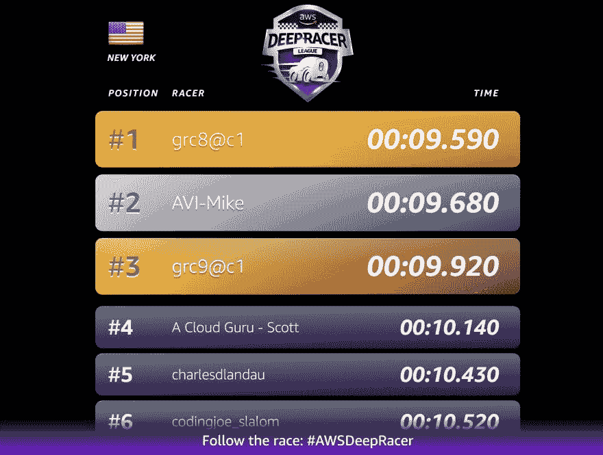
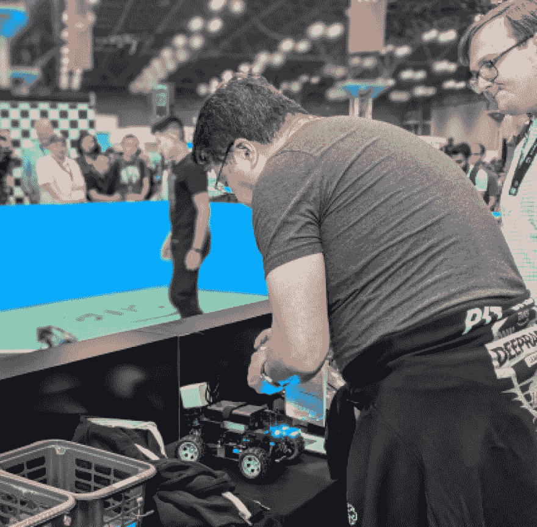

# AWS DeepRacer 上世界级强化学习的设计原则

> 原文：<https://dev.to/charlesdlandau/design-principles-for-world-class-reinforcement-learning-on-aws-deepracer-24l1>

<figure>

<figcaption>The DeepRacer track at AWS Summit NYC</figcaption>

</figure>

昨天在纽约的 AWS 峰会上真是有趣的一天，我想坐下来记录我的想法。我们还碰巧在 AWS DeepRacer 比赛中获得了第五名。因此，在这篇文章中，我将给出一些关于 DeepRacer 的 TLDRs 和“see also ”,分享让我们成功的设计原则，然后总结我对会议的总体想法。我保证这个帖子里不会有双关语。

#### DeepRacer 和 RL

**DeepRacer，简单来说:**是一个赛车联盟。参与者是教练，他们“训练”强化学习模型来驾驶汽车。比赛在全球各地的 AWS 峰会上举行，也有仅在模拟器上举行的比赛(“虚拟比赛”)。你在 AWS 提供的模拟器上进行训练。站着就是你的店有(字面意思！)世界一流的数据科学印章-和大牌组织相应地参与。就我而言，每个设法让赛车绕过赛道的人都完成了一项非常艰巨的任务，我尊重他们的技术。

[点击此处查看所有排行榜。](https://aws.amazon.com/deepracer/schedule-and-standings/)

**强化学习，简而言之:**不是优化预测标签的模型(监督学习)或在无标签数据中发现模式的模型(非监督学习)， **RL** 将“动作空间”和“环境”作为输入，它在“奖励函数”上进行优化

DeepRacer 在介绍他们自己和 RL 的材料方面做得很好，所以如果你想超越 TLDR，那么...参见:[https://aws.amazon.com/deepracer/](https://aws.amazon.com/deepracer/)

如果你在 DeepRacer 中感到无聊，可以去看看 OpenAI，它在 RL 中占有很大的份额:[http://gym.openai.com/](http://gym.openai.com/)

`**` *我应该注意到我个人并没有怎么玩过 OpenAIGym】*

#### 问题

在 DeepRacer 中，*环境*是赛道，*动作空间*都是速度和转向角度的组合，奖励函数由你提供。该模型由 AWS SageMaker 提供，这是 AWS 上的旗舰 MLaaS 产品。当我问他们这是否只是一个优化的 TensorFlow 神经网络时，他们并不太确定，但我认为它是。您不能直接接触模型，但有一些“超参数”会影响训练的效果，您可以在范围内编辑它们。

所以总的来说，我们的任务是通过定义:

*   奖励函数
*   该型号可以选择多少油门/多少油门设置。
*   它能转多急/在那个范围内它能选择多少角度。
*   ...超参数比如..

1.  *学习率*(模型如何更新)以及...

2.  *熵*(模型采取随机行动以确保所有行动都得到训练的频率)以及...

3.  *训练时间*(模型训练多长时间**，因此你训练它要花多少钱**

鉴于这个问题，我采用了三个设计原则:

#### 原则一:拟人化

你的奖励函数可能是你在这个过程中所做的最重要的事情。奖励功能具有 AWS 记录的预定义输入，如“距中心线的距离”或“速度”。如果你在教别人赛车，你会怎么做？当他们完成比赛时，你给他们一个击掌，你责备他们做一些愚蠢的事情，比如坐着不动或者撞车。对于其他一切，你建议。你说“开快点”。“像这样转”你说。你的模型是赛车手，你是教练，你的奖励函数是你如何与它“交谈”。

#### 原则二:接吻

保持简单愚蠢。在这种情况下，这看起来像什么？

**一:**专注于你的奖励功能。编写简单的函数，提取汽车正在发生的事情的信号，例如“开得快”或“撞了”。DeepRacer 有样板代码来帮助你做到这一点，但他们提出了完整的奖励功能。**他们不是。**这些是信号提取函数——你的奖励函数解释了所有的信号。简单的信号提取功能，简单的奖励功能。

**二:**对超参数和训练次数进行标准化。我发现默认的超参数选择得很明智。我标准化了 120 分钟的训练。

**三:**抵制“大红按钮”和“最小/最大”ing。作为实践者，很自然会惊叹于手头杠杆的力量。抵制在一个有前途的模型上最大化你的训练时间的冲动。转到 1。

#### 原则三:走得快

这应该是不言自明的，为什么我要提到它？这个模型解决了一个复杂的问题，包括转向、速度、寿命和稳定性。DeepRacer 给你带来了所有这些问题，但它本质上是一场比赛。在其他一些情况下，比如真车，你不会接受一个撞车的模型。**这个不是那个。**尽可能快地行驶，不要一直撞车。是的，惩罚撞车。是的，转向很重要。尽管如此，你正在训练一名赛车手，而赛车手想要跑得更快。当你的注意力集中在问题的另一部分时，把它放在脑后。

#### 奖励原则:玩得开心

有许多公司，其中一些相当大，在这场竞赛中名列前茅。他们中的一些人拥有自己的汽车和赛道，并与全球 DeepRacer 联赛平行举办内部比赛。忍住不要因此而气馁的冲动。这与传统的赛车联盟非常相似...**但与那些联赛不同的是，准入门槛非常低。**一个小时的培训费用约为 3 美元。只需几百美元，我们就能在强化学习中实现世界级的表现，并让来自财富 100 强公司(如 Capital One)的团队物有所值。**所以放轻松，玩得开心。否则所有这些游戏化有什么意义呢？**

我认为，如果你遵循这些原则，你可以做出一个值得比赛的模型，并有一个令人敬畏的时间去做它。

<figure>

<figcaption>Putting the model in the car.</figcaption>

</figure>

## 祝贺获奖者，阿齐马、迈克尔和纳尔逊

液体错误:内部

#### 峰会上的其他想法:

1.  我们遇到了一群很酷的人。
2.  我们了解了大量很酷的服务和技术(荣誉奖包括 [AWS CDK](https://aws.amazon.com/cdk) 、[孔](https://konghq.com/kong/)、 [DataDog](https://www.datadoghq.com/) )
3.  我们玩得很开心。(好吧，我必须说一个双关语。)