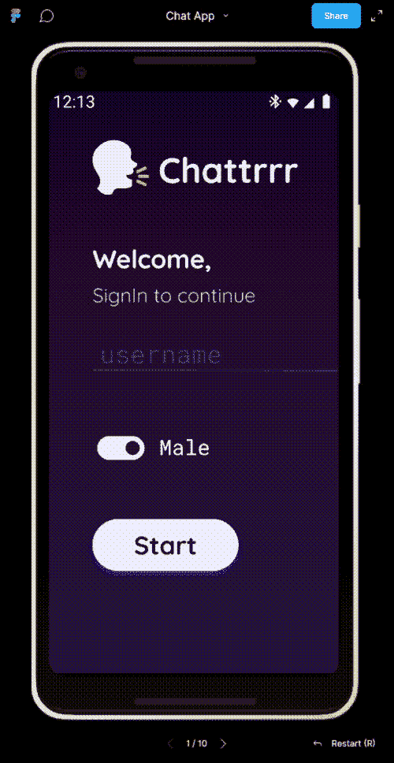

# 设计审查需要-匿名聊天应用程序

> 原文：<https://dev.to/logeekal/design-review-an-anonymous-chat-application-3575>

## 背景

所以我从 5-6 周(或周末)开始学习行动设计，为了我的简历生成器应用程序，我在这里写了 3 篇文章。我发现继续进行那个网站的设计真的很难，所以我想尝试一些更容易的东西。因此，我设计了一个简单的聊天应用程序作为起点，因为作为我的 MVP 设计的一部分，它的屏幕和交互数量较少。

## 欢迎聊天

Chatrr 是我在 8-9 年前 Web 2.0 兴起时想到的名字(光看名字就能猜到)，但在当时，我没有时间、技能和奉献精神来开始使用它。欢迎 2019 年，在多年寻找借口后，我进入了 web 开发，我确信这是开源产品之一，我需要出货。它是否有效并不是我现在的首要任务。

## 动机

现在有 100 多种聊天应用，但是很少是匿名的。我一直很喜欢 10 年前雅虎聊天室的感觉，但现在没有了。此外，聊天应用程序将帮助我从头开始培养以下技能:

1.  移动设计语言
2.  设计工具，如 Figma
3.  Web 套接字
4.  反应原生/颤动/科特林(还不确定)
5.  GraphQL

## 第一阶段

所以我在 3 周前投入其中，周末在 Figma 做原型。我想我对初稿很满意，可以开始开发了。UI 不是我的强项，因此我感到有点成就感，因为我喜欢颜色，字体，按钮的选择和应用程序的整体外观和感觉。

***但谁不爱自己的方案。*** 因此，我很感谢社区的意见。如果你是专家，请残忍的判断什么东西看起来好，什么东西看起来坏，什么东西看起来丑，为什么。如果你不是，请不要隐藏你的观点。

这样，在我们开始模拟视频之前，我不会占用你太多的时间和陈述假设和应用程序的功能，以便你有一些背景。

## 功能

1.  因此，这是一个匿名聊天应用程序，因此登录屏幕没有任何内容，除了:

    *   用户名
    *   性别
    *   提交按钮(可能是实际应用程序中的验证码)
2.  房间

    *   聊天室是预先创建的，不能由用户创建。
    *   这些就像有成员加入特定聊天室的群组。
    *   人们不能退出所有房间，他们只能交换房间。因此，如果在登录期间，如果一个人加入了一个房间，他们将在后台保持加入，用户应该能够从任何地方访问成员列表。用户可以切换房间或注销；
3.  用户概要

    *   非常简单，正如已经说过的，你只能修改你的性别作为 MVP 的一部分。
4.  设置页面仍然保留，因为我还在考虑它，但它将主要有通知的东西和性别隐藏。仅此而已。

5.  字体是多种尺寸的流沙

6.  徽标和名称是临时的，仅仅是占位符。

注意:Figma 只有屏幕过渡，而没有组件动画和过渡，所以有一些元素当前动画不存在或者很烂。例如，主菜单将是一个扩大的圆圈，如下所示(不是我的)。但在原型中，它只是滑动或溶解:

 
注:以上牛逼动画出自[福斯托·雷尼尔](http://011101.it/)。去看看这个[网站的](http://011101.it/)主页。它有非常有趣的元素。

这是我的:

你可以在这里找到我的 github Repo 的所有资料