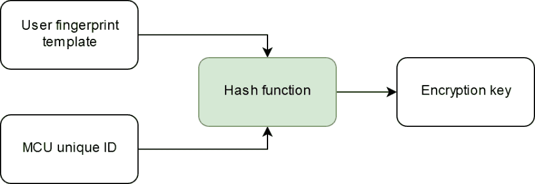
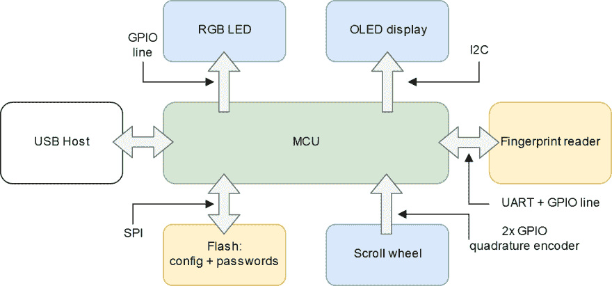

# 设计生物密码管理器

> 原文：<https://dev.to/minkovsky/designing-a-biometric-password-manager-26kn>

密码提示。到处都是密码提示。在每天登录我的工作 VPN 和在我的个人机器上访问 sudo 之间，我必须每天多次输入多个密码。我是一个糟糕的打字员，这意味着我会经常打错问题中的密码(尤其是在那些糟糕透顶的蝴蝶键盘上)，让自己无休止地沮丧。

与我的手机相比，在大多数情况下，我可以用我的指纹登录，甚至授权交易。输入密码或 pin 是一个备用选项，而不是默认选项。方便和安全的认证，基于你*是*的东西而不是你*知道的东西*。如果我能在我使用的每一台设备上做到这一点，那岂不是太棒了？

是的，是的，会的。我想这么做。

## 目标

在这一部分，我将采取一种更加以设计为导向的方法，在这里我将概述我想要完成的任务，然后具体说明我想要如何完成它。我想要的可以用一句话来概括:

> 我希望能够在任何一台计算机上用手指轻轻一点就能输入我的密码，但仍然是安全的。

我认为这可以分为三个不同的子目标:

1.  **安全性:**密码只能由正确的人解锁。得到该设备的人应该不花很大力气就能找回密码。
2.  **兼容性:**该设备应能在任何合理的计算机上输入密码，无需特殊软件或驱动程序。
3.  **简单:**理想情况下，我只会在设备上存储少量密码，我希望能够快速滚动列表并确认我的指纹以输入密码。

我将在后面更深入地讨论实现细节，但是现在我想让你注意安全性目标和可用性目标(2 和 3)之间的内在冲突。这是设计安全系统的固有挑战，因为增加一个东西的可用性通常也会增加它的攻击面。我认为在这种权衡下，生物识别方法比安全输入键盘或小型读卡器(如 Mooltipass)更好——安全键盘仍然需要您输入可以被猜到的代码，Mooltipass 卡可能会丢失。基于指纹的系统提供了合理的安全性和便利性——如果不打开设备并花费一些时间进行调试，第三方无法获得您的密码，如果您失去了手指，您可能会面临比保持数据安全更大的紧迫问题。

## 动机

做这个项目的主要原因是我厌倦了输错我的密码，我们也必须每三个月更换一次。我理想中的设备应该是一个简单的按键就能把特定的密码传到 USB 上的设备，但是这并不安全！如上所述，我认为指纹认证在一般情况下比输入密码更安全，因为一旦你验证了你是谁，而不是你知道什么，你就可以让“密码”尽可能长而安全，因为没有人会看到它。用钥匙串的方法来储存一些密码也是有意义的。

我开始这样做的另一个重要原因是我想学习一些新的东西。为此，我决定回到 ARM 微控制器上，这是我在大学时就知道但又讨厌的东西，但这次略有不同——使用 Rust 而不是 C/C++，并使用在制造商圈子中更受欢迎的微控制器。我选择了 STM32 系列，更具体地说是 STM32F446RE 部分，因为有一个开发板，价格为 13 英镑，是一个功能强大的小芯片。

我选择 Rust 是因为我认为嵌入式项目更适合学习这种系统编程语言。对于我在桌面上做的大多数项目，我通常更喜欢使用更高级和可移植的东西，比如 Python 或 JavaScript。不过我会在编写配置程序时尝试桌面 Rust。

## 装置

考虑到这个项目的总体目标，我决定使用 USB 加密狗。通过 USB，我可以将设备注册为键盘，并将密码一键一键发送到主机。USB 键盘可以在任何有 USB 接口的系统上工作，所以不需要额外的驱动程序。配置接口可以是虚拟串行端口，也不需要额外的驱动程序。最后，USB 可以用于固件更新。

我决定使用滚轮控件来选择输入的密码。滚轮应该有很好的制动器，应该能够自由旋转。我希望界面能够很好地扩展到存储 10 个密码，所以按钮是正确的。值得注意的是，Mooltipass 也使用这种方法。

有机发光二极管显示器将用于向用户显示他们选择的密码，以及其他信息，如设备的状态(如果处于配置或 DFU 模式)。我还在考虑添加一个新像素型的 RGB LED 来提供额外的指示——也许我想让用户将每个密码与一种颜色相关联。

关于用户交互，因为我想到的指纹读取器也可以作为一个按钮，我决定将手指放在读取器上来确认选择，获取指纹并尝试输入密码。进入配置模式和更新固件也需要指纹确认。为了额外的安全，我可能会添加一个功能，如果没有成功的身份验证达到一定的次数，就会删除密码列表，并使用指数后退来防止用户意外删除他们的设备。

至于加密，我需要想出一个合理的方案，要求攻击者实际拥有设备和至少一些实验室设备来恢复密码列表。目前，我正在考虑将主微控制器的唯一 ID 和用户的指纹模板结合起来作为对称加密密钥。

我希望指纹模块本身能够根据用户的指纹生成一个加密值，然后只在检测到授权的手指时才释放它——但是我选择的模块上没有这种功能。

## 实现

虽然我选择 Rust 主要是因为我想学习这门语言，但我也知道在内存访问方面，它比 C/C++安全得多。除非代码被明确标记为不安全，否则 Rust 会尝试在编译时验证内存访问，捕捉各类错误，如释放后使用或缓冲区溢出。

我选择这款特殊的 STM32 器件有几个原因。第一，便宜的开发板——芯片本身大约 6 美元，所以如果 ST 以成本价出售这些东西，我不会感到惊讶。第二，这是一个非常强大的部分。第三，STM32 系列很受制造商和电子爱好者的欢迎。因此，有很多来自供应商和社区的文档。还有 Rust 库，用于以相对较好的方式访问芯片的外设。

指纹传感器是最难找到的东西。虽然 Adafruit 出售一些 Arduino 友好的设备(有来自通常嫌疑人的克隆)，但它们相当大。适用于保险箱或门，不适用于便携式设备。确实花了一些研究时间来寻找一个小的、接口相当方便的器件。可以预见的是，它来自一个相对不知名的中国供应商，市场上有许多克隆产品。它是 [Grow R502](http://en.hzgrow.com/product/113.html) ，一个大约 10 便士硬币大小的模块，带有 UART 接口。可以通过全球速卖通或阿里巴巴订购，而且速度相对较快。然而，英文文档有点缺乏，我找不到与该模块配套的演示软件。我已经给供应商发了电子邮件。

Grow R502 并没有实现我希望它实现的所有功能。首先，我希望在其中添加一项功能:当指纹首次注册时，会生成一个令牌，该令牌仅在与该指纹成功匹配时返回。这将简化我的设计，并使整个系统更加安全，因为我可以用它作为加密密钥。小知识:指纹模块有一个 GD32 MCU，是 GigaDevice 的 STM32 克隆。

考虑到我希望在设备上包含的功能以及我希望使用的器件所带来的限制，我决定这样布置系统:

## 计划

我将在这个项目中写博客，甚至可能制作一些演示视频。我想与您分享开发过程中的笔记，并希望获得一些关于我的计划的反馈。目前，我计划写 11 篇博文。

1.  STM32F446RE Nucleo board 上的锈迹——我跳过了 blinky，直接在有机发光二极管显示器上找到了一些东西。我还将尝试介绍 STM Cube IDE 中的初始化代码生成，以及在转化为 Rust 之前先这么做是否是个好主意。
2.  R502 探索——我试图找到一些现有的软件来测试模块，并开始用 Rust 编写一个测试 STM32 程序。
3.  USB 键盘——我试图从 SPI 闪存中创建一个简单的 USB 橡皮鸭克隆
4.  基本原型-我建立了一个设备，当指纹正确时，它发送一个以明文存储的密码
5.  配置密码——我创建了一个复合 USB 设备，它有一个 USB 键盘和一个虚拟串行端口，然后用它来配置密码列表
6.  UI 原型——在这里我连接了编码器，并使用它来上下导航密码列表，并谈论更多关于这个东西的整体 UX
7.  加密——我开始将加密程序集成到固件中
8.  完整的试验板原型——我把所有的东西都放在试验板上，讨论正在发生的事情
9.  电子工程——我创建了完整的原理图，并为 USB 加密狗设计了 PCB
10.  我把器件组装在 PCB 上，希望它能工作
11.  反思-我花了一些时间谈论我从这个项目中学到了什么，以及我想把它带到哪里；如果我把它放在一起后还能用的话，还会有一些用法注释

这里有很多，我希望能够在合理的时间内完成。现在，我想邀请大家关注这个系列，并对这个项目提出一些意见。下次见！