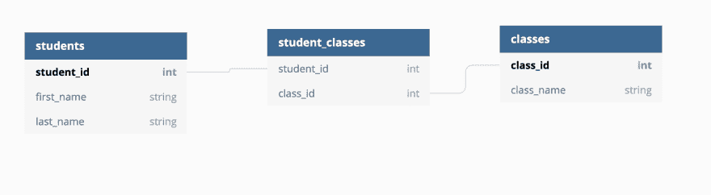
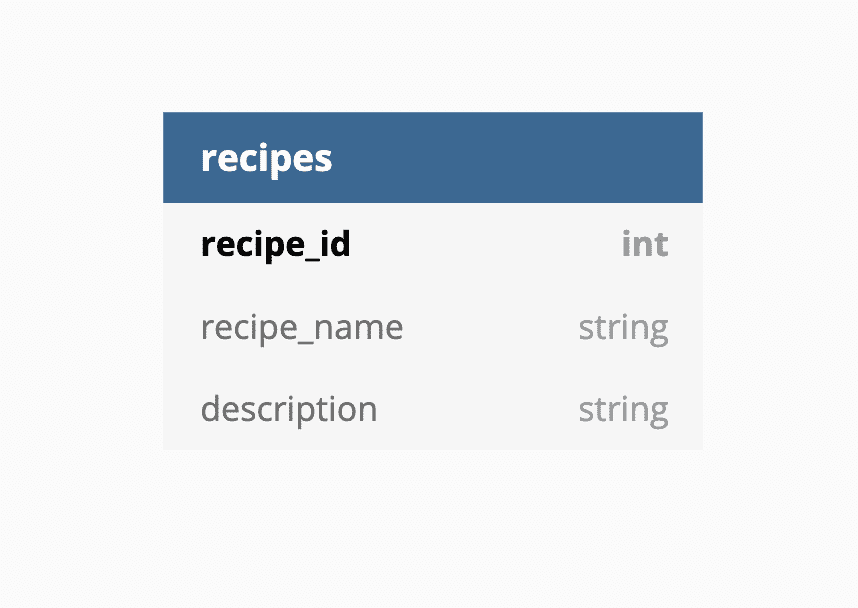
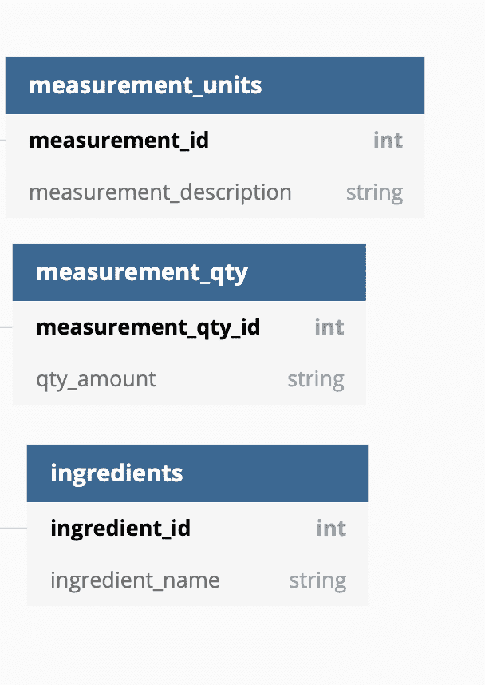
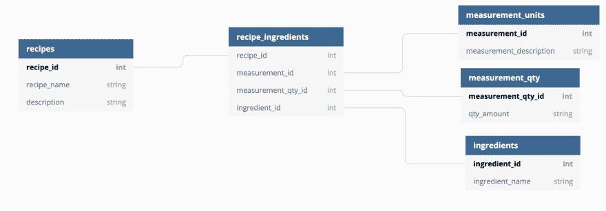

# 为烹饪书设计关系数据库

> 原文：<https://dev.to/amckean12/designing-a-relational-database-for-a-cookbook-4nj6>

当我不编程的时候，我在做饭。我喜欢翻阅烹饪书，寻找新的有趣的食谱。在浏览了相当多的书籍后，我开始注意到显示的食谱属性类型的模式。我认为根据食谱设计一个关系数据库可能是一个很好的练习。

## 背景

那么关系数据库是由什么组成的呢？关系！在关系数据库中，一切都是相互联系的。所有的东西都连接在一起，我们可以创建一个包含数百种属性类型的大表，但是我们没有这样做。这是为什么呢？数据完整性！数据完整性是指我们数据的整体完整性、准确性和一致性。为了使我们的数据库具有数据完整性，它需要具备这三个特性。

1.  没有重复值
2.  没有错误的值
3.  表之间没有断开的关系

那么，我们如何才能做到这一点呢？为此，我们将数据分解成多个可管理的、唯一的表。然后，我们通过关系连接这些表。当谈到关系时，我们只有三种类型可以使用(实际上是两种，但我们会谈到这一点)。这些类型是:

1.  一对一-(例:一人一本护照，一本护照一人)
2.  一对多(例如:一个人可以有多张信用卡，但多张信用卡只能有一个人)
3.  多对多(例如:许多班级有许多学生，而许多学生有许多班级)

最后一个似乎很难阅读和理解，对不对？确实是。再加上它不工作。它不起作用的原因与一个叫做亲子关系的概念有关。让我们看看“一对多”的例子，并试图找出谁是父母，谁是孩子。离开了人和信用卡就不能存在了吗？信用卡！没有不可思议的无限信用卡不是分配给某人的。因此，在这种情况下，父卡是人，子卡是卡。现在让我们看看“多对多”关系。那里的父母和孩子是谁的？在一种情况下，一个学生不去上课就不能成为一个学生。另一方面，一个班级真的是没有学生的班级吗？这就是为什么多对多关系不起作用的原因。我们没有明确的父母。

我们通过将“多对多”关系分解为两个“一对多”关系来解决这个问题。这样我们就有了明确的父母和孩子。因此，如果我们要对学生和班级表进行建模，我们会得到类似这样的结果。

[](https://res.cloudinary.com/practicaldev/image/fetch/s--WUArzNpP--/c_limit%2Cf_auto%2Cfl_progressive%2Cq_auto%2Cw_880/https://thepracticaldev.s3.amazonaws.com/i/c4egrmyntrivg3k1qyua.png)

其中“学生-班级”表是学生表和班级表的子表。

## DB 设计

好了，有了这些知识，让我们为食谱建立一个数据库吧！我们来看一个菜谱，翻出相关资料。

```
Recipe Title: Simple Cheese Pizza
Recipe Description: A great pizza that's really easy to make. 
Recipe Ingredients:
2.5 cups All Purpose Flour
1 Packet Yeast 
1.5 teaspoons Sugar
0.75 teaspoons salt
2 tablespoons Olive Oil
0.75 cups warm water
1.25 cups cheese
1 cup tomato sauce 
```

Enter fullscreen mode Exit fullscreen mode

这似乎是我们开始的足够信息。看看上面的配方，哪些数据真正依赖于一个配方？我会争论“食谱标题”和“食谱描述”，所以让我们把它放到一个表格里。

[](https://res.cloudinary.com/practicaldev/image/fetch/s--oOndnNhU--/c_limit%2Cf_auto%2Cfl_progressive%2Cq_auto%2Cw_880/https://thepracticaldev.s3.amazonaws.com/i/wjqi3siull0bv4r0a3oy.png)

好的，现在让我们看看配料部分。首先，我们知道一个食谱有许多配料，但是一种配料也有许多食谱。我可以在另一个食谱中使用 2.5 杯面粉，因此没有必要在我的数据库中再次重复该值。我们也可以争辩说，我可以使用我的数据库中的 2.5 杯其他成分，如 2.5 杯红糖。那么有没有必要在一个数据库中连续重复 2.5 杯？我认为不是。

让我们从单个成分开始，然后扩展到一个食谱的所有成分。当查看一种成分时，我们会注意到一些关键特征:测量数量、测量单位和成分。下面用“1 杯番茄酱”来说明这一点。

```
1 = measurement qty
cup = measurement unit
tomato sauce = ingredient 
```

Enter fullscreen mode Exit fullscreen mode

然后，我们可以根据这三个特性创建三个表。

[](https://res.cloudinary.com/practicaldev/image/fetch/s--xNd42klD--/c_limit%2Cf_auto%2Cfl_progressive%2Cq_auto%2Cw_880/https://thepracticaldev.s3.amazonaws.com/i/y7p892nh07a48qhmmfh2.png)

好了，我们已经展示了所有的信息，但是我们如何将配方表和三个配料表联系起来呢？我们使用一个连接表！

[](https://res.cloudinary.com/practicaldev/image/fetch/s--43JNAc-c--/c_limit%2Cf_auto%2Cfl_progressive%2Cq_auto%2Cw_880/https://thepracticaldev.s3.amazonaws.com/i/ga0f1mk0u10izyfx4td1.png)

这个数据库允许我们做什么？好吧，让我们来看看两个比萨饼食谱。

```
Recipe Title: Simple Cheese Pizza
Recipe Description: A great pizza that's really easy to make. 
Recipe Ingredients:
2.5 cups All Purpose Flour
1 Packet Walmart Yeast 
1.5 teaspoons Sugar
0.75 teaspoons salt
2 tablespoons Olive Oil
0.75 cups warm water
1.25 cups cheese
1 cup tomato sauce

Recipe Title: Simple Cheese Pizza with Pepperoni
Recipe Description: A great pizza with pepperoni that really easy to make. 
Recipe Ingredients:
2.5 cups All Purpose Flour
1 Packet Walmart Yeast 
1.5 teaspoons Sugar
0.75 teaspoons salt
2 tablespoons Olive Oil
0.75 cups warm water
1.25 cups cheese
1 cup tomato sauce
1 bag pepperoni 
```

Enter fullscreen mode Exit fullscreen mode

我们知道我们的食谱标题和食谱描述是不同的，因此我们需要存储这两个值，但是看看配料。除了结尾的“一袋意大利香肠”之外，没有什么真正的变化。我们真的需要复制所有这些值吗？如果我们做了会发生什么？我们来看“1 包沃尔玛酵母”。如果沃尔玛倒闭，沃尔玛酵母将不复存在。所以我们必须找到酵母的替代品，然后改变不是一个，而是两个记录。这看起来并不难，但现在想象一下，我们有 10，000 个使用沃尔玛酵母的食谱。变化太大了。使用上面的数据库，我们只需更改一个表值，而不是 10，000 个！谢谢关系！

## 结论

数据库设计没有唯一正确的答案，但是有很多错误的答案。数据库设计是艺术和科学的平等部分。它需要对您试图连接的所有数据之间的关系有深刻的理解。我发现，如果我没有在适当的数据库设计上投入足够的时间，我的应用就会变得不灵活和低效。一开始，这个概念对我来说很难理解，尤其是对多对多关系建模。我很好奇你对数据库设计的想法，以及它是否值得花费大量时间。让我知道！