# 使用 angular 开发电子桌面应用程序

> 原文：<https://dev.to/th3n00bc0d3r/desktop-application-development-in-electronjs-using-angular-4cno>

时至今日，程序是一个界面，是计算机和用户之间的桥梁。还有一个词已经给它贴上了标签，叫应用。一个应用程序可以很好地利用任何人的时间来提高他们的工作效率。考虑到智能手机和个人电脑的数量，移动应用程序比桌面应用程序要多。这给桌面用户留下了一个很大的灰色区域，他们很难找到高效的应用程序。

[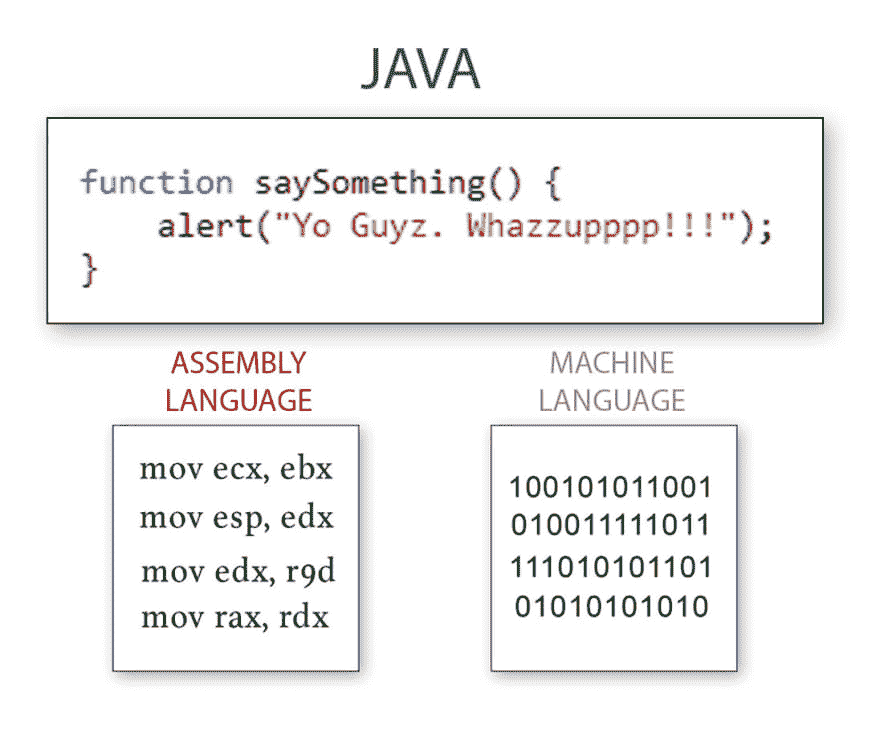](https://res.cloudinary.com/practicaldev/image/fetch/s--sQzaDrMf--/c_limit%2Cf_auto%2Cfl_progressive%2Cq_auto%2Cw_880/https://thepracticaldev.s3.amazonaws.com/i/0t9ld03zsgw5z7hmajme.jpg)

### 制作申请的过程

应用程序曾经是用机器语言编写的，后来出现了可读性更好的汇编语言，今天我们有了 Javascript，我们将在其中制作桌面应用程序。特别是为什么是 Javascript？因为它像自然人类语言一样更易于阅读和使用..它有基本的最小设置，可以在任何地方运行。

[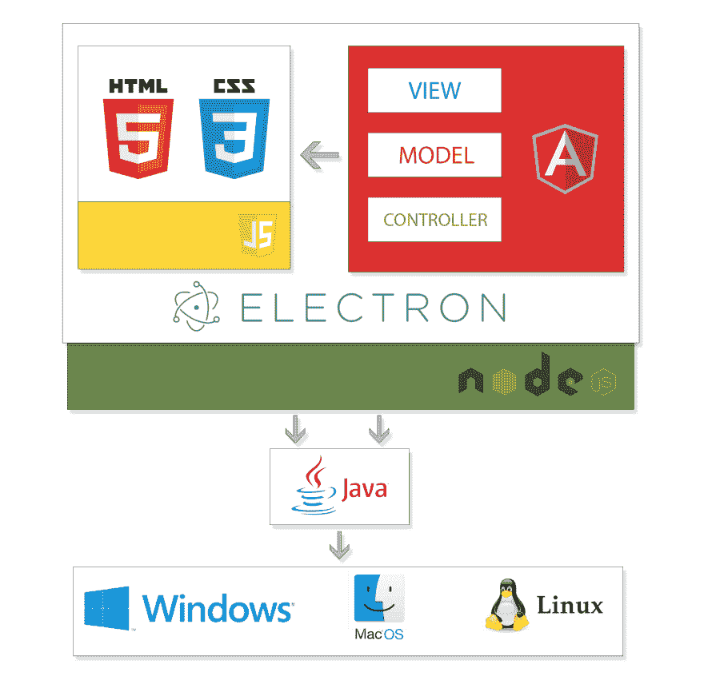](https://res.cloudinary.com/practicaldev/image/fetch/s--vJziaVwt--/c_limit%2Cf_auto%2Cfl_progressive%2Cq_auto%2Cw_880/https://thepracticaldev.s3.amazonaws.com/i/xybyod5zn1qksm0afcaa.jpg)

### 我们的应用架构

Angular 发生的 MVC(模型视图控制器){place？}可以理解为一套标准实践，一种通过帮助您在内部组织代码并在出现错误时快速修复错误来确保您不会将代码从咖啡杯中溢出的机制。模型部分剥离了应用程序的逻辑，并将其放入另一个容器中，在那里它与其他部分连接，但所有逻辑都在那里完成，因此如果您有一些逻辑问题，您不必打开并搜索所有文件。它管理进出应用程序的所有数据。

MVC(模型视图控制器)的视图部分是所有东西在浏览器上呈现和显示的地方。你在网页上看到的所有图形和文本都是 MVC 的视图模块存在的地方。控制器部分处理来自用户的所有输入，并将所有输入传递给模型和视图。因此，Angular 是一个 Web 框架，由 Google 维护，由个人帮助开发被称为 SPA(单页应用程序)的应用程序。它将您的应用程序转换成模型-视图-控制器架构。

ElectronJS 是另一个框架，它使你能够将你的网络应用程序或网站转换成一个可执行的应用程序，可以充分利用任何操作系统的所有 windows、mac 或 Linux 功能。

现在 Node.js 是一个环境，所有这些都驻留在其上。它帮助每个人使用 Javascript 将英语写成一种容易理解的编程语言。它既是服务器端的，也是客户端的。它将帮助您服务于您的服务，并提供客户端逻辑。

### 环境安装过程

我们将使用 Windows 10 操作系统开发一个入门应用程序。

下载 NodeJS
[https://nodejs.org/en/download/](https://nodejs.org/en/download/)

前往网址，下载安装程序。同一个网站也可以用来下载其他平台的 NodeJS。

[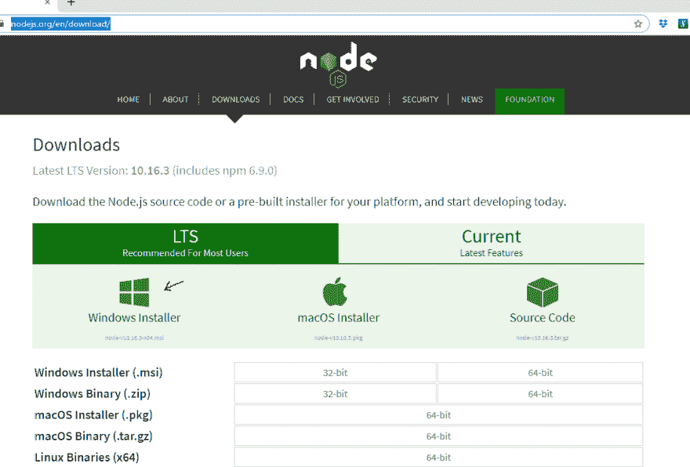](https://res.cloudinary.com/practicaldev/image/fetch/s--793E4nR_--/c_limit%2Cf_auto%2Cfl_progressive%2Cq_auto%2Cw_880/https://thepracticaldev.s3.amazonaws.com/i/ig2fsei7m6kdyasejgjg.png)

现在运行安装程序，您应该会看到一个 NodeJS 安装程序屏幕。单击下一步并继续。选择自定义安装，并检查从磁盘安装所有应启用，特别是添加到路径。Add to 路径将 nodeJS 目录链接到您的环境路径，这类似于对所有命令和可执行文件的全局访问。

[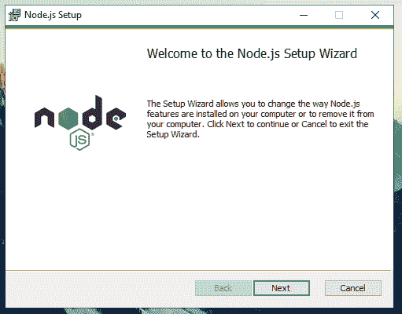](https://res.cloudinary.com/practicaldev/image/fetch/s---pcwU7tP--/c_limit%2Cf_auto%2Cfl_progressive%2Cq_auto%2Cw_880/https://thepracticaldev.s3.amazonaws.com/i/n9fdgodp3pu3zxsu14c3.png)
[T6】](https://res.cloudinary.com/practicaldev/image/fetch/s--kWXhZPJa--/c_limit%2Cf_auto%2Cfl_progressive%2Cq_auto%2Cw_880/https://thepracticaldev.s3.amazonaws.com/i/5io98cjoj8uh86vpxab0.png)

这就像您不需要转到 NodeJS 目录来运行命令一样，NodeJS 命令在任何目录的任何地方都是可访问的。安装完成后，让我们检查节点是否安装成功。要检查从“开始”菜单打开“运行”对话框，请按 Window 键+ R 快捷键，并键入 CMD，然后按 enter 键。您应该会看到一个命令提示符。

[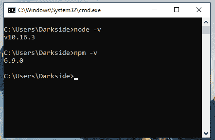](https://res.cloudinary.com/practicaldev/image/fetch/s--jmBrl1gP--/c_limit%2Cf_auto%2Cfl_progressive%2Cq_auto%2Cw_880/https://thepracticaldev.s3.amazonaws.com/i/942956urqsizdcqp6mzk.png)
[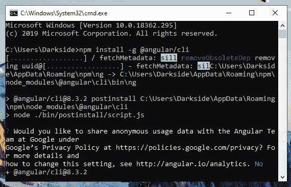T6】](https://res.cloudinary.com/practicaldev/image/fetch/s--D632mHL7--/c_limit%2Cf_auto%2Cfl_progressive%2Cq_auto%2Cw_880/https://thepracticaldev.s3.amazonaws.com/i/hg45ktvjmdm0ulvhnrdb.png)

键入以下命令

```
Node -v 
Npm -v 
```

Enter fullscreen mode Exit fullscreen mode

它应该会给你安装的版本。我们已经安装了节点。现在让我们安装 Angular。使用以下命令
安装角度

```
npm install -g @angular/cli
npm install typescript -g 
```

Enter fullscreen mode Exit fullscreen mode

### 设置项目

为了创建一个新的 Angular 项目，我们使用 Angular 命令行工具 ng。使用以下命令创建一个新项目。

```
Ng new myDesktopApp
Would you like to add Angular routing? Yes
Which stylesheet format would you like to use? SCSS
Cd myDesktopApp
npm i -D electron@latest 
```

Enter fullscreen mode Exit fullscreen mode

现在我们需要创建一个 main.js 文件作为我们的入口点，并修改 package.json、tsconifg.json 和 angular.json。

[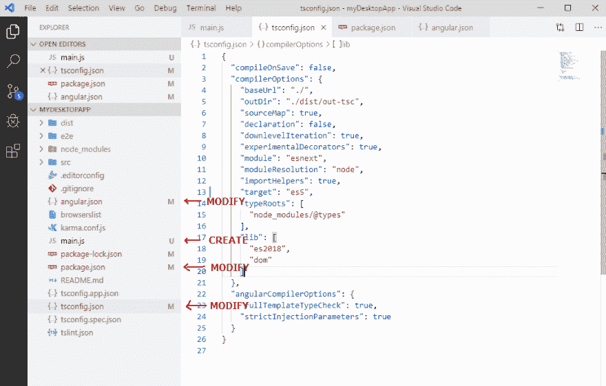](https://res.cloudinary.com/practicaldev/image/fetch/s--pTmxh8RD--/c_limit%2Cf_auto%2Cfl_progressive%2Cq_auto%2Cw_880/https://thepracticaldev.s3.amazonaws.com/i/9ym47w7vtccptde7n8ou.png)

[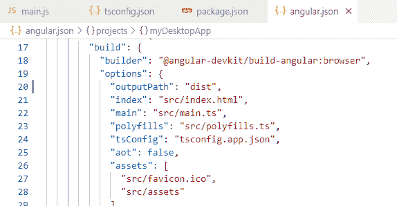](https://res.cloudinary.com/practicaldev/image/fetch/s--H7465gTR--/c_limit%2Cf_auto%2Cfl_progressive%2Cq_auto%2Cw_880/https://thepracticaldev.s3.amazonaws.com/i/22fn7aytr6l5ky2wdc8j.png)T3】

```
Angular.json

"outputPath": "dist",

Package.json
  "main": "main.js", 
  "scripts": {
    "electron": "ng build --base-href ./ && electron .",
    "electron-tsc": "tsc main.ts && ng build --base-href ./ && electron .",

Tsconfig.json
    "target": "es5",

Main.js

const { app, BrowserWindow } = require("electron");
const path  = require("path");
const url   = require("url");

let win;

// Create our App Window
app.on("ready", createWindow);

// Fix for MAC to Quite
app.on("window-all-closed", () => {
    if (process.platform !== "darwin") {
        app.quit();
    }
});

// Focus our Window
app.on("activate", () => {
    if (win === null) {
        createWindow();
    }
});

function createWindow() {
    win = new BrowserWindow({ width: 800, height: 600 });

    // Loading the Dist Folder
    win.loadURL(
        url.format({
        pathname: path.join(__dirname, `/dist/index.html`),
        protocol: "file:",
        slashes: true
        })
    );

    // Open Developer Tools
    win.webContents.openDevTools()

    //On Close Event
    win.on("closed", () => {
        win = null;
    });    
} 
```

Enter fullscreen mode Exit fullscreen mode

[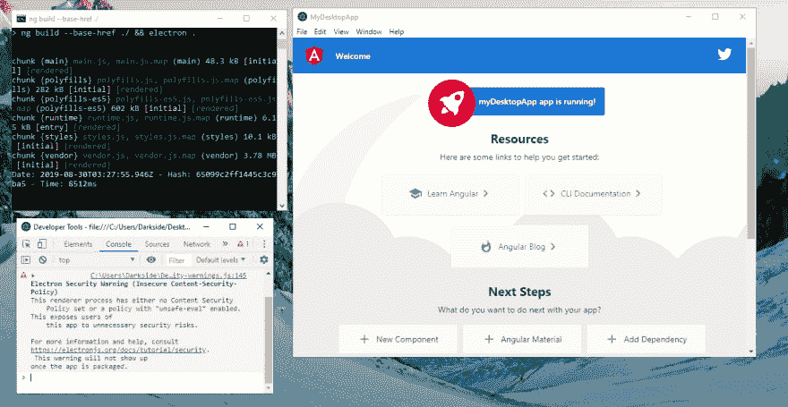](https://res.cloudinary.com/practicaldev/image/fetch/s--n-Kj_sCh--/c_limit%2Cf_auto%2Cfl_progressive%2Cq_auto%2Cw_880/https://thepracticaldev.s3.amazonaws.com/i/142cwh8r971ql6wxv1gd.png)T3】

```
npm install -g electron-builder
npm install electron-builder --save-dev

Now open Package.json
  "scripts": {
    "electron": "ng build --base-href ./ && electron .",
    "electron-tsc": "tsc main.ts && ng build --base-href ./ && electron .",
    "pack": "electron-builder --dir",
    "dist": "electron-builder",
  },
  "build": {
    "appId": "com.noobs.noobapp",
    "win": {
      "target": "nsis"
    }
  }, 
```

Enter fullscreen mode Exit fullscreen mode

然后下面要编译的应用程序

```
Npm run dist 
```

Enter fullscreen mode Exit fullscreen mode

[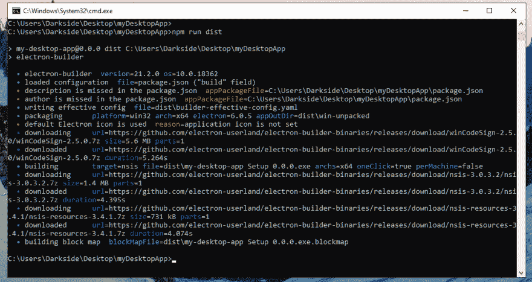](https://res.cloudinary.com/practicaldev/image/fetch/s--YHosq7VY--/c_limit%2Cf_auto%2Cfl_progressive%2Cq_auto%2Cw_880/https://thepracticaldev.s3.amazonaws.com/i/vhxn0wp46w73tg0rtucu.png)

现在打开 dist 文件夹，你会看到一个安装程序我的桌面应用程序安装 0.0.0.exe 和一个 win 解压文件夹

[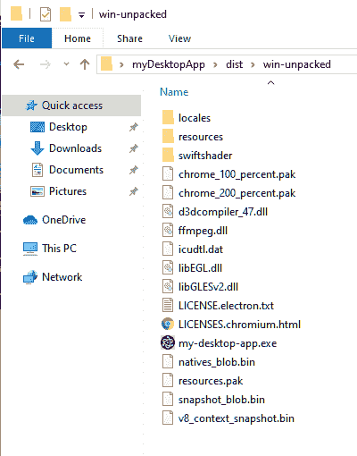](https://res.cloudinary.com/practicaldev/image/fetch/s--eAnOfN4e--/c_limit%2Cf_auto%2Cfl_progressive%2Cq_auto%2Cw_880/https://thepracticaldev.s3.amazonaws.com/i/t79pfvh6tyw0qo28531e.png)

很好，现在你已经有了一个使用 angular 的 MVC 结构的桌面应用程序。享受并获利。它也创建了一个安装程序，它使用 Nullsoft 可脚本化的安装脚本。它是 Nullsoft 为微软开发的一个创作工具。它使用 zlib 许可证，您可以在

[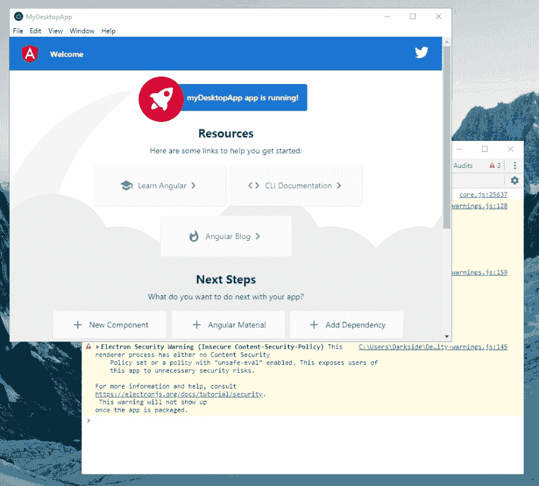](https://res.cloudinary.com/practicaldev/image/fetch/s--7b11AD_8--/c_limit%2Cf_auto%2Cfl_progressive%2Cq_auto%2Cw_880/https://thepracticaldev.s3.amazonaws.com/i/4aquww85unwfs9ee5exa.png)

## [th 3n 00 BC 0d3r](https://github.com/th3n00bc0d3r)/[noob-angular-electron](https://github.com/th3n00bc0d3r/noob-angular-electron)

### 一个有角的 8 和电子样板

<article class="markdown-body entry-content container-lg" itemprop="text">

# Noob 角和电子

角θ和电子的样板

## 环境

角 8 电子 6

## 奔跑

```
git clone repo
npm install

npm run electron //To Run It
npm run dist //To Get Windows Build 
```

</article>

[View on GitHub](https://github.com/th3n00bc0d3r/noob-angular-electron)