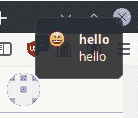

# 使用 Python 的桌面通知

> 原文：<https://dev.to/petercour/desktop-notifications-with-python-3k18>

你不喜欢通知吗？你的电话一直在响。你的桌面一直嗡嗡作响。注意力经济是未来！

让我们让世界变得更美好！更多通知；)

这段代码将使用一个名为“notify-send”的程序，该程序适用于 Linux。对于 Mac 或 Windows，你必须使用另一个程序。

### 通知

您可以像这样向桌面发送通知:

```
notify-send "hello" "hello" -i "face-smile" 
```

是的，从终点站。

[](https://res.cloudinary.com/practicaldev/image/fetch/s--K7UyRL-a--/c_limit%2Cf_auto%2Cfl_progressive%2Cq_auto%2Cw_880/https://thepracticaldev.s3.amazonaws.com/i/u0l4c3p7sr44e6muso1w.png)

然后将终端命令链接到 Python 函数:

```
#!/usr/bin/env python3
#-*- coding: utf-8 -*-

import subprocess

def sendmessage(message):
    subprocess.Popen(['notify-send', message])
    return

def sendmessageicon(message,icon):
    subprocess.Popen(['notify-send', '-i', icon, message])
    return

def sendmessagetitle(message,title):
    subprocess.Popen(['notify-send', title, message])
    return

def msg(message,title,icon):
    subprocess.Popen(['notify-send', title, '-i', icon, message])
    return 
```

方法重载可能更好，但解释一下，这是为了达到目的。将其另存为 message.py

重要通知必须发送:

[](https://res.cloudinary.com/practicaldev/image/fetch/s--Qln7VJVK--/c_limit%2Cf_auto%2Cfl_progressive%2Cq_66%2Cw_880/https://proxy.duckduckgo.com/iu/%3Fu%3Dhttps%253A%252F%252Fmedia.giphy.com%252Fmedia%252F1229mlttgo8aR2%252Fgiphy.gif%26f%3D1)

然后创建一个新文件来加载模块。

```
#!/usr/bin/python3
from message import sendmessage, sendmessageicon, sendmessagetitle, msg

sendmessage("hello you")
sendmessageicon("hello you","face-wink")
sendmessagetitle("message","title") 
msg("message","title","face-angry") 
```

**注意:**

[](https://res.cloudinary.com/practicaldev/image/fetch/s--vcgbBZDo--/c_limit%2Cf_auto%2Cfl_progressive%2Cq_66%2Cw_880/https://proxy.duckduckgo.com/iu/%3Fu%3Dhttps%253A%252F%252Fmedia.giphy.com%252Fmedia%252FxTiTnhMOQ4zE0ukz2U%252Fgiphy.gif%26f%3D1)

### 现状:注意力经济

现在我们的世界充满了通知。为什么不添加一些更有用的东西呢？因为，当然，除了注意力经济，人们没有更好的事情可做:

```
#!/usr/bin/python3
from message import sendmessage, sendmessageicon, sendmessagetitle, msg
import time

sendmessage("hello you")

icons = ['face-angel','face-sad','stock_smiley-13','face-angry','face-sick','stock_smiley-15','face-cool','face-smile-big','stock_smiley-18','face-crying','face-smile','stock_smiley-1','face-devilish','face-smirk','stock_smiley-22','face-embarrassed','face-surprise','stock_smiley-2','face-glasses','face-tired','stock_smiley-3','face-kiss','face-uncertain','stock_smiley-4','face-laugh','face-wink','stock_smiley-5','face-monkey','face-worried','stock_smiley-6','face-plain','stock_smiley-10','stock_smiley-7','face-raspberry','stock_smiley-11','stock_smiley-8']

for icon in icons:
    sendmessageicon("Important: yada yada yada yada yada yada",icon)
    time.sleep(0.5) 
```

未来的版本(Android)也可以在随机的时间间隔内随机发出蜂鸣声。为了使它更完美，它可以作为守护程序/服务运行，所以人们不知道如何关闭它。

啊啊...完美:

[](https://res.cloudinary.com/practicaldev/image/fetch/s--7ijPmB52--/c_limit%2Cf_auto%2Cfl_progressive%2Cq_auto%2Cw_880/https://thepracticaldev.s3.amazonaws.com/i/cq2sj65g6i4vt32mbbiv.png)

阅读更多信息:

*   [https://humanetech.com/](https://humanetech.com/)
*   [https://TechCrunch . com/2017/07/30/the-attention-economy-created-by-silicon-valley-is-banking-us/](https://techcrunch.com/2017/07/30/the-attention-economy-created-by-silicon-valley-is-bankrupting-us/)
*   [https://pythonbasics.org](https://pythonbasics.org)
*   [https://pythonprogramminglanguage.com](https://pythonprogramminglanguage.com)