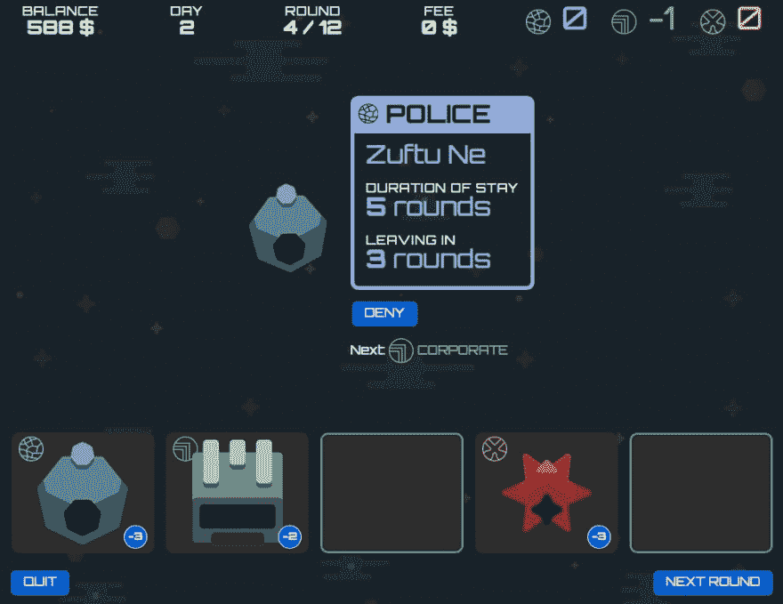
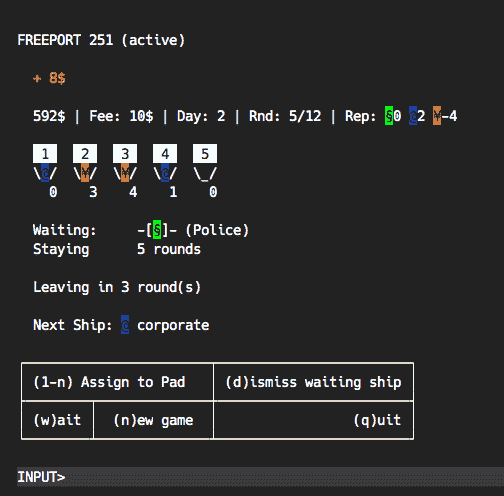

# 开发日志#4:登陆者游戏。暂停一下。

> 原文：<https://dev.to/niorad/dev-log-4-lander-game-putting-it-on-hiatus-1a8o>

我的小登陆游戏将被搁置一段时间。

我喜欢让我的计划和想法短小精悍，但我不知道如何在有限的时间里让它变得有趣。

主要的想法是，玩家将到来的飞船分配到着陆场。有 5 个垫子。每艘船都属于三个部分(警察、公司、黑帮)中的一个。那些分数彼此喜欢、不喜欢或保持中立。当你把两个不喜欢的部分放在一起时，你在那个部分的声誉会受损，反之亦然。更好的声誉意味着从船上赚更多的钱，你需要这些钱来维持港口的运转。

最新的想法是让玩家去发现，哪个分数喜欢/不喜欢哪个分数。另一种方法是将这些关系逐一介绍给玩家。

还会有进一步的影响和事件，如失去游戏，如果每个平台都被暴徒占领。或者从暴徒那里得到额外的钱，如果港口没有警察船的话。

所有这些都已经在游戏中发挥作用了，但玩起来还是不好玩。感觉像是工作，我真的不喜欢玩。

这仍然是一个伟大的方式让我的脚湿了药剂和凤凰，如果有人想看代码，或尝试游戏，请评论！

(它在 GH 上的私人回购中，由核心游戏、游戏的 CLI 和 Phoenix-Web-App(无 JS)组成)

如果你喜欢这个主意，或者有其他让它变得更有趣的想法，就大声说出来。如果你喜欢，也可以随意窃取这个想法。