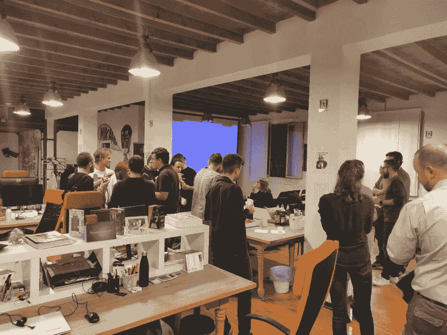
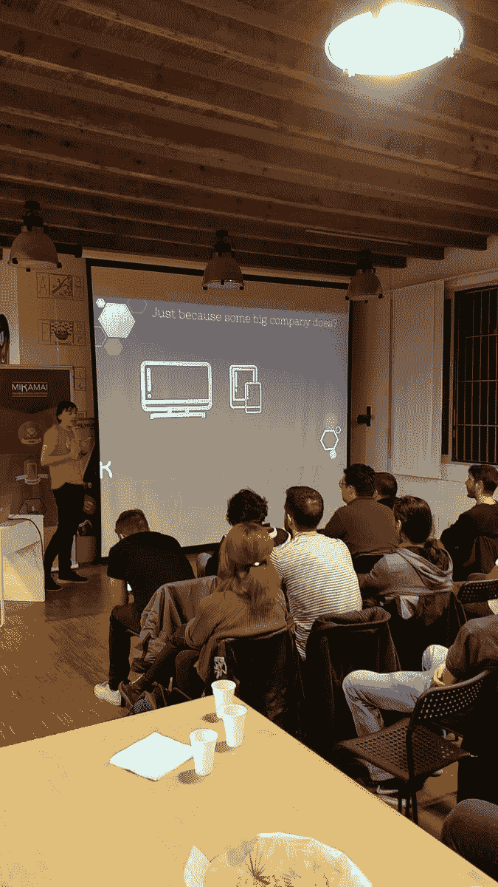
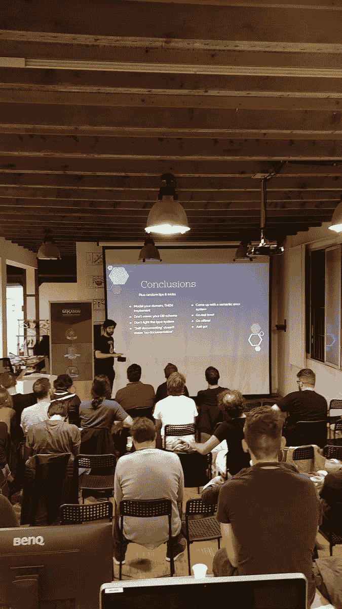

# 戴夫·米兰已经开始了，太棒了！

> 原文：<https://dev.to/mikamai/dev-milan-has-started-and-it-was-awesome-2odf>

9 月 23 日星期一，我们启动了 DEV 社区米兰分会的第一项活动，那真是一场狂欢！🇮🇹

这些年来，我们 Mikamai 在米兰培养并帮助聚集了许多技术社区，我们很高兴自己组织了这次活动，以感谢所有这些了不起的人以及他们每天为将意大利开发者聚集在一起所做的努力。

我们主持了两个讲座(实际上是一个分为两个部分的大型讲座),首先在后端，然后在前端探索 graph QL API 的神奇世界。

## 浩荡的后端

我以后端谈话开始了这个晚上，向新人介绍了 GraphQL 是什么和不是什么，并快速解释了该语言的内部工作原理，然后转向更实用的建议和策略，以实现干净有效的 GraphQL APIs。

我们触及了诸如[类型](https://graphql.org/learn/schema/)和[标量](https://graphql.org/learn/schema/#scalar-types)、数据源、[批量加载](https://www.graphql-java.com/documentation/v12/batching/)和进化模式等主题，并试图给出如何干净有效地解决所有这些问题的可行建议。

参与者非常活跃，并提出了聪明的问题，使整个体验更加包容和愉快！

## 在意大利时，只吃比萨饼🍕

第一次谈完后，该休息了！我们向所有与会者提供了比萨饼、薯条和饮料，并愉快地交流、讨论，总体上玩得很开心。这真的很有趣，我为今晚的结果感到非常自豪。

## 辉煌的前端

然后就到了活动的下半场。我的同事 Mattia Panzeri 是我们最优秀的前端工程师之一，他谈到了现代前端开发的挑战，从多种设备和屏幕分辨率到挑剔的移动网络和语音助手，以及 GraphQL 如何帮助客户根据他们的需求定制 API 请求。他提供了类似和相关技术的例子，如[网飞·法尔科](https://netflix.github.io/falcor/)以及为什么他们不能实现 GraphQL 所做的。

所有这一切都用他机智风趣的风格来解释，使得整个演讲非常轻松愉快。

我们以一个使用 GitLab 的 [GraphQL Explorer](http://gitlab.com/-/graphql-explorer) 展示查询如何在野外工作的现场演示结束了这个晚上，当然，这是一个现场演示，它出现了严重的认证问题，我的笔记本电脑的窗口管理器最终决定它不太喜欢我们的投影仪，但总的来说我们玩得很开心。

我们给每个人发了贴纸，并宣布了这次活动的后续活动，我们绝对想再次举办，可能会定期举办。我们考虑一个月或两个月一次，这取决于发言者是否有空。

我真的要感谢开发团队推出了 [IRL](https://irl.dev) 并支持这类计划。在物流方面仍有工作要做，但最终，活动是成功的，每个人都很享受。

感谢您的阅读，希望下次再见！

你可以在这里找到幻灯片[。](https://docs.google.com/presentation/d/1kl1jhjQJIHDIvTJfUL_GcPrBN7wGdqxiJiqegKZb9q0/edit?usp=sharing)

> 吉安 d[@ fusillicode](https://dev.to/fusillicode)我的伙伴 [@matteojoliveau](https://twitter.com/matteojoliveau) 出席 [@Mikamai](https://twitter.com/Mikamai) 第一届 [#devto](https://twitter.com/hashtag/devto) 🇮🇹见面会！
> 
> 很自豪&很荣幸能够参加他的精彩演讲！🙇2019 年 9 月 23 日下午 17:5635