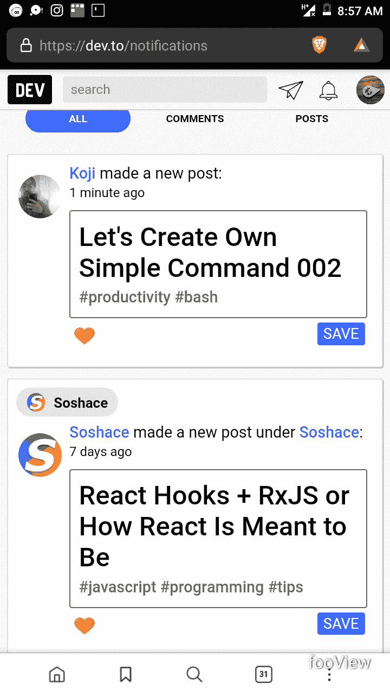
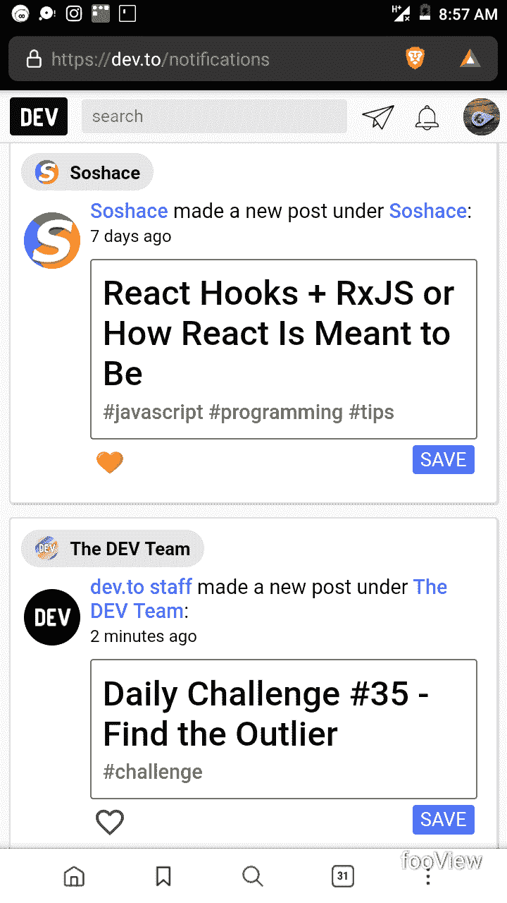

# 开发通知和电报组

> 原文：<https://dev.to/areahints/dev-notifications-and-telegram-group-408n>

所以我注意到一些事情，我的通知不是按时间顺序的。我只检查我的通知的灰色顶部，因为我相信那些是我错过的或者是新的。

我的第一个通知说 1 分钟，然后下一个是 7 天前

然后你可以看到它切换回 2 分钟。我滚动到底部，似乎我的大多数通知都是这样的。

我还以为电报组会分享主网站上的所有帖子？我定期检查频道，但情况似乎并非如此。