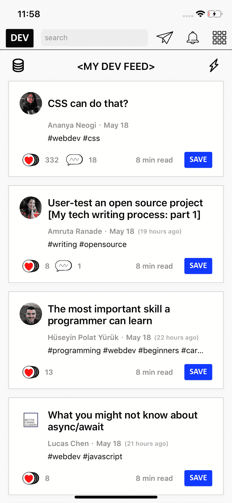

# 构建本地 iOS 应用程序的开发

> 原文：<https://dev.to/hadiidbouk/dev-to-native-ios-application-lde>

大家好，我已经启动了一个项目，为这个网站构建一个本机 iOS 应用程序(正在进行中)，我知道已经有一个 iOS 版本，但它只是一个网络视图。

我非常欢迎反馈和贡献。

🧐，我为什么要建这个？

*   开心
*   与 RxSwift 合作。
*   MVVM +协调员。
*   探索 Dev.to 及其 API
*   依赖注入(Swinject)
*   只有代码-没有故事板🤓

你可以在这里查看代码:[https://github.com/hadiidbouk/DevTo.iOS](https://github.com/hadiidbouk/DevTo.iOS)