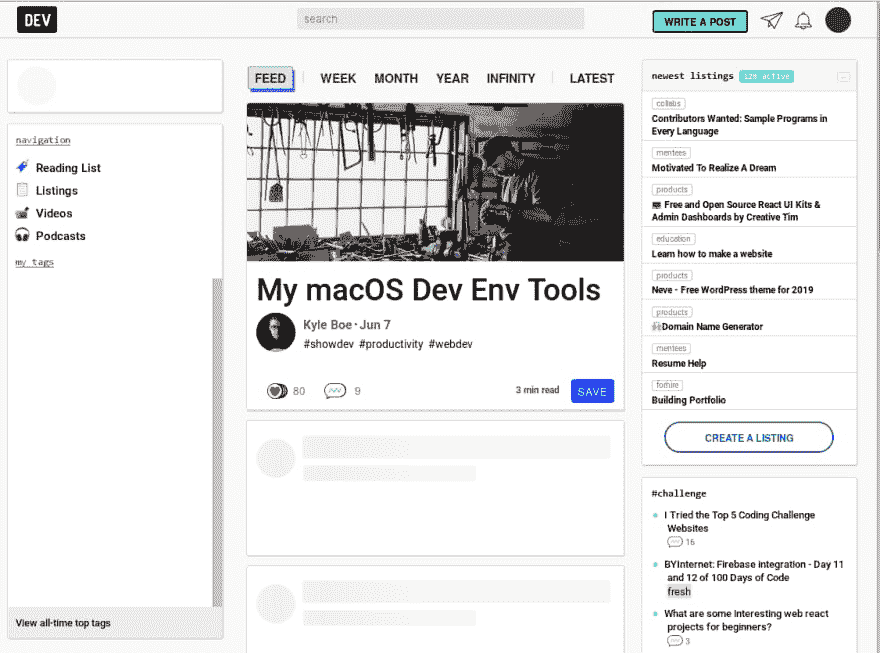

# 开发人员无法在 Firefox 中工作

> 原文：<https://dev.to/choroba/dev-to-not-working-in-firefox-592>

Dev.to 在 Firefox(没错，那是我的默认浏览器)中不再为我工作。仅显示提要中的顶部文章。我的头像没有显示，我的标签没有加载...它始于 Firefox 扩展出现问题的时候，但我并不经常使用它们，而且我怀疑 dev.to 依赖于它们中的任何一个。

它在 Chromium 或 Opera 中运行良好。这对你有用吗？你知道我该怎么解决吗？

