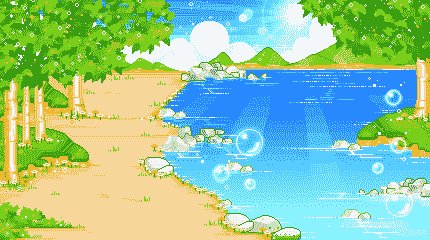
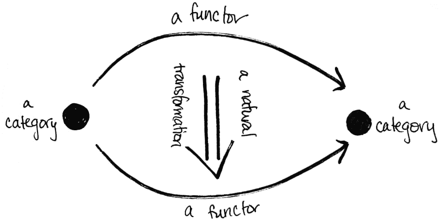

# 开发者聚焦:自学一切。

> 原文：<https://dev.to/katyadee/developer-spotlight-05-teach-yourself-everything-2m93>

阿罗哈，朋友们！今天，我在美丽的瓦胡岛写信，我非常高兴地欢迎大家参加我们的另一期**开发者聚焦**系列！

 
*图片来自 Tumblr*

我们和我最喜欢的社区成员之一“超级胡须”坐在一起。你们中的一些人可能已经知道@superwhiskers 是我们 [Discord](https://repl.it/discord) 服务器的语言学习俱乐部的 golang 老师——但是她*最初*引起我的注意是因为她[的下层主题的 tet chat](https://repl.it/@superwhiskers/undertale-textchat-thing) 。

[@katyadee](https://dev.to/katyadee) :嘿！很高兴你能来。我很了解你，但是让我们先给家里的人介绍一下。

@superwhiskers:你好！我只是一个住在美国的 16 岁的程序员。没什么其他的了。

[@katyadee](https://dev.to/katyadee) :这个我想了很久了……你的用户名背后有什么故事？

@superwhiskers:这只是我旧用户名的一个变形版本。我用了这么久，它有点卡住了。

[@katyadee](https://dev.to/katyadee) :😭我认为这背后有一些很酷的意思！你在学校吗？

@超级胡须:是的。我参加稍微高级一点的课程，比如微积分，但是我觉得很无聊，所以我真的想学的东西都是在我自己的时间里学的。例如，我一直在考虑在校外学习一种叫做范畴理论的东西，因为它更像是大学水平的东西。

[@katyadee](https://dev.to/katyadee) :你觉得学校有什么无聊的地方？还有…什么是[范畴理论](https://en.wikipedia.org/wiki/Category_theory)？

@superwhiskers: IDK，我只是更喜欢自己学习，所以我不会太在意，而是听足够多的信息来学习我需要学习的基础知识，并自己解决剩下的问题。

我真的不能完全解释范畴理论，因为我自己也不完全理解它，而且它还包含了一些在这里解释起来太多的东西。我建议你自己做一些研究来解释它，而不是让我这么做。

[@katyadee](https://dev.to/katyadee) : LOL，好吧。我们来谈谈编程。

你是怎么进入编码行业的？你编码多久了？

@superwhiskers:我已经认真编程一年多了，但我做编程的时间比这更长(大约 5 年左右)，但没有什么值得注意的东西。

[@katyadee](https://dev.to/katyadee) :你说你‘认真编程’一年多是什么意思？什么变了？

@superwhiskers:我开始更好地理解基础知识，并且非常非常擅长用 golang 编程。与一年前相比，这是一个很大的进步。

[@katyadee](https://dev.to/katyadee) :你的 golang 还不错。你实际上领导着 golang LLC 集团。你就是自学的？

@superwhiskers:刚学的。当我在学校无聊的时候，我倾向于阅读文档和其他东西，所以我想我只是被动地吸收信息并将其付诸使用。Go 也是一种非常简单的语言。这方面没什么可学的，所以当你学习基本概念时，你几乎就知道了整个语言。

[@katyadee](https://dev.to/katyadee) :我能说什么呢，我还是印象深刻。你怎么找到 Repl.it 的？

@superwhiskers:我想我只是在寻找可以用来在线写代码的东西，我找到了 _(ツ)_/

[@katyadee](https://dev.to/katyadee) : Aw。没有故事，你真的不记得了？

@superwhiskers:其实没什么真正有意思的，只是发现了一下就决定用了:)

[@katyadee](https://dev.to/katyadee) :好的。好的。我想我总是希望人们有这些很酷的故事。但通常情况下，我们只是满足他们需求的最佳 IDE，哈哈。

你最喜欢用什么语言编写代码，为什么？

@superwhiskers:我真的没有“最喜欢的语言”,但我有点喜欢 C，因为它给了你大量的控制，同时对于大型的东西来说仍然很实用(不像汇编)。

[@katyadee](https://dev.to/katyadee) : C 挺难的吧？实际上，我不太了解它。你用 C 语言创作过什么样的东西？

@superwhiskers:不是很难(至少对我来说)。只是真的很罗嗦。我做的不多，但我做了 meme 和 port crunch，并在其中编写了一个问题函数，作为将一个函数移植到每种语言的项目的一部分。(此处见

根据我对你和你的项目的了解，你给我的印象是超级能干和积极主动。在编程时，有哪一次你感觉受到了真正的挑战，你是如何克服的？

@superwhiskers:我觉得找到真正做事情的动力真的很难。在编程的过程中，我并没有发现太多具有挑战性的事情，但是我绝对不喜欢一开始就有动力去做一些事情。

我通常会通过寻找其他有趣的事情来克服它，然后回来，而不是不停地做一个又一个项目，而不做其他事情来防止自己疲劳。

你认为什么能激励你？

@superwhiskers:其他想用我做的东西的人做得很好。

[@katyadee](https://dev.to/katyadee) :我喜欢。我想我对自己创造的东西也是如此。

你对未来有什么计划？你想从事科技行业吗？如果有，是哪种？

@superwhiskers:我打算找一些与编程相关的工作，但我真的不知道在哪里:/

[@katyadee](https://dev.to/katyadee) :这种事情很难说，我觉得。你永远不知道你会在哪里结束！然而，你梦想的工作是什么？

@superwhiskers:我真的没有，我只是想能够享受我所做的事情

你比我在你这个年纪的时候实际多了。我想我的回答是“成为一名漫画家”，我对这意味着什么以及我想在哪里工作有一个非常狭隘的想法。把实现作为目标…就好像你是 30 岁，而不是 16 岁！

在 Repl.it 上或之外，你最喜欢的东西是什么？

@superwhiskers:嗯，我有一个不错的缓冲库，我最近一直在做这个库，它使用了一系列叫做 crunch 的优化技术。这可能是我做得最好的图书馆，但我认为它可以做得更好。这就是了。

[@katyadee](https://dev.to/katyadee) :你能给可能不知道的人解释一下什么是缓冲库吗？

@superwhiskers:基本上就是内存中存储数据的一个区域。crunch 实际上使用了一个数组，(数组可以被认为是一个缓冲区，因为它只是数据)并在您对它执行操作时编辑它。

[@katyadee](https://dev.to/katyadee) :你在 Repl.it 上建立的最喜欢的东西是什么？

@superwhiskers:当我离开我的开发设置时，我倾向于使用 Repl.it 来获得更小的代码片段，但我确实有那个人们似乎很喜欢的东西。

@katyadee :我也很喜欢那部。背后有什么故事？

@superwhiskers:只是我在学校无聊的时候写的一个简单的聊天应用。除了“这是一次聊天，所有的文本框看起来都没有标签”之外，这背后没有太多的故事

[@katyadee](https://dev.to/katyadee) :你会给刚开始编程的人什么建议？

@superwhiskers:按照自己的节奏学习比让别人决定你如何学习效果更好。或者至少我是这样发现它对我有用的。

你就像一个活广告，宣传为什么孩子们应该辍学，成为自学者。我希望你知道！

你有什么科技英雄吗？他们是谁？为什么？

@superwhiskers:不尽然。我明白有一个你崇拜的人来激励你的意义，但是我真的找不到任何能激励我的人。当你意识到没有人是完美的时候，崇拜某人只会让你失望。

@katyadee :这个问题的答案真有趣...我有点喜欢它。如果不是某个人，是什么激励了你？

@superwhiskers:看着别人做的东西，看着我如何改进它们，我受到了启发。