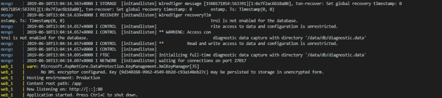
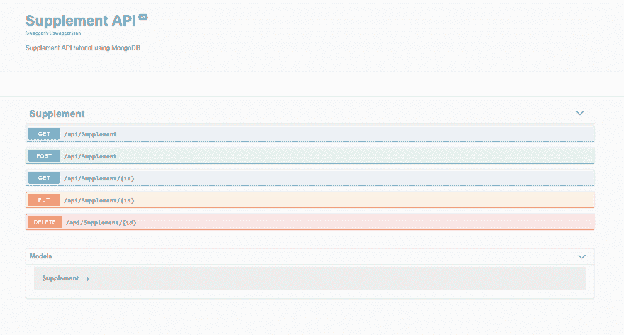

# 用 ASP.NET 核心，MongoDB Docker，Swagger 开发一个 CRUDAPI。

> 原文：<https://dev.to/etnicholson/developing-a-crudapi-with-asp-net-core-mongodb-docker-swagger-cf4>

使用 MongoDB 和 Dotnet core 从未如此简单。Docker 通过消除在本地机器上安装 MongoDB 的需要，使得这个过程更加容易。对于这个例子，我们将创建一个补充商店 CRUD API。

## 先决条件

我想你见过。NET Core 2.2 已安装并对接。我用 Visual Studio 代码编写了这个 API。

## 创建项目

转到您选择的文件夹，在命令行上键入

```
dotnet new webapi -n SupplementCRUDAPI 
```

Enter fullscreen mode Exit fullscreen mode

在 visual studio 代码和终端上打开项目。让我们安装项目所需的所有依赖项。

```
dotnet add package MongoDB.Driver --version 2.8.1
dotnet add package Swashbuckle.AspNetCore --version 4.0.1 
```

Enter fullscreen mode Exit fullscreen mode

## 创建补充类和服务

用下面的代码
创建一个名为 Supplement 的模型文件夹和类

```
using MongoDB.Bson;
using MongoDB.Bson.Serialization.Attributes;

namespace SupplementCRUDAPI.Models
{
    public class Supplement
    {
        [BsonId]
        [BsonRepresentation(BsonType.ObjectId)]
        public string Id { get; set; }

        [BsonElement("Name")]
        public string SupplementName { get; set; }

        [BsonElement("Price")]
        public decimal Price { get; set; }

        [BsonElement("Size")]
        public string Size { get; set; }

        [BsonElement("Type")]
        public string Type { get; set; }

        [BsonElement("Brand")]
        public string Brand { get; set; }
    }
} 
```

Enter fullscreen mode Exit fullscreen mode

## 修改 appsettings.json

```
{
  "ConnectionStrings": {
    "SupplementDB": "mongodb://mongo:27017"
  },
  "Logging": {
    "LogLevel": {
      "Default": "Warning"
    }
  },
  "AllowedHosts": "*"
} 
```

Enter fullscreen mode Exit fullscreen mode

用下面的代码
创建一个名为 SupplementService 的服务文件夹和类

```
using Microsoft.Extensions.Configuration;
using MongoDB.Driver;
using SupplementCRUDAPI.Models;
using System;
using System.Collections.Generic;
using System.Linq;
using System.Threading.Tasks;

namespace SupplementCRUDAPI.Services
{
    public class SupplementService
    {
        private readonly IMongoCollection<Supplement> _supplement;

        public SupplementService(IConfiguration config)
        {
            // Connects to MongoDB.
            var client = new MongoClient(config.GetConnectionString("SupplementDB"));
            // Gets the supplementDB.
            var database = client.GetDatabase("SupplementDB");
            //Fetches the supplement collection.
            _supplement = database.GetCollection<Supplement>("Supplements");
        }

        public async Task<List<Supplement>> Get()
        {
            //Gets all supplements. 
            return await _supplement.Find(s => true).ToListAsync();
        }

        public async Task<Supplement> Get(string id)
        {
            //Get a single supplement. 
            return await _supplement.Find(s => s.Id == id).FirstOrDefaultAsync();
        }

        public async Task<Supplement> Create(Supplement s)
        {
            //Create a supplement.
            await _supplement.InsertOneAsync(s);
            return s;
        }

        public async Task<Supplement> Update(string id, Supplement s)
        {
            // Updates and existing supplement. 
             await _supplement.ReplaceOneAsync(su => su.Id == id, s);
             return s;
        }

        public async Task Remove(string id)
        {
            //Removes a supplement.
            await _supplement.DeleteOneAsync(su => su.Id == id);
        }

    }
} 
```

Enter fullscreen mode Exit fullscreen mode

## 修改启动

让我们更新 Startup.cs 来添加我们的服务和 Swagger 配置。在 ConfigureServices 上，添加以下几行。

```
 services.AddScoped<SupplementService>();

            services.AddSwaggerGen(c =>
            {
                c.SwaggerDoc("v1", new Info
                {
                    Title = "Supplement API",
                    Version = "v1",
                    Description = "Supplement API tutorial using MongoDB",
                });
            }); 
```

Enter fullscreen mode Exit fullscreen mode

在 Configure 上，添加以下几行。

```
 app.UseSwagger();
            app.UseSwaggerUI(c =>
            {
                c.SwaggerEndpoint("/swagger/v1/swagger.json", "My Supplement V1");
            }); 
```

Enter fullscreen mode Exit fullscreen mode

## 创建补充控制器

现在在 controllers 文件夹中，用下面的代码创建一个新的类 SupplementController。

```
using System;
using System.Collections.Generic;
using System.Linq;
using System.Threading.Tasks;
using Microsoft.AspNetCore.Http;
using Microsoft.AspNetCore.Mvc;
using SupplementCRUDAPI.Models;
using SupplementCRUDAPI.Services;

namespace SupplementCRUDAPI.Controllers
{
    [Route("api/[controller]")]
    [ApiController]
    public class SupplementController : ControllerBase
    {
        private readonly SupplementService _supplementService;

        public SupplementController(SupplementService supplementService)
        {
            _supplementService = supplementService;
        }
        // GET: api/Supplement
        [HttpGet]
        public async Task<ActionResult<List<Supplement>>> Get()
        {
            return await _supplementService.Get();
        }

        // GET: api/Supplement/5
        [HttpGet("{id}", Name = "Get")]
        public async Task<ActionResult<Supplement>> Get(string id)
        {
            var s = await _supplementService.Get(id);
            if(s == null)
            {
                return NotFound();
            }

            return s;
        }

        // POST: api/Supplement
        [HttpPost]
        public async Task<ActionResult<Supplement>> Create([FromBody] Supplement s)
        {
            await _supplementService.Create(s);
            return CreatedAtRoute("Get", new { id = s.Id.ToString() }, s);

        }

        // PUT: api/Supplement/5
        [HttpPut("{id}")]
        public  async Task<ActionResult<Supplement>> Put(string id, [FromBody] Supplement su)
        {
            var s = await _supplementService.Get(id);
            if (s == null)
            {
                return NotFound();
            }
            su.Id = s.Id;

            await _supplementService.Update(id, su);
            return CreatedAtRoute("Get", new { id = su.Id.ToString() }, su);
        }

        // DELETE: api/Supplement/5
        [HttpDelete("{id}")]
        public async Task<ActionResult<Supplement>> Delete(string id)
        {
            var s = await _supplementService.Get(id);
            if (s == null)
            {
                return NotFound();
            }

            return NoContent();

        }
    }
} 
```

Enter fullscreen mode Exit fullscreen mode

## Docker 文件

首先，让我们在主文件夹中创建一个名为 Dockerfile 的文件。这个文件用于创建一个 docker 映像来运行我们的项目。

```
 FROM microsoft/dotnet:sdk AS build-env
WORKDIR /app

# Copy csproj and restore as distinct layers
COPY *.csproj ./
RUN dotnet restore

# Copy everything else and build
COPY . ./
RUN dotnet publish -c Release -o out

# Build runtime image
FROM microsoft/dotnet:aspnetcore-runtime
WORKDIR /app
COPY --from=build-env /app/out .
ENTRYPOINT ["dotnet", "SupplementCRUDAPI.dll"] 
```

Enter fullscreen mode Exit fullscreen mode

在同一个文件夹中，创建一个名为 docker-compose.yml 的文件。

```
version: '3.1'

services:

  mongo:
    container_name: mongo
    image: mongo
    restart: always
    volumes:
      - ${WEBAPP_STORAGE_HOME}/site:/data/db
      #- ./data:/data/db
    ports:
      - "27017:27017"

  web:
        build: .
        ports:
            - "8000:80"
            - "44348:443"
        depends_on:
            - mongo
        volumes:
            - ${HOME}/.microsoft/usersecrets/:/root/.microsoft/usersecrets
            - ${HOME}/.aspnet/https:/root/.aspnet/https/
        links:
          - mongo 
```

Enter fullscreen mode Exit fullscreen mode

## 运行 API

我们终于准备好看到 API 工作了。首先，让我们在终端上运行以下命令。

```
docker-compose build
docker-compose up 
```

Enter fullscreen mode Exit fullscreen mode

如果一切正常，我们应该会看到下面几行。
[T3】](https://res.cloudinary.com/practicaldev/image/fetch/s--B8qqDrkc--/c_limit%2Cf_auto%2Cfl_progressive%2Cq_auto%2Cw_880/https://i.imgur.com/MaFWlyj.png)

## 使用 Swagger 与 API 进行交互

Swagger 是可视化和测试我们的 API 的一个很好的工具。
让我们导航到[http://localhost:8000/swagger/index . html](http://localhost:8000/swagger/index.html)

[](https://res.cloudinary.com/practicaldev/image/fetch/s--UZfluEJJ--/c_limit%2Cf_auto%2Cfl_progressive%2Cq_auto%2Cw_880/https://i.imgur.com/uPZnUSF.png)

让我们发布一个 API 的补充。

[](https://res.cloudinary.com/practicaldev/image/fetch/s--tcZwnDof--/c_limit%2Cf_auto%2Cfl_progressive%2Cq_auto%2Cw_880/https://i.imgur.com/JPVPeEi.png)

## 结论

我希望你喜欢这个教程。这是项目资源库的链接。
[https://github.com/etnicholson/SupplementAPIAspCoreMongoDB](https://github.com/etnicholson/SupplementAPIAspCoreMongoDB)