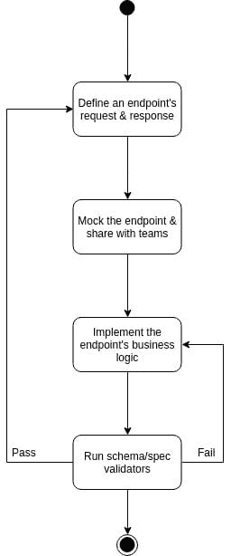

# 基于 OpenAPI 规范开发 API

> 原文：<https://dev.to/buildly/developing-apis-based-on-openapi-specification-2knl>

API 已经存在很长时间了，它将不同的逻辑单元连接在一起，但是在过去它们并没有被很多人使用。如今，API 不再局限于应用程序的后端，而是更多地由消费者驱动。API 的世界通常是一个标准、利益和安排相互竞争的世界。标准有助于提供一个通用的交流和开发框架，并让我们根据特定的需求选择正确的工具。

## 什么是 OpenAPI？

我非常喜欢 OpenAPI 网站上的解释:“OpenAPI 规范(OAS)为 RESTful APIs 定义了一个标准的、语言不可知的接口，它允许人类和计算机在不访问源代码、文档或通过网络流量检查的情况下发现和理解服务的功能。”。[1]
总而言之，OpenAPI 规范是一个为 REST APIs 生成机器可读文档的解决方案。

## 基于 OpenAPI 规范开发 API

作为测试驱动开发(TDD ),它结合了测试优先开发，即在编写解决方案代码以完成测试和重构之前先编写测试，我们也可以在开始编码和重构之前使用 OpenAPI 框架指定 API 的端点。因此，在开始构建 API 的业务逻辑、测试它或任何其他生命周期之前，我们创建 API 的接口，指定端点将显示的准确请求和响应。
[T3】](https://res.cloudinary.com/practicaldev/image/fetch/s--Pzaa1Sw2--/c_limit%2Cf_auto%2Cfl_progressive%2Cq_auto%2Cw_880/https://thepracticaldev.s3.amazonaws.com/i/0vove5f87li0ka623rx6.jpeg)

## 为什么要 OpenAPI 规范驱动开发？

基于 OpenAPI 规范开发 API 的一个显著优点是，它支持团队之间的独立性，例如，前端、后端和 QA 工程师知道 API 应该如何工作，所以他们都在上面保持一致。消除这些依赖性也将加速发布过程，因为不同的团队可以以更快的速度完成他们的任务。使用这种方法的另一个优势是开发人员体验的改善。开发者体验是关于交付稳定、快速、视觉直观的健壮功能。[2]如果你在考虑它如何改善开发人员的体验，你只需要记住，开发人员会使用你的 API，拥有一个良好定义/文档化的 API 会对它产生很大的影响。你可以事先关注 API 消费者的需求。

## 结论

正如我在开始时所说的，API 在过去并不意味着被很多人使用，但是现在，它们不再局限于应用程序的后端，而是更多地由消费者驱动。因此，我们需要人们理解 API 是做什么的，这就是消费者驱动的 API 观点迅速流行的原因，OpenAPI 规范帮助我们构建 API，同时通过定义驱动的方法保证良好的开发人员体验。

## 引用

1-[https://swagger.io/specification/](https://swagger.io/specification/)
2-[https://hacker noon . com/developer-experience-dx-devs-are-people-too-6590d 6577 AFE](https://hackernoon.com/developer-experience-dx-devs-are-people-too-6590d6577afe)