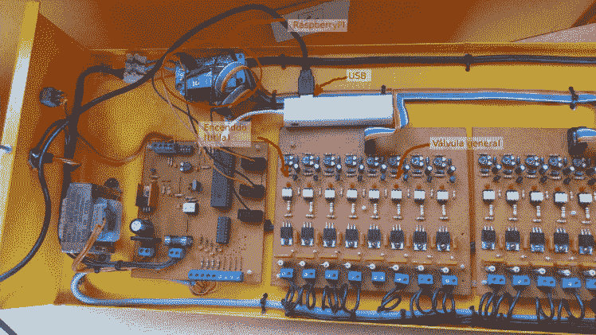
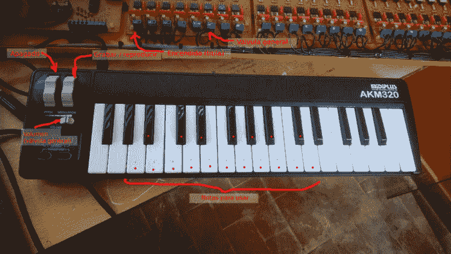
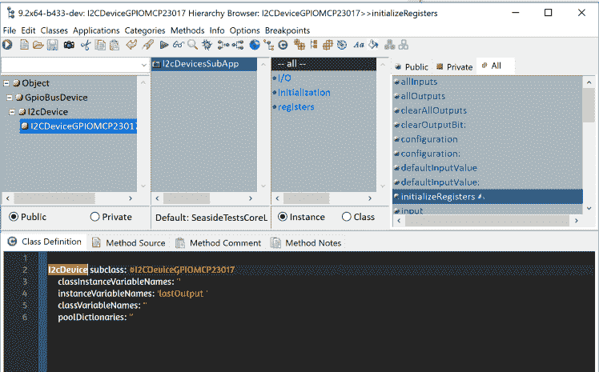
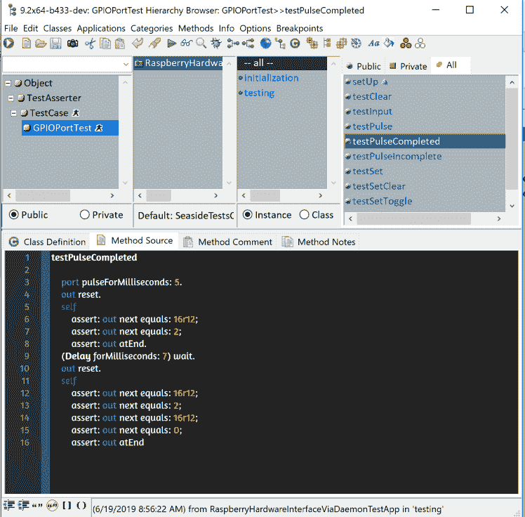
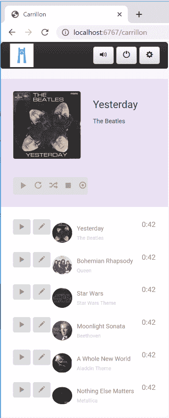

# 用树莓派和 DIY LEDs 钢琴开发、测试和模仿世界上最大的 MIDI 乐器

> 原文：<https://dev.to/martinezpeck/developing-testing-and-mocking-the-largest-midi-instrument-of-the-world-with-a-raspberry-pi-and-a-diy-leds-piano-7el>

## 

“El Carrillón”是一座钟楼，位于阿根廷布宜诺斯艾利斯的埃斯科瓦尔。在那里，每年都会举行一场盛大的活动:

[](https://res.cloudinary.com/practicaldev/image/fetch/s--mfbtBwqP--/c_limit%2Cf_auto%2Cfl_progressive%2Cq_auto%2Cw_880/https://marianopeck.files.wordpress.com/2019/06/2019-05-27-2.jpg%3Fw%3D748)

有 18 个气动铃，由一个 Raspberry Pi Zero 使用两个 [IO Pi Zero 板](https://www.abelectronics.co.uk/p/71/io-pi-zero)和一个由三端双向可控硅开关组成的驱动模块控制。每个 IO 扩展器为我们提供 16 个 GPIOs，总共 24 个通道。有一个 MIDI 键盘连接到设置，所以他们可以现场演奏，也可以录制歌曲。

Raspberry Pi 的设置只有两年的历史，在此之前，自动化是由几个 PIC 处理器驱动的，只能播放一首歌:“艾耶尔”(西班牙语中的“昨天”)，正如存储芯片中的标签所宣传的那样。改造仪器的第一步是使用圆周率和一些 python，但真正的时刻已经到来，所以，python 不要害羞，让开，Smalltalk 即将到来。

每个铃都与一个给定的音符相关联。因此，您可以在 Pi 上播放任何 MIDI 文件，歌曲的音符实际上会映射到调好的铃声上。当然，有些 MIDIs 在演奏时可能听起来不太好，例如，如果它们使用了 18 个以上的可用音符，或者如果它们使用和弦或演奏太快。所以…有些 MIDIs 听起来比其他的好。但是这超出了本文的范围。

[](https://res.cloudinary.com/practicaldev/image/fetch/s--VrcaUi1f--/c_limit%2Cf_auto%2Cfl_progressive%2Cq_auto%2Cw_880/https://marianopeck.files.wordpress.com/2019/06/pi-controller.jpg%3Fw%3D748)

[](https://res.cloudinary.com/practicaldev/image/fetch/s--hxycF4-h--/c_limit%2Cf_auto%2Cfl_progressive%2Cq_auto%2Cw_880/https://marianopeck.files.wordpress.com/2019/06/keyboard-controller.jpg%3Fw%3D748)

所有这些设置以及代码(Github 中提供的开源和[)都是由我的朋友 Gera Richarte 开发的，所以所有的荣誉都归于他。原代码 100%用 Python。](http://github.com/gerasdf/carrillon)

今年，Gera 想要提供一个 web 界面(也运行在 Pi Zero！！！)以便您可以选择播放、停止、暂停和执行一些管理任务。当我用 IoT 和 [VASmalltalk](https://www.instantiations.com/products/vasmalltalk/index.html) 做大量实验时，我加入了他，这样两者就可以一起:

*   将 MIDI 部分(至少部分)迁移到 Smalltalk。
*   Smalltalk 中的代码通过 I2C 与 MCP23017 芯片(IO Pi Zero hats)的接口。
*   在 Smalltalk 中创建一个要在 Pi 中运行的 web 界面

## Smalltalk，请开始说 MIDI！

我们需要做的第一件事是能够“读取”正在运行的 MIDI 歌曲的 MIDI 事件。为此，我们依赖于一些 Python 工具，并在 Smalltalk 中创建了一个简单的`midi2tcp`脚本和一个 TCP 客户端。Python 使用`rtmidi`监听 MIDI 事件，并将它们转发给 Smalltalk 中运行的 TCP 端点。

即使这对我们的需求来说已经足够了，Gera 还用 Python 编写了一个`tcp2midi`，这样我们也可以从 Smalltalk 向 Python 反馈 MIDI 事件，并做类似于
的事情

```
exampleProxyChorder
    "
      self exampleProxyChorder
    "
    | in out evt |
    in := MidiInput localProxy.
    out := MidiOutput localProxy.
    [[true] whileTrue: [
        evt := in nextEvent.
        out nextEventPut: evt.
        (evt isNoteOn | evt isNoteOff) ifTrue: [ 
            evt note: evt note + 4.
            out nextEventPut: evt.
            evt note: evt note + 3.
            out nextEventPut: evt.]
    ]] forkAt: Processor userBackgroundPriority 
```

Enter fullscreen mode Exit fullscreen mode

下面你可以看到一个[关于它的精彩视频](https://www.youtube.com/watch?v=IIjqkqi6X-Q&feature=youtu.be):

液体错误:内部

通过这一步，我们能够开始在 Smalltalk 上获取 MIDI 事件。你可以在这里找到这个 MIDI 代码。

## 编写一个 Smalltalk 接口给 MCP23017 (IO 扩展器)

在之前的帖子中，你可以看到如何[开始使用 Smalltalk 和 Raspberry Pi](https://dev.to/martinezpeck/getting-started-with-raspberry-pi-and-smalltalk-47oa) 以及[如何使用 gpio 和 pigpio 包装器](https://dev.to/martinezpeck/accessing-raspberry-pi-gpios-with-smalltalk-4blh)。

IO 扩展器由支持 I2C 和 SPI 协议的 MCP23017 芯片组成。我们使用了 I2C，因此我们创建了一个类`I2CDeviceGPIOMCP23017`和`I2cDevice`的子类。

[](https://res.cloudinary.com/practicaldev/image/fetch/s--D3bhT9ns--/c_limit%2Cf_auto%2Cfl_progressive%2Cq_auto%2Cw_880/https://marianopeck.files.wordpress.com/2019/06/screen-shot-2019-06-29-at-12.39.00-am.png%3Fw%3D748)

但这还不是全部……最令人惊奇的部分是 Gera 在没有任何 Pi 的情况下在 Linux 桌面上编写了所有这些代码。他用一种有趣的嘲讽技巧编写了所有的单元测试(另一个帖子！).你猜怎么着？当我们试用 Pi 时，整个`I2CDeviceGPIOMCP23017`运行得非常完美。

[](https://res.cloudinary.com/practicaldev/image/fetch/s--UbTFG0TA--/c_limit%2Cf_auto%2Cfl_progressive%2Cq_auto%2Cw_880/https://marianopeck.files.wordpress.com/2019/06/screen-shot-2019-06-29-at-12.40.38-am.png%3Fw%3D748)

最终他尝试了 Pi。但不是他的。我的。远程的。从 10 公里外。这要归功于 pigpio 通过守护进程远程工作的能力。详情见本帖。

液体错误:内部

因此…在这一步之后，我们能够通过 Smalltalk 的 I2C 使用我们的 IO 扩展器。

## Carrillón Web 界面

这是我参与最多的部分。这是一个简单的服务器端渲染应用程序，使用了 Seaside 和 Bootstrap 框架。所有请求都是 AJAX。然后，应用程序为部署做好准备，并在 Pi Zero 上无头运行。

这是它目前的样子:

[](https://res.cloudinary.com/practicaldev/image/fetch/s--MydsKs-M--/c_limit%2Cf_auto%2Cfl_progressive%2Cq_auto%2Cw_880/https://marianopeck.files.wordpress.com/2019/06/screen-shot-2019-06-28-at-11.22.21-pm.png%3Fw%3D330%26h%3D816)

代码非常简单。我们播放一首歌要做的就是分叉一个 OS 进程，执行 Unix 命令`aplaymidi`。比如:

```
aplaymidi --port 128:0 "$CARRILLON\_GIT\_ROOT/web/files/Metallica - Nothing Else Matters.mid"` 
```

Enter fullscreen mode Exit fullscreen mode

然后，停止按钮执行`kill -SIGTERM XXXX`，暂停按钮执行`kill -SIGSTOP`，恢复按钮执行`kill -SIGCONT`。

## 把所有的碎片放在一起

我们有一个可以开始播放 MIDI 歌曲的网络界面。我们有一个 Python `midi2tcp`来处理 MIDI 音符，并通过 TCP 将它们发送到 Smalltalk 中的服务器。MIDI 音符然后被映射到具体的 gpio(代表一个特定的铃),我们使这些 gpio 产生脉冲，最终击中物理铃。

## 用 DIY led 钢琴进行测试

到目前为止一切都很好。但是，我们如何在不去那里用物理铃测试的情况下进行测试呢？嗯……我们可以将正在处理的 MIDI 音符以及正在激活的 GPIO 编号打印到控制台中。但是说真的，这有意思吗？不要！

因此，我建造了一架 16 个 led 的钢琴。我给每个 led 分配了正确的音符，完全按照它们在“El Carrillon”中的顺序。现场观看钢琴:

液体错误:内部

当然，我们不仅可以从我们的网络控制台上玩，我还可以用虚拟键盘播放任何歌曲哈哈:

液体错误:内部

仅此而已！希望你喜欢。