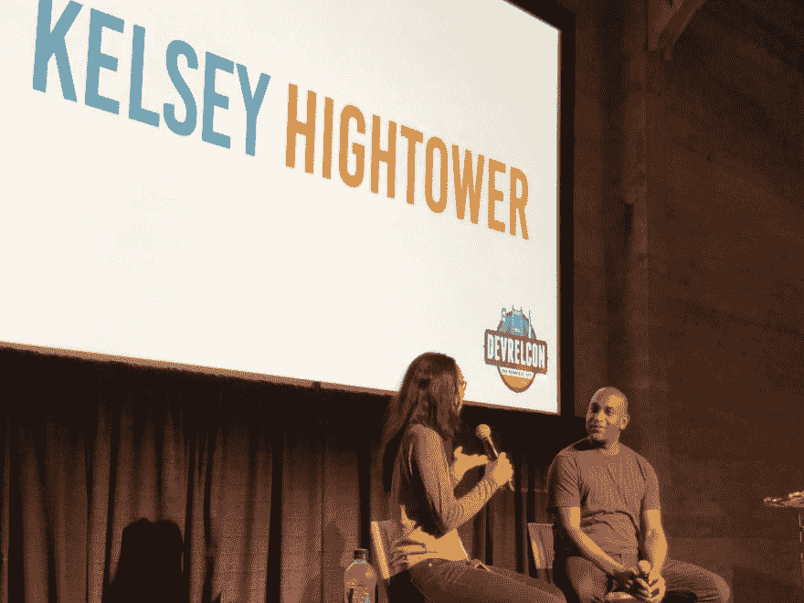
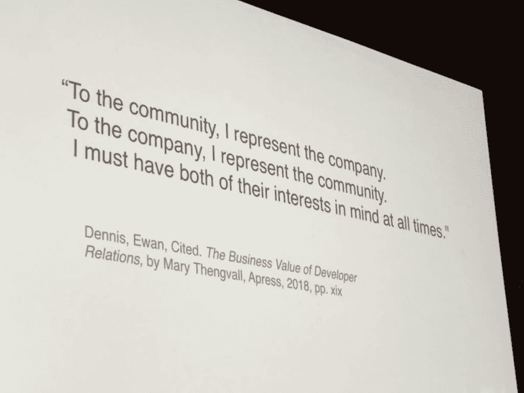
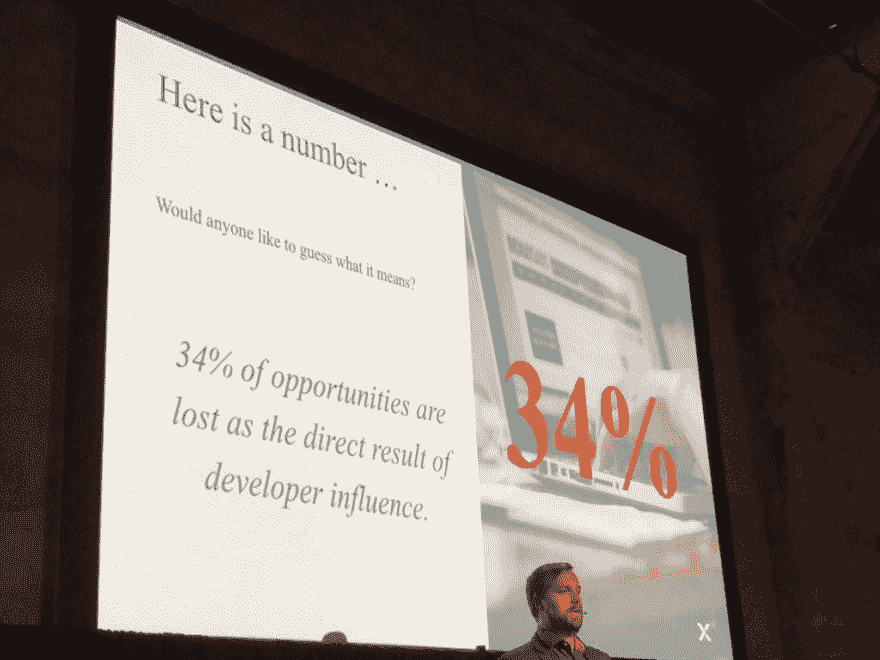
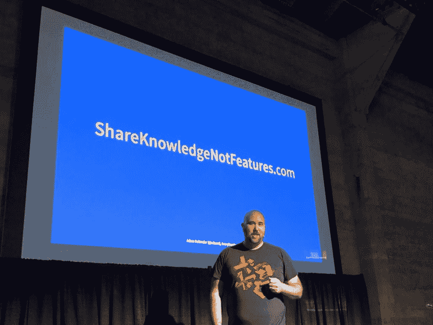
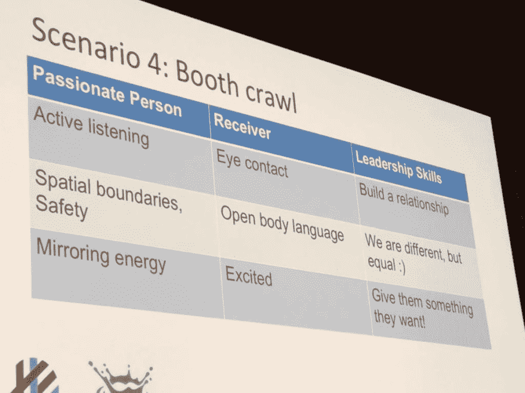
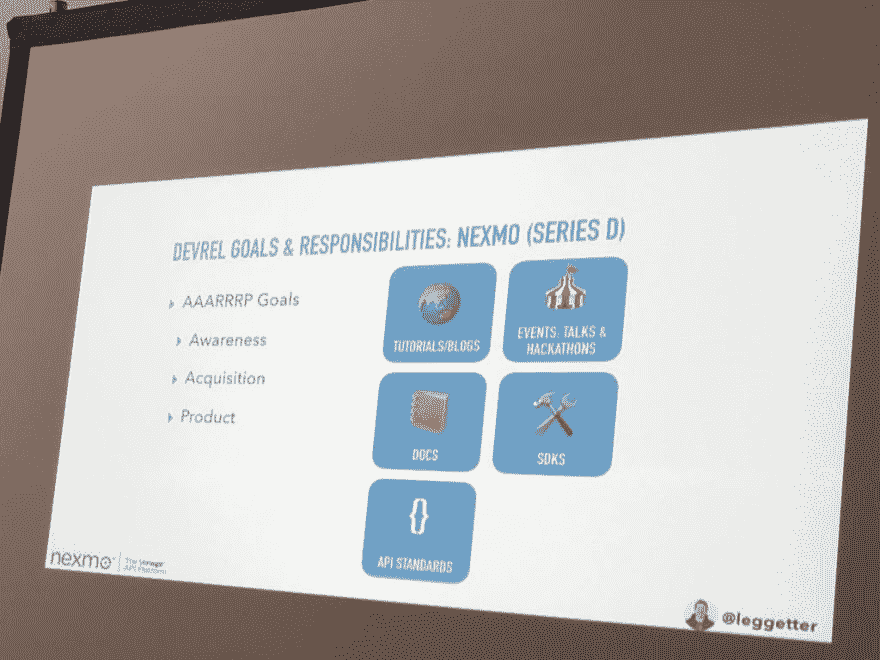

# DevRelCon SF 2019 10 张图

> 原文：<https://dev.to/maxkatz/devrelcon-sf-2019-in-10-pictures-2onf>

<figure> 

<figcaption id="caption-attachment-10474">史蒂夫·普斯特里(CrunchyData)正在展示如何更好地处理开发者关系</figcaption>

</figure>

<figure> 

<figcaption id="caption-attachment-10472">凯尔西·海塔尔(Google)分享他的开发者关系经历</figcaption>

</figure>

<figure> 

<figcaption id="caption-attachment-10471">凯蒂·佩恩(Twitch)正在分享新的开发者营销方式</figcaption>

</figure>

<figure>

<figcaption id="caption-attachment-10475">Ana Bahr(Target)分享了 Mary Thengvall</figcaption>

</figure>

所著的《开发者关系的商业价值》一书中最著名的一段话

<figure> 

<figcaption id="caption-attachment-10466">开发者有今天的影响力，而且只会越来越大</figcaption>

</figure>

<figure> 

<figcaption id="caption-attachment-10468">亚当·迪万德(EveryDeveloper)展示了我最喜欢的一个开发者关系概念</figcaption>

</figure>

<figure> 

<figcaption id="caption-attachment-10470">如何在会议展台上分享知识。由 Tamao Nakahara (Weaveworks)、Baruch Sadogursky (JFrog)</figcaption>

</figure>

所作的角色扮演演讲

<figure>

<figcaption id="caption-attachment-10467">Avital Tzubeli(Kaltura)展示了一个很棒的入门文档方法</figcaption>

</figure>

<figure> 

<figcaption id="caption-attachment-10473">菲尔·莱格特(Nexmo)正在分享不同阶段公司的开发者关系目标和职责</figcaption>

</figure>

<figure> 

<figcaption id="caption-attachment-10469">本·格林伯格(Nexmo)关于仆人领导和适应性问题解决的教学</figcaption>

</figure>