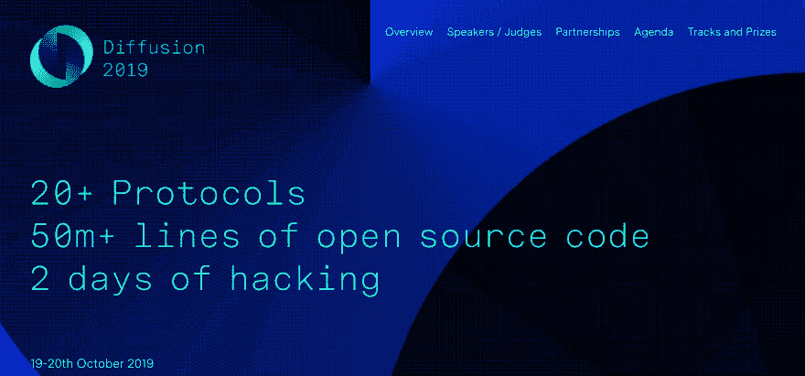
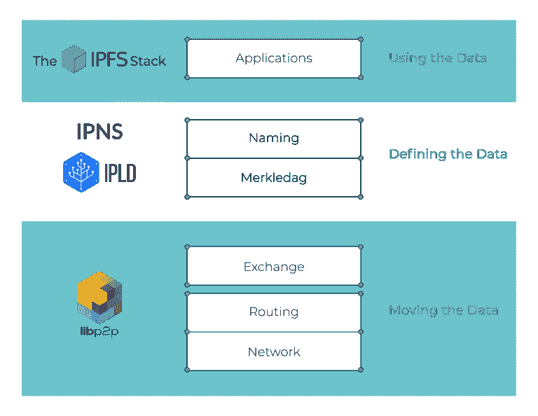

# 扩散开发者大会与 IPFS 服务台

> 原文：<https://dev.to/fission/diffusion-developer-conference-with-ipfs-help-desk-1eok>

裂变团队正返回柏林参加第一届[扩散开发者大会](https://diffusion.events/)，由[离群风险投资](https://outlierventures.io)团队围绕他们的[融合栈](https://outlierventures.io/research/the-convergence-stack/)组织。这个概念是试图将不同的群体聚集在一起，这些群体可能不会在特定协议的活动中相遇和合作。他们正在寻找所有致力于建立隐私保护、点对点、分散化技术的参与者，合力发展 Web3。

<figure> 

<figcaption>在 [Diffusion.events](https://diffusion.events)</figcaption>

</figure>

网站上查看全部信息

该活动将于 10 月 19 日和 20 日在柏林工厂 Goerlitzer Park(T1)举行，这里也是今年的[埃思柏林吾妻玲二](https://ethberlinzwei.com/)以及我们自己的[跑 EVM](https://runevm.com/) 活动的举办地。请继续关注柏林的其他活动:我们很高兴在城里见到你，并与[开源沙龙](https://github.com/opensourcesalon/berlin)成员和其他人谈论我们在城里的活动。

如果你想在周末参与编码，[在 Devpost 上注册——开发者可以免费加入](https://diffusion2019.devpost.com/)。

如果你不打算写代码，还会有对每个人开放的广泛的分布式网络主题的小组和研讨会。[在 Eventbrite 上注册门票，使用代码“ov discount”](https://www.eventbrite.co.uk/e/diffusion-2019-tickets-71056994383?fission)。

关于我们在 Diffusion 上发布的新工具，我们将发布更多内容。敬请期待！

<figure> 

<figcaption>摘自 [Mozilla Hacks: Dweb:与 IPFS 一起在网络中建立合作与信任](https://hacks.mozilla.org/2018/08/dweb-building-cooperation-and-trust-into-the-web-with-ipfs/)</figcaption>

</figure>

## IPFS 服务台

受到埃思柏林伟大的 IPFS 服务台的启发，我们自愿帮助扩散中心的一号员工！

到目前为止，我们有来自 [Moxy 工作室](https://moxy.studio)的 André和 Vasco(感谢介绍，来自协议实验室的 [Molly](https://twitter.com/momack28) )!)加入我们来帮助运行帮助台。如果你和 IPFS 有关系，来加入我们吧。

如果你有关于 IPFS 的问题或者想要一些酷工具的指点(或者想要帮助运行帮助台！)，[注册](https://diffusion2019.devpost.com/)扩散开发帖[评论我们已经开始的讨论帖](https://diffusion2019.devpost.com/forum_topics/33166-ipfs-helpdesk-at-diffusion)。

期待在柏林见到大家！