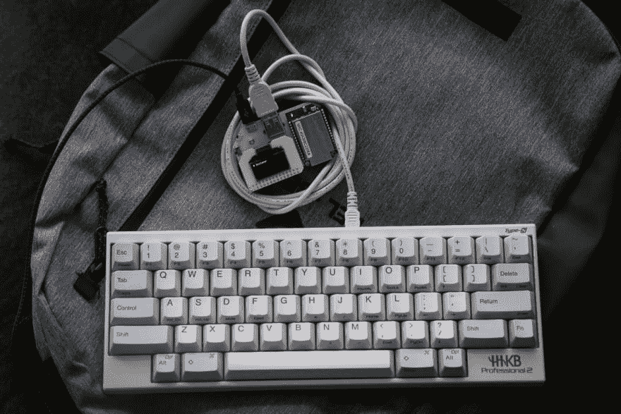
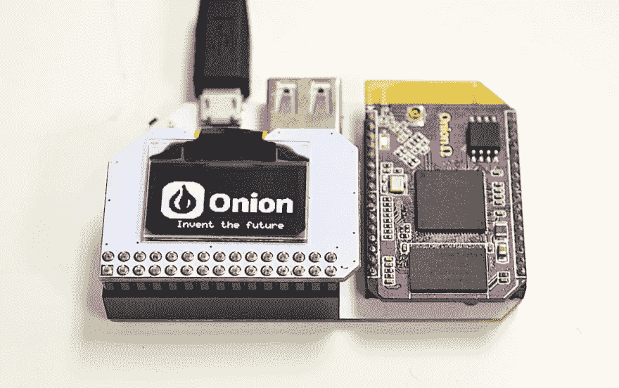
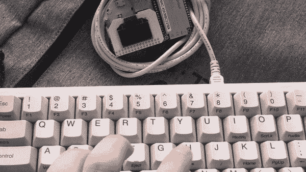

# 数字打字机

> 原文：<https://dev.to/frantic/digital-typewriter-43fb>

如果你可以离开电脑使用你最喜欢的键盘会怎么样？

[](https://res.cloudinary.com/practicaldev/image/fetch/s--ButSeexA--/c_limit%2Cf_auto%2Cfl_progressive%2Cq_auto%2Cw_880/http://frantic.im/assets/onityper/onityper.jpg) 
这就是现在的样子。进一步查看 GIF 演示。

很久以前，我了解到一个有趣的“文本编辑器”。它的主要特点是，嗯，缺乏文本编辑。没错，你不能修改你输入的任何东西。

背后的想法很有意思。讲的是两种写作模式。在这种模式下，你可以产生尽可能多的文本，而不用试图以任何方式组织或修改它。另一个是你编辑和重组文本，直到它的一致性和易读性。

在现代计算机上做第一部分对我来说是一个挑战。我很容易分心。我也很想马上开始编辑，经常是以一遍又一遍地重写一个句子而告终。

老式打字机没有这个问题:没有干扰，也没有办法编辑文本。

[](https://res.cloudinary.com/practicaldev/image/fetch/s--Qryw939t--/c_limit%2Cf_auto%2Cfl_progressive%2Cq_auto%2Cw_880/http://frantic.im/assets/onityper/deleece-cook-1167525-unsplash.jpg) 
不支持 twitter，没有退格键。

## 实现

在我去年的生日，我得到了一个小装置，洋葱欧米伽 2+。它就像 Rapsberry Pi，运行 Linux，但构建在不同的架构上，有自己的一套附件。它带有 21x7 字符的有机发光二极管显示扩展。

[](https://res.cloudinary.com/practicaldev/image/fetch/s--VTRZqGat--/c_limit%2Cf_auto%2Cfl_progressive%2Cq_auto%2Cw_880/http://frantic.im/assets/onityper/omega.jpg) 
洋葱欧米茄

这个想法是通过 USB 将我最喜欢的键盘(HHKBPro2 type-S)连接到 Omega2。我在那里输入的任何东西都会立即显示在内置的有机发光二极管显示屏上，并同步到“云端”。

> 我敢打赌，我可以用一行 bash 来破解它。
> 
> 我，两周前

我认为这很简单，只需读取击键，将它们传输到有机发光二极管和一个文本文件，通过 Dropbox 同步文本文件。

然而，事实证明要复杂得多:)

首先，我找不到一种简单的方法来阅读键盘上的文本。我一直在寻找类似于`getc`的东西，可以从连接的 USB 设备中获取数据，但没有运气。相反，我发现 Linux 有`/dev/input/event*`文件，在那里我可以[读取原始事件](https://www.kernel.org/doc/Documentation/input/input.txt)。这让我想到了古老的 [`input.h`](https://github.com/spotify/linux/blob/master/include/linux/input.h) ，我用它拼凑了一个简单的解析器。

接下来，把这些东西印刷到有机发光二极管也有问题。我最初的版本只是在每次击键时重新绘制屏幕，结果证明效率非常低。使用欧米茄的有机发光二极管 API 进行全显示重绘需要 400 毫秒，对于良好的体验来说完全不可接受。

所以我修改了代码来跟踪光标的位置，并随着更多的字符显示在屏幕上而向前移动。

一旦我添加了对退格键的支持，事情就变得更加复杂了。分页甚至更复杂。当我开始实现自动换行时，这太难了——有太多不同的状态需要转换！

理想情况下，我不想跟踪当前的屏幕位置，也不想为每个编辑命令编写绘图逻辑。我想要一个模型，其中我可以定义状态(文本)和一个函数，它定义这在屏幕上应该是什么样子，而不用担心底层的有机发光二极管 API 性能。

它让你想起什么了吗？:)

做出反应。我喜欢这种模式，并且我确信在 web 开发之外还有大量的应用。下面是我的代码现在的样子:

```
def render(text)
  # Return the text I want to be on the screen
end

next_screen = render(message)
reconcile(prev_screen, next_screen) do |row, col, text|
  oled_command "cursor", "#{row},#{col}", "write", text
end
prev_screen = next_screen 
```

Enter fullscreen mode Exit fullscreen mode

按下一个按钮和在屏幕上看到它之间的延迟是惊人的，我将研究测量它。

[](https://res.cloudinary.com/practicaldev/image/fetch/s--6AVSvEGG--/c_limit%2Cf_auto%2Cfl_progressive%2Cq_66%2Cw_880/http://frantic.im/assets/onityper/demo.gif)T3】演示

## Sync

我在这台设备上输入的所有内容都存储在文本文件中。从设备中取出这些文件不是很容易，所以我还添加了一些代码来将每一行上传到服务器。

在后端，我使用 Firebase。我有一个简单的“云功能”，它将文本作为输入，并将其存储在 Firestore 中。我也有一个非常简单的前端呈现来自 Firestore 的文本。

棘手的是，我不能完全依赖可用的互联网连接。我打算把这个设备带到咖啡店和 WiFi 覆盖不到的地方。该脚本在一个文件中存储了一个要上传的行队列，因此即使在设备重启后，它也应该能够继续上传。

理想情况下，我喜欢使用 Dropbox，但不幸的是，我找不到他们客户端的 linux MIPS 版本。

## 测试

在回顾中，我应该从适当的 Ruby 测试开始，但是牦牛毛和好奇心把我带到了 [`cram`](https://pypi.org/project/cram/) 。这是一个简单的 CLI 工具，以`*.t`文件作为输入。这些文件包含 shell 命令和预期的输出。

`cram`的开发体验还是蛮不错的。你不需要事先设置“预期输出”。您可以运行该工具，它将显示预期和实际输出之间的差异，并带有更新`*.t`文件的选项。

非常类似于 Jest 快照测试。

## 部署

在我的体验中，欧米茄的 WiFi 非常糟糕，经常出现随机断线。因为这个原因，我不能依赖 SSH，必须使用带有`screen`的串口。这使得部署过程更加复杂，没有用于终端连接的`scp`。

这里有一个我学到的聪明绝招:

```
screen -S $SESSION -X stuff 'cat > /root/onityper.rb <<\EOF'$'\015'
screen -S $SESSION -X readreg p "$ROOT/onityper.rb"
screen -S $SESSION -X paste p
screen -S $SESSION -X stuff 'EOF'$'\015' 
```

Enter fullscreen mode Exit fullscreen mode

我可以在一个选项卡中运行`screen`，当连接激活时，我可以向它发送命令。`stuff`发送击键，`readreg` / `paste`可以模拟输入大段文字。

为了在每次启动时运行这个脚本，我使用了官方指令中的[，该指令建议将内容放入`/etc/rc.local`。](https://docs.onion.io/omega2-docs/running-a-command-on-boot.html) 

```
ruby /root/onityper.rb >> /tmp/onityper.log 2>&1 & 
```

Enter fullscreen mode Exit fullscreen mode

我一点也不喜欢这样。必须有一种合适的方法来定义一个可以在后台运行的服务，包括关于日志和日志循环的策略，以及何时重启等等。貌似 OpenWRT 有 [`procd`](https://openwrt.org/docs/guide-developer/procd-init-scripts) 但是当时我也懒得深究。

## 代码

警告:这是一包黑客。在 [GitHub](https://github.com/frantic/onityper) 上看到的。

## 接下来

到目前为止，我对这个设置非常满意。我在亚马逊上买了我能找到的最便宜的 powerbank，所以这个设备基本上独立于我的笔记本电脑。这篇文章的 70%是在咖啡店的电脑上创作的。

现在我想用 3D 打印机为它造一个箱子。