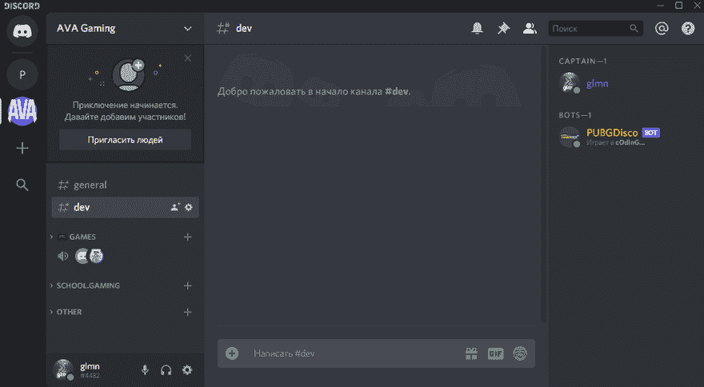
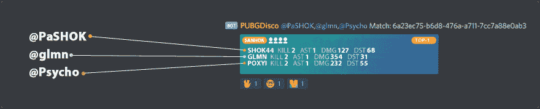

# 显示 PUBG 赛后统计的不和谐机器人

> 原文：<https://dev.to/glmn/discord-bot-that-shows-pubg-after-match-stats-1204>

#### 跟踪赛后统计数据并将其推送到不和谐频道

* * *

机器人通知你所有的朋友在不和谐频道关于你的最后一场比赛，你得到了至少前 3 名的排名。计算你杀死、击倒和伤害的数量。它也显示了你的每个花名册相同的统计数据。

*   基于 [discord.py](https://github.com/Rapptz/discord.py) 库的 Discord API
*   用 [pubg_python](https://github.com/ramonsaraiva/pubg-python) 项目实现的 PUBG API

* * *

### Bot 命令

Bot 使用前缀`!pdb-`来检测提及。所以每个命令都应该从这个前缀加上下面列表中的命令开始。

| 命令 | 争吵 | 描述 |
| `track` | `player_name` | *将玩家放入你的曲目列表* |
| `untrack` | `player_name` | *从您的曲目列表中删除玩家* |
| `last` | `player_name` | *显示玩家最近的前 3 名比赛* |
| `list` |  | *显示您的曲目列表* |

### 多轨

如果多个渠道的参与者跟踪同一名球员或跟踪不同的球员，但在同一个游戏名册，然后机器人将只发送一个消息，所有参与者提到。在下面的例子中，机器人只发送了一条消息，而不是三条，因为他们都在一个名单中

### 想测试？

加入特别的[不和谐频道](https://discord.gg/p6TGxqB)，制作你的第一首曲目。
如果你的上一个游戏是前 3 名，那么机器人会立即显示你的统计数据，否则你需要玩 PUBG 来达到至少前 3 名的排名。

#### 反馈

任何意见，评论，建议，问题或拉动请求将不胜感激。

[Github 链接](https://github.com/glmn/PUBGDiscoBot)
附:这是我的第一个 python 项目。