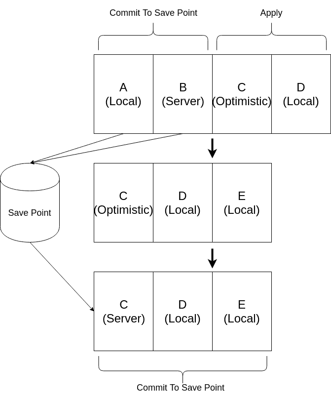
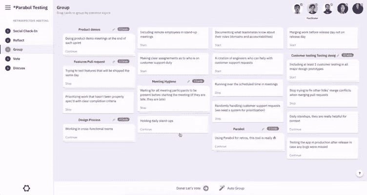

# 分布式国家 101 -为什么我分叉脸书的继电器

> 原文：<https://dev.to/mattkrick/distributed-state-101-why-i-forked-facebook-s-relay-1p7d>

就在一年多前，我分叉[脸书的中继](https://relay.dev)来修复一个基于网络延迟导致不正确状态的 bug(哎呀！).虽然发布队列和分布式状态的概念相当复杂，但这个 bug 本身非常简单，是对分布式系统的一次巨大尝试，这就是为什么我在这里用它来说明基本原理(和陷阱！)来构建一个简单的客户端缓存。这并不是对脸书开发商的抨击；bug 发生&大型公司遗留代码的束缚是真实存在的。相反，如果这是脸书的专业开发人员可能犯的错误，那么它可能发生在任何人身上，所以让我们从中吸取教训吧！

## 状态 vs .变换

那是 1999 年，我有一个计数器显示目前有多少人在我的新网站上。如果我想让这个数字实时更新，我的服务器可以发送两个消息中的一个:

*   状态:“嘿，新值是 8。”
*   转换:“嘿，无论你的计数器现在是多少，都加 1”。

State 对于像计数器(8)这样的小东西很有用，而 transforms 对于像 Google Doc 这样的大东西更有用(在位置 5，插入“A”)。对于像 Relay 这样的文档存储，这看起来像是一个状态更新(用新的 JSON 替换旧的 JSON)，但是服务器只是发送一个补丁，Relay 使用默认转换将它合并到一个更大的文档树中。然后，它在变异`updater`函数中执行任何额外的转换。状态的出现使它变得简单，转换的工作使它变得强大。完美的组合！

## 更新和 Lamport 的发生-之前

在所有客户端缓存中，有 3 种更新:本地、乐观和服务器。本地更新来自客户端并驻留在客户端，因此它只包含该会话的状态。乐观更新源自客户端&模拟服务器更新的结果，因此无论延迟如何，操作都很快。服务器更新源自服务器，并且*替换*乐观更新，如果可用的话。

在这三种情况下，只需要遵循一条规则:*按照更新发生的顺序应用更新*。如果我调用一个乐观更新，然后是一个本地更新，乐观的`updater`应该首先运行，然后把它的结果传递给本地的`updater`。当莱斯利·兰波特在 1978 年发表它的时候，这个概念是最前沿的东西！不幸的是，这就是接力出错的地方。

***中继不是按照更新发生的顺序处理更新，而是依次处理服务器更新、本地更新和乐观更新。*** 这意味着即使乐观更新首先发生，中继也会在本地更新之后*应用它。这就是 bug 的症结所在。*

让我们在一个简单的组件中使用这个逻辑，比如从 1 到 10 的音量滑块。假设体积是 3，我乐观地给它加 1。然后，我在本地将音量设置为 10。结果如何？如果你猜是 10，你就正确地应用了兰波特关系。如果你猜是 11，那么你得到了一个坏掉的应用和一个在脸书的[光明未来(开玩笑。我完全是在开玩笑。😉).](https://github.com/facebook/relay/blob/1a94841b1d7809836ef5b71854d3ade2b5cb4dde/packages/relay-runtime/store/__tests__/RelayPublishQueue-test.js#L1208-L1209)

## 更好的方法

如果目前的方法在数学上不合理，还有什么选择？答案很简单。让我们看一个有 4 个事件的发布队列的例子: 

上面的发布队列从 4 个事件开始:一个本地更新、一个服务器更新、一个乐观更新和另一个本地更新。每次更新做什么并不重要，因为只要它们按照发生的顺序应用，我们最终会得到正确的答案。

在第一行，我们知道 A & B 是确定性的(乐观的相反)，所以我们可以提交它们，这意味着我们永远不会“撤销”它们所做的。但是，C 是乐观的。如果来自服务器的 C 与乐观 C 不同，那么接下来的一切也会不同。例如，如果 D 将 C 的结果乘以 2 会怎么样？因此，我们应用这些更新来创建一个当前状态，但是保留它们以防我们不得不重放它们。

在第 2 行，我们有一个保存点，它是应用 A 和 B 后的状态。我们还保留了从第一个乐观事件开始的所有事件，因为它们都依赖于从服务器返回的结果。当我们等待服务器响应时，像 E 这样的新事件不断出现。我们应用它们，以便状态是当前的，但也保持它们。

在第 3 行，C 的服务器事件返回！我们移除乐观事件并用服务器事件替换它。从保存点开始，我们提交每个事件，直到出现另一个乐观事件。因为没有更多乐观的事件，所以队列是空的，我们完成了！真的就这么简单。为什么服务器上的 C 可以插队？这是因为 C *发生在乐观更新的时候*，但是由于延迟，直到 e 之后*才收到*。如果你搜索那个，你搜索的是分布式数据类型。如果你想看看代码是什么样子，包在这里:[中继-线性-发布-队列](https://www.github.com/mattkrick/relay-linear-publish-queue)。注意，这取决于中继合并[这个微小的 PR](https://github.com/facebook/relay/pull/2791) 。

有了这样一个简单的发布队列，就有可能在服务器事件和乐观事件到来时对它们进行比较。如果服务器事件只是确认乐观事件所怀疑的，那么我们可以刷新队列而不执行重新计算，因为我们知道它是正确的。性能提升即将到来！

## 现实世界应用

理论很无聊。现在我们明白了，我们可以开始有趣的事情了！通过一个有效的发布队列，我为像我一样不喜欢会议室的人建立了一个在线 sprint 回顾。如果你不熟悉回顾会，这是一个团队匿名写下去年 sprint 可以做得更好的会议，按主题分组，然后讨论重要的问题。这是一个很好的工程习惯，正在慢慢进入销售、营销和管理团队。在构建分组阶段时，我不想失去每个人同时参与的能力。这意味着建立一个系统，当其他人拿起并拖动一张卡时，它可以可靠地共享:

如果你想玩这个演示，你可以在这里查看(不需要注册)或者甚至[查看源代码](https://github.com/parabolinc/action)。

## 结论

我希望这澄清了发布队列的目的！如果分布式系统听起来很有趣，这只是开始。从这里，您可以深入研究数据类型，比如操作转换(Google Docs 使用的)或无服务器 CRDTs，比如 [Automerge](https://github.com/automerge/automerge) 。如果你想有偿学习这些东西，同时避免裤子和大部队，我们正在雇用一些远程开发人员。伸出手。