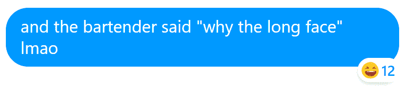
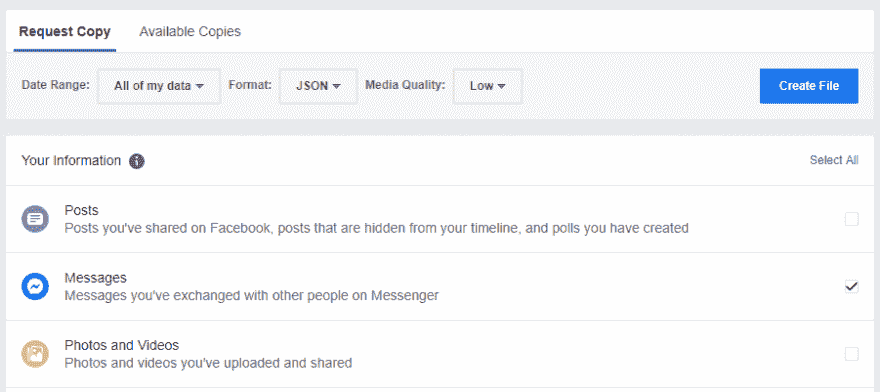
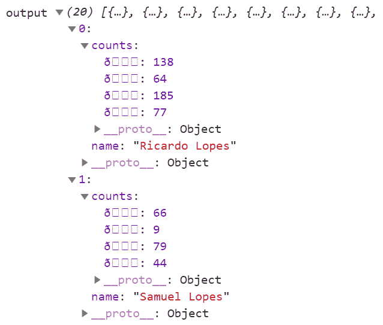
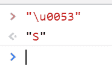
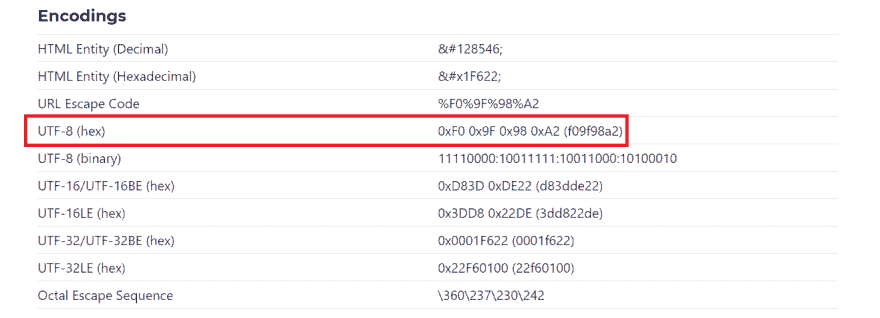
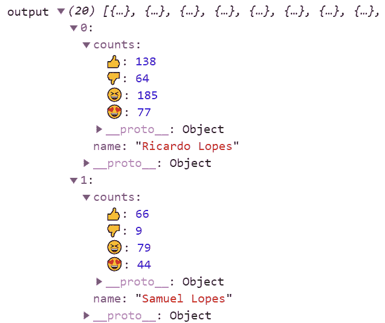
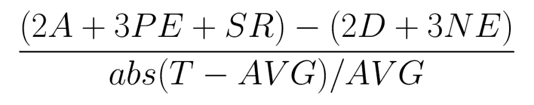
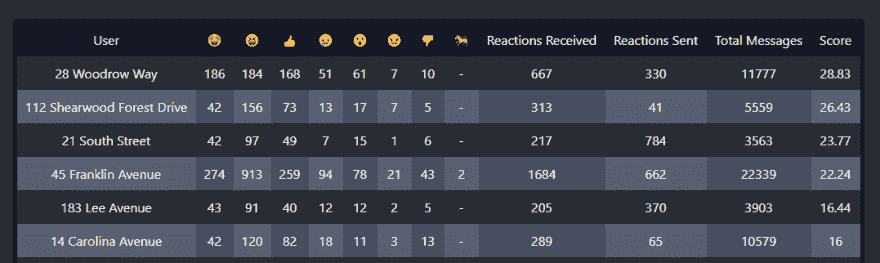

# 用脸书数据和 JavaScript 抛弃无用的朋友

> 原文：<https://dev.to/raicuparta/ditching-worthless-friends-with-facebook-data-and-javascript-3f2i>

友谊很难维持。如此多的精力被浪费在维持友谊上，而这种友谊实际上可能不会带来任何切实的回报。我发现自己在想“当然，我从幼儿园就认识她了，她把我介绍给了我的妻子，当我被赶出家门时，她让我在她家住了 6 个月，但这真的是值得的友谊吗？”。

我需要决定抛弃哪些朋友。但是标准是什么呢？长相？智力？钱？

当然，个人的价值是主观的。没有办法根据经验进行基准测试，对吧？**错了**。衡量一个朋友的价值有一个万无一失的方法:*Facebook Messenger 上收到的表情符号反应量。*

[](https://res.cloudinary.com/practicaldev/image/fetch/s--zEce3euS--/c_limit%2Cf_auto%2Cfl_progressive%2Cq_auto%2Cw_880/https://i.imgur.com/ztbplsK.png)

更多笑的反应意味着那是有趣的朋友。反应最愤怒的是有争议的那个。诸如此类。简单！

手动计数是不可能的；我需要自动完成这项任务。

# 获取数据

抓取聊天记录会太慢。有一个 API，但我不知道它是否适用于此。看着吓人，文档字数太多！我最终找到了获取所需数据的方法:

[](https://res.cloudinary.com/practicaldev/image/fetch/s--FxoDSLeT--/c_limit%2Cf_auto%2Cfl_progressive%2Cq_auto%2Cw_880/https://i.imgur.com/4kquCab.png)

脸书让我下载他们多年来收集的我的所有个人信息，以一种易读的 JSON 格式。他们真好！我确保只选择我需要的数据(邮件)，并选择最低的图像质量，以保持存档尽可能小。它可能需要几个小时甚至几天才能生成。

第二天，我收到一封电子邮件，通知我可以在“Available Copies”选项卡下下载该归档文件(全部 8.6 GB)。zip 文件的结构如下:

```
messages
├── archived_threads
│   └── [chats]
├── filtered_threads
│   └── [chats]
├── inbox
│   └── [chats]
├── message_requests
│   └── [chats]
└── stickers_used
    └── [bunch of PNGs] 
```

Enter fullscreen mode Exit fullscreen mode

我感兴趣的目录是`inbox`。`[chats]`目录的结构如下:

```
[ChatTitle]_[uniqueid]
├── gifs
│   └── [shared gifs]
├── photos
│   └── [shared photos]
├── videos
│   └── [shared videos]
├── files
│   └── [other shared files]
└── message_1.json 
```

Enter fullscreen mode Exit fullscreen mode

我需要的数据在`message_1.json`里。不知道为什么需要`_1`后缀。在我的档案中没有`message_2.json`或者任何其他的变体。

例如，如果我想使用的聊天名为“裸体排球伙伴”，那么完整路径将类似于`messages/inbox/NudeVolleyballBuddies_5tujptrnrm/message_1.json`。

这些文件可能会变得相当大，所以如果您的 IDE 一看到它就晕了，也不要感到惊讶。我要分析的聊天大约是 5 年前的事了，这导致了 JSON 超过*百万行*。

JSON 文件的结构是这样的:

```
{  "participants":  [  {  "name":  "Ricardo L"  },  {  "name":  "etc..."  }  ],  "messages":  [  " (list of messages...) "  ],  "title":  "Nude Volleyball Buddies",  "is_still_participant":  true,  "thread_type":  "RegularGroup",  "thread_path":  "inbox/NudeVolleyballBuddies_5tujptrnrm"  } 
```

Enter fullscreen mode Exit fullscreen mode

我想重点说一下`messages`。每条消息的格式如下:

```
{  "sender_name":  "Ricardo L",  "timestamp_ms":  1565448249085,  "content":  "is it ok if i wear a sock",  "reactions":  [  {  "reaction":  "\u00f0\u009f\u0098\u00a2",  "actor":  "Samuel L"  },  {  "reaction":  "\u00f0\u009f\u0098\u00a2",  "actor":  "Carmen Franco"  }  ],  "type":  "Generic"  } 
```

Enter fullscreen mode Exit fullscreen mode

我找到了我要找的东西！所有的反应都列在这里。

# 从 JavaScript 读取 JSON

对于这个任务，我使用了 [FileReader API](https://developer.mozilla.org/en-US/docs/Web/API/FileReader) :

```
<input type="file" accept=".json" onChange="handleChange(this)"> 
```

Enter fullscreen mode Exit fullscreen mode

```
function handleChange(target) {
  const reader = new FileReader();
  reader.onload = handleReaderLoad;
  reader.readAsText(target.files[0]);
}

function handleReaderLoad (event) {
  const parsedObject = JSON.parse(event.target.result);
  console.log('parsed object', parsedObject);
} 
```

Enter fullscreen mode Exit fullscreen mode

我在页面上看到了文件输入字段，当我选择 JSON 时，解析的 JavaScript 对象被记录到控制台。由于荒谬的长度，可能需要几秒钟。现在我需要弄清楚如何阅读它。

# 解析数据

让我们从简单的开始。我的第一个目标是将我的`messages_1.json`作为**输入**，以及类似这样的作为**输出** :

```
output = [
  {
    name: 'Ricardo L',
    counts: {
      '😂': 10,
      '😍': 3,
      '😢': 4,
    },
  },
  {
    name: 'Samuel L',
    counts: {
      '😂': 4,
      '😍': 5,
      '😢': 12,
    },
  },
  // etc for every participant
] 
```

Enter fullscreen mode Exit fullscreen mode

原始 JSON 中的`participants`对象已经有了类似的格式。只需要添加那个`counts`字段:

```
const output = parsedObject.participants.map(({ name }) => ({
  name,
  counts: {},
})) 
```

Enter fullscreen mode Exit fullscreen mode

现在我需要迭代整个消息列表，并累积反应计数:

```
parsedObject.messages.forEach(message => {
  // Find the correct participant in the output object
  const outputParticipant = output.find(({ name }) => name === message.sender_name)

  // Increment the reaction counts for that participant
  message.reactions.forEach(({ reaction }) => {
    if (!outputParticipant.counts[reaction]) {
      outputParticipant.counts[reaction] = 1
    } else {
      outputParticipant.counts[reaction] += 1
    }
  })
}) 
```

Enter fullscreen mode Exit fullscreen mode

记录的输出如下所示:

[](https://res.cloudinary.com/practicaldev/image/fetch/s--EVf3O7h3--/c_limit%2Cf_auto%2Cfl_progressive%2Cq_auto%2Cw_880/https://i.imgur.com/kd0Fqks.png)

我得到了四个奇怪的符号，而不是表情符号。怎么回事？

# 解码反应表情符号

我以一条消息为例，它只有一个反应:哭泣的表情符号(😢).检查 JSON 文件，这是我找到的:

```
"reaction": "\u00f0\u009f\u0098\u00a2" 
```

Enter fullscreen mode Exit fullscreen mode

这个字符序列和哭泣的表情符号有什么关系？

可能看起来不像，但是这个字符串有四个字符长:

*   `\u00f0`
*   `\u009f`
*   `\u0098`
*   `\u00a2`

在 JavaScript 中，`\u`是表示转义序列的前缀。这个特殊的转义序列以`\u`开始，后面紧跟四个十六进制数字。它表示 UTF-16 格式的 Unicode 字符。*注意:[比](https://mathiasbynens.be/notes/javascript-encoding)稍微复杂一点，但是为了本文的目的，我们可以认为所有东西都是 UTF-16。*

例如，[大写字母 S 的 Unicode 十六进制代码是`0053`](https://unicode-table.com/en/0053/) 。您可以通过在控制台中键入`"\u0053"`来查看它在 JavaScript 中是如何工作的:

[](https://res.cloudinary.com/practicaldev/image/fetch/s--C7tmSyuX--/c_limit%2Cf_auto%2Cfl_progressive%2Cq_auto%2Cw_880/https://i.imgur.com/KfIY8Lc.png)

再次查看 Unicode 表，我看到[哭泣表情符号的十六进制代码是`1F622`](https://unicode-table.com/en/1F622/) 。这超过了四位数，所以简单地使用`\u1F622`是行不通的。有两种方法可以解决这个问题:

*   [UFT-16 代孕夫妇](https://en.wikipedia.org/wiki/UTF-16#U+010000_to_U+10FFFF)。这会将大的十六进制数分成两个较小的 4 位数。在这种情况下，哭泣的表情符号将被表示为`\ud83d\ude22`。

*   直接使用 Unicode 码位，使用稍微不同的格式:`\u{1F622}`。注意代码周围的花括号。

在 JSON 中，每个反应使用四个不带花括号的字符代码，它们都不能作为代理对，因为[它们不在正确的范围](https://mathiasbynens.be/notes/javascript-encoding#surrogate-pairs)内。

那么它们是什么呢？

让我们来看看这个表情符号的一堆[可能的编码。这些看起来熟悉吗？](https://graphemica.com/%F0%9F%98%A2)

[](https://res.cloudinary.com/practicaldev/image/fetch/s--Q3cnt9K_--/c_limit%2Cf_auto%2Cfl_progressive%2Cq_auto%2Cw_880/https://i.imgur.com/Y18GlSx.png)

那是相当接近的！原来这是十六进制格式的 UTF 8 编码。但是由于某种原因，每个字节都被写成 UTF-16 格式的 Unicode 字符。

知道了这些，我怎么从`\u00f0\u009f\u0098\u00a2`到`\uD83D\uDE22`？

我将每个字符提取为一个字节，然后将这些字节合并成一个 UTF-8 字符串:

```
function decodeFBEmoji (fbString) {
  // Convert String to Array of hex codes
  const codeArray = (
    fbString  // starts as '\u00f0\u009f\u0098\u00a2'
    .split('')
    .map(char => (
      char.charCodeAt(0)  // convert '\u00f0' to 0xf0
    )
  );  // result is [0xf0, 0x9f, 0x98, 0xa2]

  // Convert plain JavaScript array to Uint8Array
  const byteArray = Uint8Array.from(codeArray);

  // Decode byte array as a UTF-8 string
  return new TextDecoder('utf-8').decode(byteArray);  // '😢'
} 
```

Enter fullscreen mode Exit fullscreen mode

现在我有了正确渲染结果所需的东西:

[](https://res.cloudinary.com/practicaldev/image/fetch/s--wz8_6Eev--/c_limit%2Cf_auto%2Cfl_progressive%2Cq_auto%2Cw_880/https://i.imgur.com/9hOSokB.png)

# 选择要抛弃的朋友

我想根据每种反应的数量来计算分数。我需要一些变量:

*   参与者的消息总数( **T** )
*   参与者发送的总反应( **SR** )
*   每位参与者的全球平均消息数( **AVG** )

对于收到的反馈，我做了一些分类:

*   👍:批准( **A** )
*   👎:不赞成( **D** )
*   😆和😍:积极情绪( **PE**
*   😢和😠:负面情绪( **NE**
*   😮:中立，我就扔了

最后的公式是:

[](https://res.cloudinary.com/practicaldev/image/fetch/s--h6GINu2B--/c_limit%2Cf_auto%2Cfl_progressive%2Cq_auto%2Cw_880/https://i.imgur.com/Jw4JrIO.png)

得到的分数越高，这个人就越优秀。下面是我如何得出这个等式的解释。

在 JavaScript 中会是这样的:

```
participants.forEach((participant) => {
  const {
    reactions,
    sentReactionCount,
    messageCount,
  } = participant

  const approval = reactions['👍']
  const disapproval = reactions['👎']
  const positiveEmotion = reactions['😆'] + reactions['😍']
  const negativeEmotions = reactions['😢'] + reactions['😠']

  const positiveFactor = (2 * approval + 3 * positiveEmotion + sentReactionCount)
  const negativeFactor = (2 * disapproval + 3 * negativeEmotions)
  const totalMessageFactor = Math.abs(messageCount - messageCountAverage) / (messageCountAverage)

  participant.score = (positiveFactor - negativeFactor) / totalMessageFactor
}) 
```

Enter fullscreen mode Exit fullscreen mode

以表格形式显示信息更容易解析:

[](https://res.cloudinary.com/practicaldev/image/fetch/s--F-TxHait--/c_limit%2Cf_auto%2Cfl_progressive%2Cq_auto%2Cw_880/https://i.imgur.com/9HbsshT.png)

注意:出于隐私考虑，我用朋友的家庭住址代替了他们的真实姓名。

# 再见

快速地看了一眼表格，我终于可以决定我需要从我的生活中除掉谁。

[](https://res.cloudinary.com/practicaldev/image/fetch/s--1u81dcjU--/c_limit%2Cf_auto%2Cfl_progressive%2Cq_66%2Cw_880/https://i.imgur.com/aZWaG77.gif)

再见，山姆表哥。