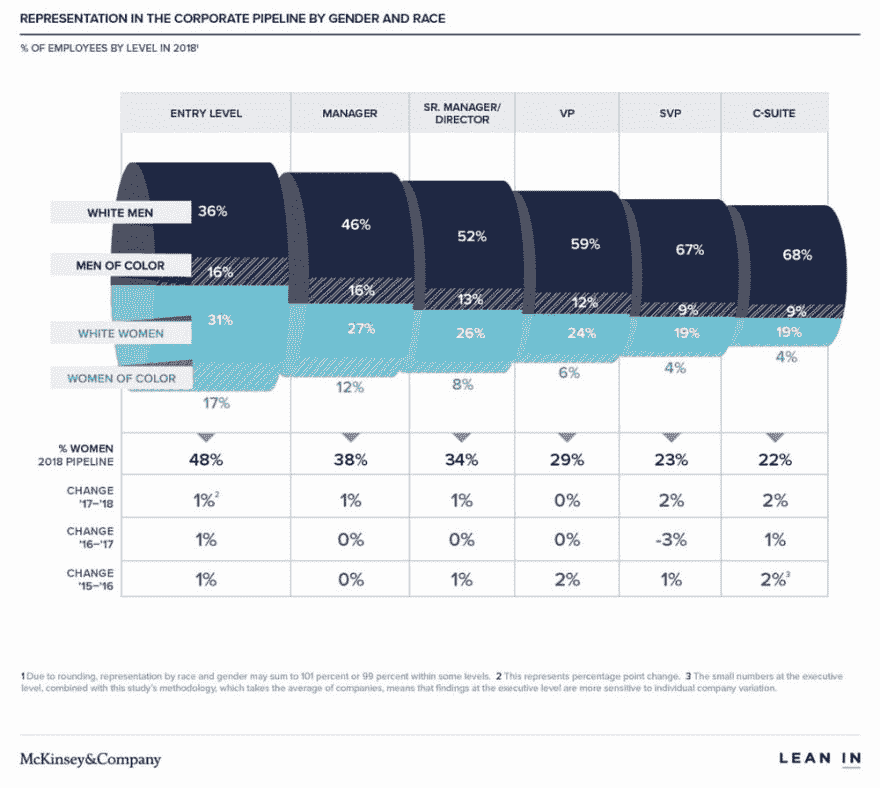
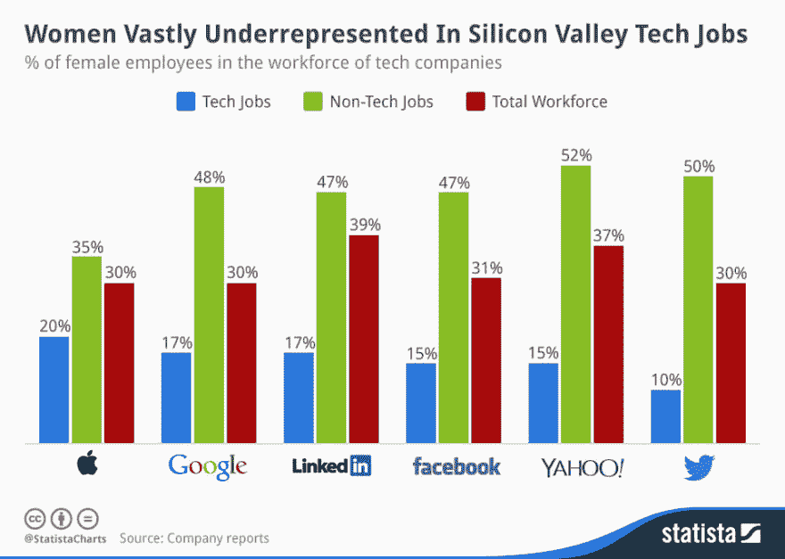

# 科技中的多样性统计:更深入的观察——及案例研究

> 原文：<https://dev.to/thisdotmedia/diversity-statistics-in-tech-a-deeper-look-and-a-case-study-5537>

 
根据 2018 年对职场女性的调查[显示，略低于一半的女性从入门级工作开始她们的科技职业生涯。](https://womenintheworkplace.com/)

但是当他们升到最高管理层时，一切都变了。女性仅占高管的 22%。

在科技领域，不平等开始蔓延。只有 20-25%的入门级技术工作由女性担任。

随着你在职业阶梯上步步高升，这种早期的差距会越来越大。根据 SHRM 的一篇文章，70%的科技公司没有女性董事会成员，54%没有女性高管。这是硅谷的情况:

那么，有什么问题呢？女性是不是就是对科技不感兴趣？

许多人是这么想的，但事实并非如此。每年都有数百名女性从编码训练营毕业。但是他们经常发现很难迈出第一步。

我们在 Twitter 上做了一个简短的调查，调查女性难以找到工作的原因。

最常见的原因是:

“你没有任何现实世界的经验。”

“我们没有时间进行你需要的实践培训。”

“我们不招大三的。”

如果没有第一份工作让她们站稳脚跟，女性就不可能成为未来的领导者。沮丧和幻想破灭后，许多女性彻底离开了这个行业。

围绕技术多样性的对话可能会很困难，我们都有责任做些事情来帮助解决这个问题。

实现工作场所的多元化不仅是正确的事情，而且还会影响公司的利润和生产力。麦肯锡公司(McKinsey and Company)2018 年的一项研究提出了一个让更多女性加入你的团队的坚实商业案例:“高管团队中性别多样性排名前四分之一的公司在盈利能力方面表现出色的可能性高出 21%，创造价值的可能性高出 27%。”

另一方面呢？缺乏多样性实际上会损害你公司的利润。麦肯锡公司发现，“在性别和种族/文化多样性方面都处于倒数四分之一的公司实现高于平均水平的盈利能力的可能性要低 29%。”

数据不会说谎:缺乏性别多样性会对你的盈利能力产生负面影响。

## **我们如何以及为什么要做多元化**

在这一点上，我们试图做不同的事情。我们是一家女性所有的公司，所以雇佣和提升女性是我们的天性。我们的团队中大约 50%是女性员工，我们亲眼见证了多元化的团队能为我们自己的公司和我们的底线做些什么。

但是为什么呢？多元化增加价值的部分原因是通过额外的视角。这些不同的视角造就了思想的多样性，这反过来又导致创造性的问题解决方案、新颖的方法和更高的效率。

多元化也有助于招聘和留住人才。在面试中，让候选人看到自己在你现有职位中的表现是很重要的。这向潜在员工表明，在多元化和包容性方面，你不只是“说说而已”:在招聘实践中，你也要“言行一致”。反过来，包容性的工作环境会留住员工，因为他们会感到在工作中受到尊重，对工作投入更多。

我们也知道多元化和包容性实践并不那么简单。

## **提出解决方案**

为了让更多的女性成为高级开发人员和高管，更多的女性必须首先获得那些入门的入门级工作。

但是，雇佣初级开发人员通常需要公司承担额外的工作量。这些是我们经常从招聘经理那里听到的担忧:

1.  我们现在没有足够的人员来指导。

2.  我团队的问题和工作很复杂。初级开发人员如何理解和解决这些复杂的技术问题？

3.  初级开发人员不具备深入研究我们代码的技能。他们如何能有所帮助？

4.  初级开发人员没有处理我们日常面临的问题的实际经验。

5.  一个初级开发人员只会拖团队的后腿，不会增加任何价值。

我们在这个网站上创建了一个“雇佣女性”项目，让公司能够雇佣女性。该计划通过允许公司在不牺牲商业目标的情况下雇用初级女性来解决这些有效的问题。

当你雇佣我们的初级女性开发人员(我们称之为学徒)时，你每周从一个学徒那里雇佣 40 个小时，从一个高级开发人员那里专门雇佣 20 个小时来开发你的应用程序。

在 Dot architects 的指导下，学徒们在工作中和你的技术堆栈上接受培训。当他们获得必要的技能时，你可以将他们转为全职员工。

我们的计划现在正在努力改变贵公司的比率。你不需要等待一个想象中的未来的时间，当一个解决方案可能来帮助你解决这个问题。

如果你关心多样性，我们很乐意与你交谈。联系我们，了解如何快速启动您团队的多元化，并与我们才华横溢的学徒和开发人员团队合作！我们的邮箱永远是开放的:[hirethefempire@thisdot.co](//mailto:hirethefempire@thisdot.co)。

需要 JavaScript 咨询、指导或培训帮助吗？在 [This Dot Labs](//thisdot.co) 查看我们的服务列表。