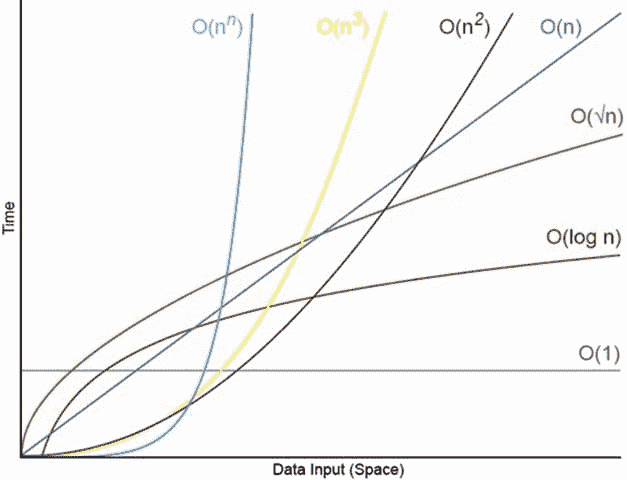

# 你知道什么是大 O 符号吗？

> 原文：<https://dev.to/mauriciord/do-you-know-what-is-big-o-notation-1hhp>

[](https://res.cloudinary.com/practicaldev/image/fetch/s--mIrZEMYB--/c_limit%2Cf_auto%2Cfl_progressive%2Cq_auto%2Cw_880/https://atalkwith.dev/media/2019-23-08---Do-you-know-what-is-bigo-notation/bigo-meme.png)

当我们需要提高作为软件工程师的能力时，我们需要停止滥用我们正在使用的语言的力量，并开始作为算法应用程序有效性的分析师。这篇文章将解释**大 O 符号**的概念，以及如何在时间(执行时间)和空间(消耗的内存)上分析一个算法的实现。

# 输入的数量

用大 O 符号分析会让你想到下面的问题:“当 n 接近无穷大时会发生什么？”。换句话说，它会告诉你算法。

[](https://res.cloudinary.com/practicaldev/image/fetch/s--6DcaIo40--/c_limit%2Cf_auto%2Cfl_progressive%2Cq_auto%2Cw_880/https://atalkwith.dev/media/2019-23-08---Do-you-know-what-is-bigo-notation/graph.png)

[https://images.app.goo.gl/UDf6DhkMH3hM5Xsw6](https://images.app.goo.gl/UDf6DhkMH3hM5Xsw6)

时间复杂性示例

# 大-O 符号规则

假设一个算法的复杂度为 f(n):

*   *n* -输入的数量
*   *f(n)space* -附加内存
*   f(n)时间-所需的时间

分析的目标是通过计算 *f(n)，*来计算算法的效率，但是由于它的难度，我们可以使用 Big-O 符号规则。

第一、第二、第四和第六十需要在你的头脑中，因为它们是常用的。

*   **Sum:** 若 f(n)为 *O(h(n))* 且 *g(n)* 为 *O(p(n))* ，则 *f(n)+g(n)* 为 *O(h(n)+p(n))* 。这是两个大 O 符号的和。
*   **乘积:**若 *f(n)* 为 *O(h(n))* 而 *g(n)* 为 *O(p(n))* ，则 *f(n)g(n* )为 *O(h(n)p(n))* 。这是大 0 符号的乘法运算。
*   **Log:***Log(NK)*O(Log(n))*为任意常数 *k > 0* 。对于 log，log 函数中的常数在 Big-O 表示法中也会被忽略。*
**   **多项式:**若 *f(n)* 为 k 次多项式，则 *f(n)* 为 *O(nk)* 。多项式时间复杂性具有相同多项式次数的 Big-O 符号。*   **传递:**若 *f(n)* 为 *O(g(n))* 且 *g(n)* 为 *O(h(n))* ，则 *f(n)* 为 *O(h(n))* 。时间复杂度有相同的大 O 符号。*   **系数:**若 *f(n* )为 *O(g(n))* ，则 *kf(n)* 为 *O(g(n))* ，对于任意常数 *k > 0* 。*

 *# 例子

## 总和- *O(n) = n*

```
function s(n) {
    var total = 0;
    for (var i = 0; i < n; i++) {
            total += 1;
    }
    for (var i = 0; i < 8 * n; i++) {
            total += 1;
    }

    return total;
} 
```

Enter fullscreen mode Exit fullscreen mode

## 产品- *O(n)=n^2*

```
function prod(n) {
    var total = 0;
    for (var i = 0; i < n; i++){
        total += 1;
        for (var i = 0; i < 6 * n; i++){
            total += 1;
        }
    }

    return total;
} 
```

Enter fullscreen mode Exit fullscreen mode

## 多项式-*O(nˇk)*

```
function poly(n) {
    var total = 0;
    for (var i = 0; i < n * n; i++) {
        total += 1;
    }

    return total;
} 
```

Enter fullscreen mode Exit fullscreen mode

## -*系数 O(n)*

```
function coef(n) {
    var total = 0;
    for (var i = 0; i < n; i++) {
        total += 1;
    }

    return total;
} 
```

Enter fullscreen mode Exit fullscreen mode

# 结论

这篇文章是关于 Big-O 符号的一个初步想法，如果你想成为一名专家，你需要更多地学习它。例如，你可以阅读其他语言的数据结构。*