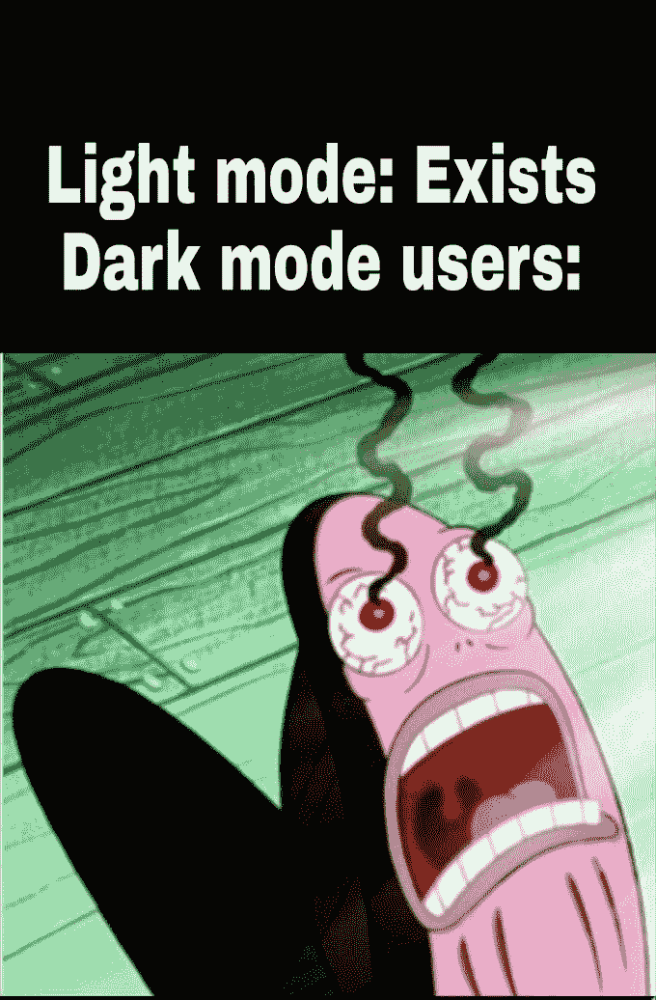

# 你更喜欢 Github 要点还是 Markdown 代码片段？

> 原文：<https://dev.to/gvetri/do-you-prefer-a-github-gist-or-markdown-code-snippet-in-a-post-1lh7>

当使用 dev.to night 主题(这是我最喜欢的)时，我更喜欢 Markdown 代码片段，因为它很暗，不会灼伤我的眼睛。
[T3】](https://res.cloudinary.com/practicaldev/image/fetch/s--vU7tuszq--/c_limit%2Cf_auto%2Cfl_progressive%2Cq_auto%2Cw_880/https://i.kym-cdn.com/photimg/newsfeed/001/479/279/201.jpg)

但在另一方面，如果出版商交叉发布并使用 Github Gist，并在一个地方修改它，并看到在多个网站上反映的变化对发布 Gist 的人来说是一个极好的优势。

你对此有什么想法？