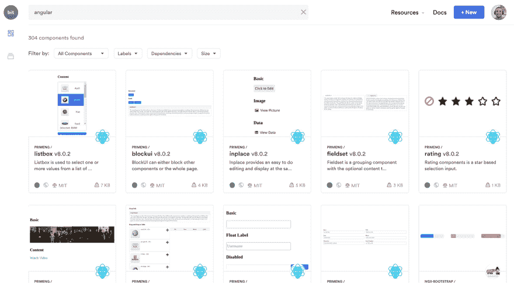
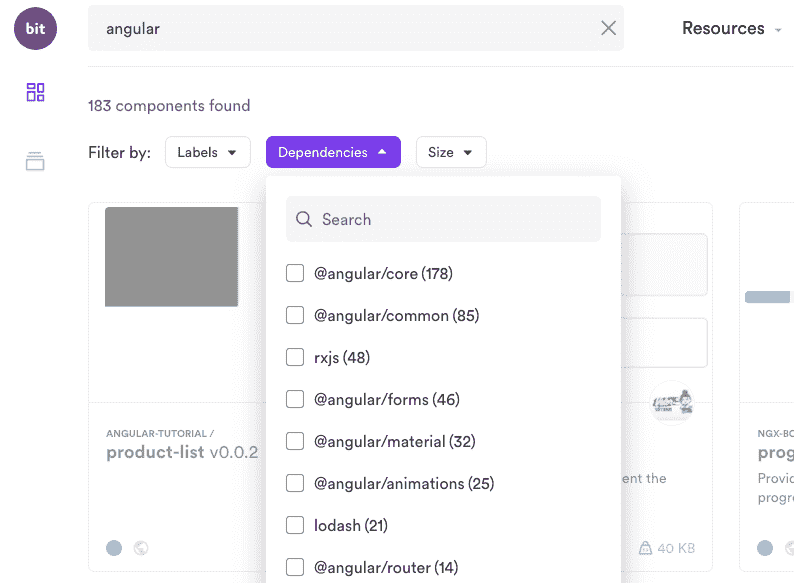
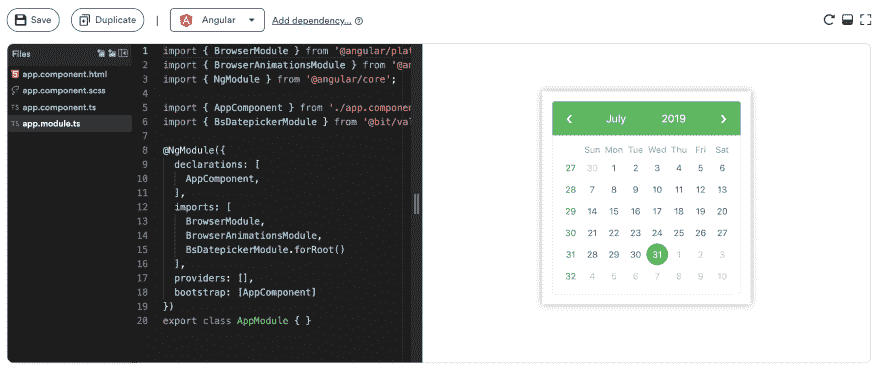
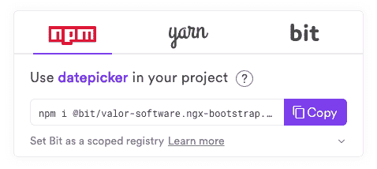
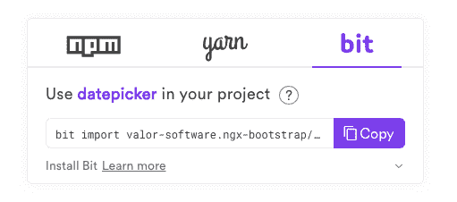

# 还需要元件库吗？

> 原文：<https://dev.to/jonisar/do-you-still-need-a-component-library-28kn>

***让我们重新思考共享组件来构建我们的应用*** 的方式。

今天，React、Vue 和 Angular 中的前端组件让我们可以通过模块化的 UI 构建块来编写应用程序。几年后，[与框架无关的 web 组件](https://hackernoon.com/7-frontend-javascript-trends-and-tools-you-should-know-for-2020-fb1476e41083)将会把它带到下一个层次。

然而，直到 2018 年，我们共享和重用模块化组件的方式与我们共享整个项目的方式没有太大不同。如果我们想从一个存储库到另一个存储库共享一个组件，我们必须创建一个新的存储库来托管它，将代码移动到那里，将它作为一个包复制，发布它，并将其作为一个依赖项安装到新项目中。

当涉及到更小的原子组件时，这个过程很难扩展。它不是针对组件的，而是针对项目的。

因此，团队开始努力共享组件，试图减少流程的开销。这通常会导致创建被称为“共享组件库”的项目(“T0”示例“T1”)，这基本上是一个包含许多组件的单一项目。

但是，在 2018 年，一种新的共享成为可能:在项目之间直接共享组件，通过远程基于云的集合进行同步。这一切之所以成为可能，要感谢一个名为 [Bit](https://github.com/teambit/bit) 的新开源项目，它是为在更大的项目之间共享更小的模块而构建的。

在这篇文章中，我们将尝试探讨“我还需要一个组件库吗？”并展示了不同组件共享工作流的优缺点。让我们开始吧。

## 一个组件库的优劣

为了更好地理解[组件库是否是正确的选择](https://blog.bitsrc.io/do-we-really-use-reusable-components-959a252a0a98)，让我们简单回顾一下构建组件库的利弊。总之答案是:看情况:)

### 构件库的优点

*   不需要为 30 多个组件设置 30 多个存储库，只需要一个外部存储库来托管所有 30 个组件。

*   将共享组件的开发整合到一个项目中:PRs、Issues 等。

*   为组件分配一个明确的所有者。

*   栈和标准的执行(双刃剑)。

基本上，组件库的主要优势取决于视角。与每个组件的 repo 方法相比，它节省了开销，并将组件的开发和使用整合到一个存储库和包中。然而，这也可能是不利的一面。我们来复习一下。

### 组件库的烦恼

*   如果组件在你的应用程序内部，那么将它们移动到库中将需要大量的重构工作。

*   消费者只需要一个组件，却被迫安装整个库。Lerna 可以帮助发布每个组件，但是对于很多组件来说开销很大。

*   您将如何版本化和更新单个组件？

*   组件的可发现性很差，所以你必须在文档门户上投资，也许还要添加像[故事书](https://github.com/storybookjs/storybook)或[代码沙盒](https://codesandbox.io/)这样的工具。但是，如何搜索一个有 X 个依赖项、包大小只有 Y kb 的按钮组件呢？(参见下面的[位开发](https://bit.dev))。

*   组件消费者不能对组件进行修改，除非潜入库中并制作一个 PR，然后等待它被接受。这通常会阻碍组织内部采用这样的库。对于许多团队来说，这本身就成为构建库的基础架构团队和使用库的应用程序开发人员之间的一个转折点。组件之间的协作并不好。

*   你对每个消费应用强制使用不适合任何用例的样式和其他东西，阻碍了库的采用。

*   你很难处理组件之间的依赖关系，因为当你对一个组件进行更改时，很难判断哪些其他组件(在库中或其他地方)会受到影响以及如何受到影响。

*   您需要致力于库周围的额外工具，以减轻一些痛苦(基本的可发现性、个体发布等)。

组件库可以比作一张音乐专辑 CD-r om(25 岁以上的人会记得:)。这是一个静态的地方，你可以随身携带，放大约 30 件物品在上面。你得看封面才能知道里面是什么，也不能搜歌。如果不重新硬刻录 CD，也不能更改内容。随着时间的推移，它会因即兴调整而受到一些损害，并开始逐渐消失。跨团队协作对于图书馆来说是非常困难的，因为图书馆经常不能被大规模采用。

但是，如果我们可以有一个“组件 iTunes”而不是一个组件 CD 专辑，我们可以轻松地共享、发现、消费和更新来自不同项目的单个组件，会怎么样？继续读。

## 云中共享组件

2018 年，一个名为 Bit 的[开源项目首次在 GitHub 上推出。](https://github.com/teambit/bit)

不像我们在项目中使用的面向项目的工具(Git repos，package managers 等)，Bit 是为原子组件构建的。

它让我们可以在项目之间共享 JavaScript 代码，而不必为此设置更多的外部存储库(然而，如果我们愿意，我们也可以使用它将代码从一个库共享到其他项目)。它管理跨项目的源代码和依赖关系的变更。

[bit.dev](https://bit.dev) 是 bit 的组件 hub。像 GitHub 一样，它对开源软件也是免费的(包括一些私有代码)。通过 bit.dev，组件可以在项目和团队之间被发现、使用和同步。

让我们快速回顾一下。

### 隔离和发布

当谈到前端组件时，Bit 让我们自动将组件从项目(应用程序或库)中分离出来，并将它们包装在一个包含的环境中，让它们开箱即可在其他项目中运行。该环境包含组件的所有文件、所有依赖项以及在项目外部构建和运行所需的配置。

这意味着我们可以在很短的时间内从一个给定的项目中单独共享多个组件，只需要零到很少的重构。

Bit 处理每个组件的版本和依赖关系，同时扩展 Git 来跟踪跨项目的源代码变更。

### 组件的可发现性

通过 [bit.dev](https://bit.dev) 您共享的组件对您自己和其他人来说都是可发现的，以便查找、了解和选择。

您可以通过名称在语义上搜索组件，并根据上下文相关的标签、依赖关系、包大小和更多有用的参数过滤结果。

您可以通过可视化快照快速浏览组件，当您进入组件页面时，您可以在项目中使用它之前在现场进行尝试。您还可以查看从代码中自动解析的 API 文档，以了解它是如何工作的。

通过 [bit.dev](https://bit.dev) 组件被可视化，以便开发人员、产品、设计人员和其他利益相关者可以协作，并且可以通用地访问组织内的所有组件。

### 组件消耗和协作

一旦你找到一个你喜欢的组件，例如，你的团队或社区共享的，你可以使用像 npm 和 yarn 这样的包管理器来安装它。

#### 从消费项目中更新组件...

Bit 还可以让你将一个组件(或者整个集合)添加到一个新项目中。这意味着 Bit 会将组件的实际源代码带入存储库，同时跟踪您所做的更改。

然后，您可以更改代码中的某些内容，例如样式，并用新版本标记组件。然后，您可以将新版本共享回集合，甚至可以将更改拉入编写该组件的任何其他存储库中，同时利用 Git 合并版本之间的更改。

简而言之，这意味着你可以非常快速地从你的应用程序中更新组件，这样你就不必一头扎进程序库，等待很长时间。虽然它需要一些协作规则(例如，选择谁可以将新版本推送到 bit.dev 中的集合)，但这也意味着人们可以采用这些组件并使它们适合自己的需求。否则，组件可能不会被使用(或者只是复制粘贴和更改，而没有人知道它:)。

## 组件库+ bit.dev 一起？

鉴于这两种方法的优点，许多人选择将他们的组件库与 [Bit](https://github.com/teambit/bit) 和 [bit.dev](http://bit.dev/) 的优点结合起来。

在这种结构中，库充当共享组件的开发和登台区。Bit 和 bit.dev 用于共享组件，使它们可被发现，并在组件之上实现协作，以促进它们在现实世界中的采用。

最佳选择取决于您的需求。对于基础架构团队发布组件而其他团队正在使用它们的大型组织来说，建议将两者结合起来——在他们的报告中开发基础架构团队拥有的所有组件，并使所有组件都可以单独被发现、使用，并根据需要进行简单的管理和更新。

对于由单个开发人员组成的较小团队来说，试图在两个应用程序之间共享一个组件，库可能是多余的，您可以通过您的 bit.dev 集合共享组件——从一个应用程序到另一个应用程序，并保持它们同步。您甚至不需要重构任何东西或添加额外的存储库来维护。

底线，真的取决于你:)

干杯