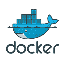

# Docker:构建共享网络

> 原文：<https://dev.to/setevoy/docker-compose-shared-networks-1iac>

[](https://res.cloudinary.com/practicaldev/image/fetch/s--SxYzshGT--/c_limit%2Cf_auto%2Cfl_progressive%2Cq_auto%2Cw_880/https://rtfm.co.ua/wp-content/uploads/2015/09/docker_lxc.png) 我们有一个 Docker Compose stack 与 Jenkins、sonar cube 和 PostgresSQL，在 Docker post 中检查[sonar cube:running tests from Jenkins Pipeline。](https://rtfm.co.ua/en/sonarqube-running-tests-from-jenkins-pipeline-from-docker/)

问题是它们被描述在同一个 Docker Compose 文件中，并由同一个 systemd 文件重新启动(查看 Linux:systemdсервисдляdocker composepost， *Rus*

因此，如果需要重启 SonarQube，必须重启所有 SonarQube，包括正在运行作业的 Jenkins。

因此，任务将是把这三个服务分成两个组合文件，但保留通信能力，而不改变容器之间的 URL 连接。

这里将使用 [`external`](https://docs.docker.com/compose/networking/#use-a-pre-existing-network) 功能。

撰写 3.5 版。

### 詹金斯网络

在詹金斯的撰写文件中，添加一个`name`来创建一个[自定义网络](https://docs.docker.com/compose/compose-file/#name-1)，称为*詹金斯* :

```
version: '3.5'
networks:
 jenkins:
   name: jenkins
services:
  jenkins:
    user: root
    image: jenkins/jenkins:2.176.2
    networks:
      - jenkins
    ports:
      - '8080:8080'
      - '50000:50000'
    environment:
      - JENKINS_HOME=/var/lib/jenkins
      - JAVA_OPTS=-Duser.timezone=Europe/Kiev
      - JENKINS_JAVA_OPTIONS="-Djava.awt.headless=true -Dhudson.model.DirectoryBrowserSupport.CSP="default-src 'self' 'unsafe-inline' 'unsafe-eval'; img-src 'self' 'unsafe-inline' data:;""
    logging:
      driver: "journald" 
```

否则 Docker 会创建一个名称为 *servceiname_networkname* 的网络，看起来不太好。

### SonarQube 网络

然后在 SonarQube 的 Compose 文件中描述一个叫做 sonar 的附加网络——但是作为 *jenkins* 网络
的[外部](https://docs.docker.com/compose/networking/#use-a-pre-existing-network)

```
version: '3.5'
networks:
  sonar:
    external:
      name: jenkins
services:
  sonarqube:
    user: 1004:1004
    image: sonarqube:7.9.1-community
    ports:
      - "9000:9000"
    networks:
      - sonar
    environment:
      - sonar.jdbc.url=jdbc:postgresql://db:5432/sonar
    volumes:
      - /data/sonarqube/conf:/opt/sonarqube/conf
      - /data/sonarqube/logs:/opt/sonarqube/logs
      - /data/sonarqube/temp:/opt/sonarqube/temp
      - /data/sonarqube/data:/opt/sonarqube/data
      - /data/sonarqube/extensions:/opt/sonarqube/extensions
      - /data/sonarqube/bundled_plugins:/opt/sonarqube/lib/bundled-plugins
    logging:
      driver: "journald"

  db: 
    image: postgres
    networks:
      - sonar 
    environment:
      - POSTGRES_USER=sonar
      - POSTGRES_PASSWORD=sonar
    volumes:
      - /data/sonarqube/postgresql:/var/lib/postgresql
      - /data/sonarqube/postgresql_data:/var/lib/postgresql/data
    logging:
      driver: "journald" 
```

重新启动服务并列出网络:

```
root@jenkins-production:/opt/jenkins# docker network ls
NETWORK ID          NAME                DRIVER              SCOPE
...
fb22545d1fae        jenkins             bridge              local
... 
```

使用此网络检查集装箱:

```
root@jenkins-production:/opt/jenkins# docker network inspect jenkins | jq '.[] | .Containers[].Name'
"jenkins_db_1"
"jenkins_sonarqube_1"
"jenkins_jenkins_1" 
```

并使用服务名检查连接，例如 sonar cube 的 Compose-*sonar cube*:

```
root@jenkins-production:/opt/jenkins# docker exec -ti jenkins_jenkins_1 curl -I sonarqube:9000
HTTP/1.1 200 
```

或者 *db* :

```
root@jenkins-production:/opt/jenkins# docker exec -ti jenkins_jenkins_1 telnet db 5432
Trying 172.20.0.3...
Connected to db.
Escape character is '^]'. 
```

完成了。

### 类似的帖子

*   <small>02/27/2017</small>[Docker:Compose down–network JM admin _ default 有活动端点](https://rtfm.co.ua/docker-compose-down-network-jmadmin_default-has-active-endpoints/)
*   <small>06/18/2019</small>[sonar cube:在 Docker](https://rtfm.co.ua/en/sonarqube-running-tests-from-jenkins-pipeline-from-docker/) 运行来自 Jenkins 管道的测试
*   <small>2019 年 8 月 15 日</small> [Kubernetes:第 3 部分–AWS EKS 概述和手动 EKS 集群设置](https://rtfm.co.ua/en/kubernetes-part-3-aws-eks-overview-and-manual-eks-cluster-set-up/)