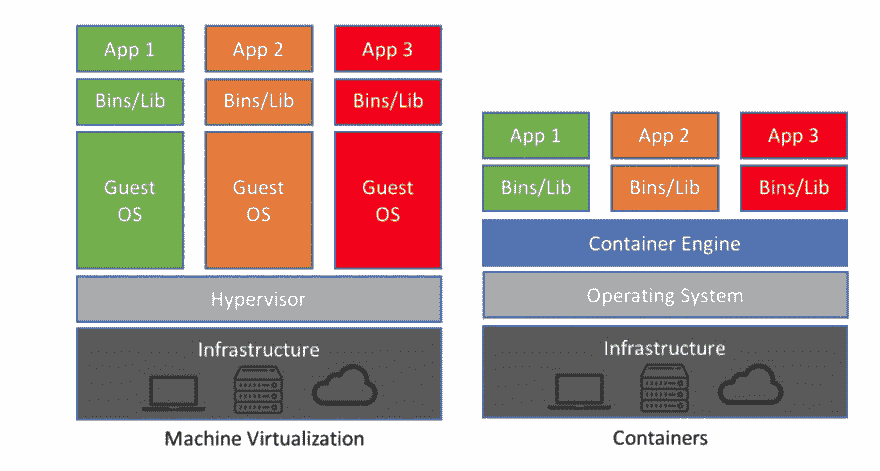
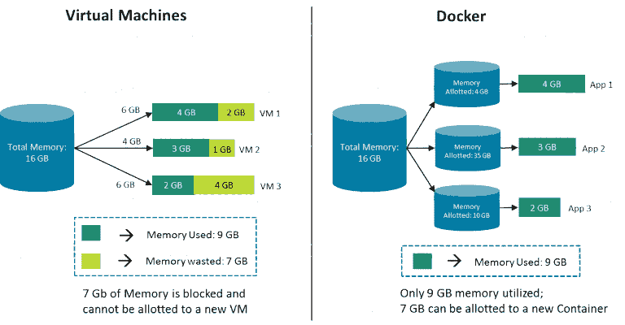
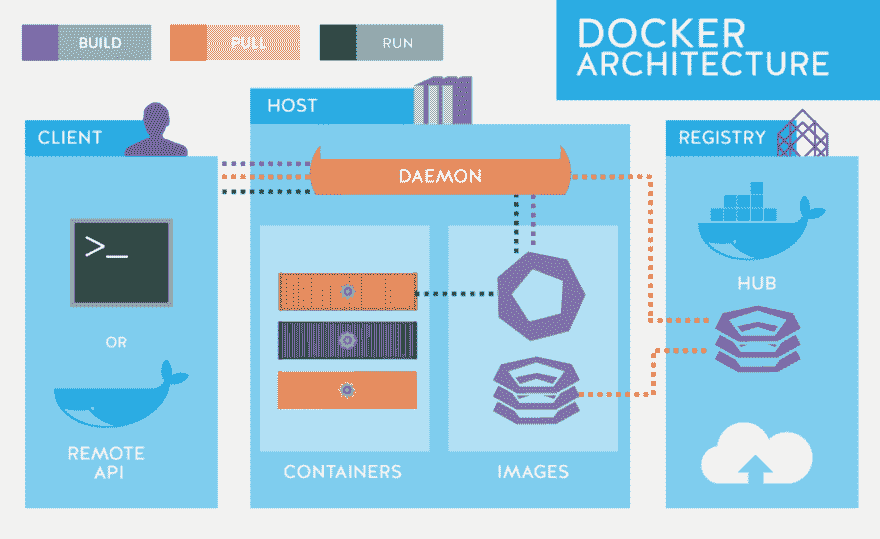

# 初学者码头工人

> 原文：<https://dev.to/anji4246/docker-for-beginners-4fn6>

<figure> 

<figcaption>虚拟机 vs 集装箱</figcaption>

</figure>

Docker 最近得到了很多关注，DevOps 成为软件开发不可或缺的一部分。Docker 提高了团队的敏捷性。开发人员也必须在本地运行容器

#### Docker 是什么？

Docker 是一个容器化软件，它允许你将应用程序及其所有依赖项打包成一个单元。它确保您的应用程序在任何环境下都能无缝运行。完整的包称为 docker 容器。

使用 Docker，您可以在共享相同内核的同一台主机上运行多个操作系统。

假设你有一个安装了 Docker 的 Ubuntu 操作系统。Docker 可以在其上运行任何风格的操作系统，只要它们都基于相同的内核，在本例中是 Linux。每个 Docker 容器都有制作这些操作系统的附加软件，Docker 利用 Docker 主机的底层内核，它可以与所有操作系统一起工作。

那么有没有和这个不共享同一个内核的 OS 呢？没错。 **Windows。**这意味着你不能在装有 Windows 操作系统的 Docker 主机上运行基于 Windows 的容器。为了那个**，**你需要在 Windows 服务器上安装 Docker。

在详细介绍之前，让我们先了解一下什么是容器、虚拟机、虚拟化和容器化。

**容器:**容器是一个隔离的执行环境，其中一个或多个进程可以独立运行。

每个容器共享主机操作系统内核，通常还共享二进制文件和库。共享组件是只读的。因此，容器特别 ***【轻】***——它们只有兆字节大小，启动只需几秒钟，而虚拟机需要几十亿字节和几分钟。

**虚拟机:**虚拟机是充当虚拟计算机的程序。它在您当前的操作系统(主机操作系统)上运行，并为客户操作系统提供虚拟硬件。来宾操作系统在您的主机操作系统(Windows)上的 LINUX 中运行，就像您计算机上的任何其他程序一样。

**虚拟化:**动态创建虚拟机并在隔离环境中运行的过程称为虚拟化

**容器化:**创建容器并将应用程序作为容器内的进程运行的过程；被称为集装箱化。

虚拟机管理程序允许您在服务器或本地机器上动态创建虚拟机。

虚拟机管理程序或虚拟机监视器是创建和运行虚拟机的软件和固件。它位于硬件和虚拟机之间，是虚拟化服务器所必需的。

**虚拟机和容器之间的差异**

*虚拟机*和*容器*的主要区别在于，容器提供了一种虚拟化操作系统的方式，以便多个工作负载可以在单个操作系统实例上运行。通过虚拟机，硬件被虚拟化以运行多个操作系统实例。

**Docker 主要部件**

**Docker 文件**

Dockerfile 是 Docker 从上到下读入的文本文件。它包含一堆指令，告知 Docker 应该如何构建 Docker 映像。

**Docker 引擎**

Docker 引擎是安装在主机上的 docker 应用程序。这是一个客户端-服务器类型的应用程序，这意味着我们有客户端中继到服务器。所以 Docker 守护进程叫做:是代表服务器的 Docker 引擎。docker 守护进程和客户端可以运行在同一个或远程主机上，它们通过命令行客户端二进制文件以及完整的 RESTful API 与守护进程进行交互。

**Docker 图像**

图像是一种惰性的、不可变的文件，本质上是容器的快照。

Docker 图像就像一个用于创建 Docker 容器的模板。它们是 Docker 容器的组成部分。这些 Docker 映像是使用 build 命令创建的。这些只读模板用于通过使用 run 命令创建容器。

图像是用命令创建的，当用。

**码头登记处**

Docker 将图像存储在注册表中。有公共和私人注册。Docker company 有一个名为 Docker hub 的公共注册表，你也可以在那里私下存储图片。

**码头集装箱**

Docker 容器映像是一个轻量级的、独立的、可执行的软件包，包括运行应用程序所需的一切:代码、运行时、系统工具、系统库和设置。

坞站库

Docker 存储库是相关 Docker 映像的集合，通常是同一应用程序的不同版本。

**坞站组成**

***Docker compose*** 将多个包组合成一个包。因此，您可以运行这个包来一次调出 docker compose 文件中列出的所有包。这避免了单独运行所有映像的手动操作。

总而言之:

*   Docker 文件是用于创建 Docker 图像的文本文件
*   Docker 映像是通过运行 Docker 命令(使用 Docker 文件)构建的
*   Docker 容器是 Docker 映像的运行实例

**Docker 架构**

下图描述了 Docker 的高级架构。

它包括 3 个主要组件

**Docker 客户端:**用于触发 Docker 命令

**Docker 主机:**负责运行 Docker 守护进程

**Docker 注册表:**负责存储图片

Docker 主机中运行的 Docker 守护进程负责映像和容器。

*原载于 2019 年 7 月 13 日*[*【http://techmonks.org】*](http://techmonks.org/docker-for-beginners/)*。*

* * *