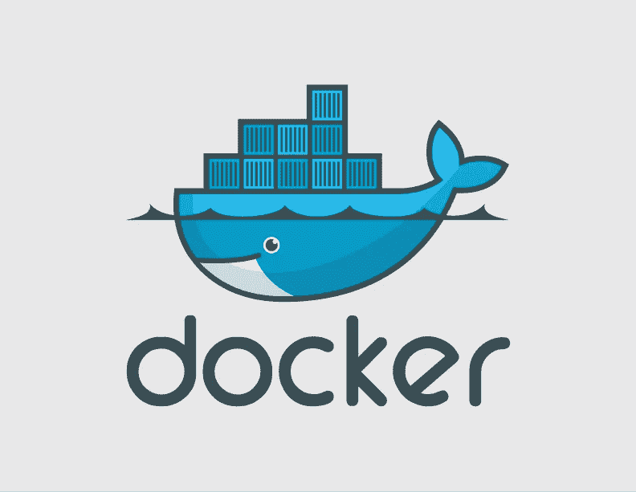
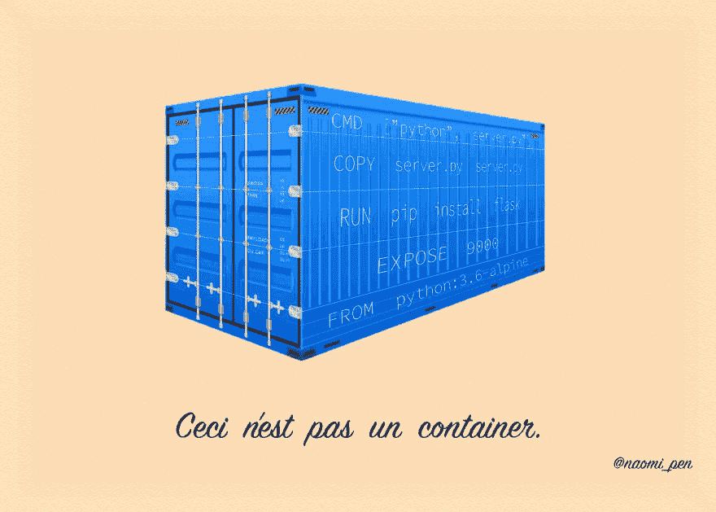
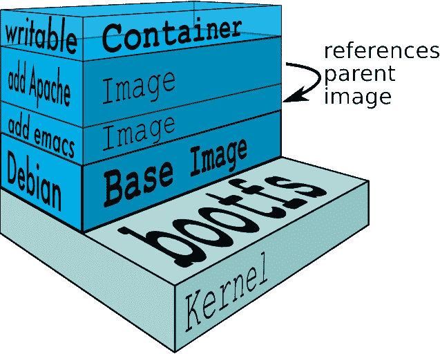
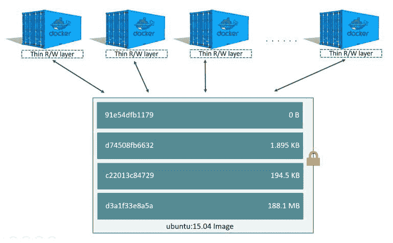
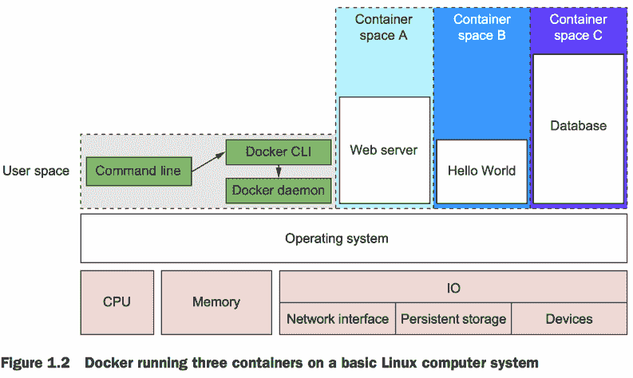

# 码头行话:从码头文件到集装箱

> 原文：<https://dev.to/npentrel/docker-jargon-from-dockerfile-to-container-942>

Docker 社区中有相当多的术语。甚至 Docker 这个词也有一个(稍微隐藏的)意思。在《Docker Deep Dive》中，Nigel Poulton 解释道:“‘Docker’这个词来自英国口语，意思是**码头**工作人员——装卸货船的人。”

虽然您可以在不知道 Docker 名称来源的情况下使用它，但了解行话是很重要的。为此，这篇博文将向你展示 Docker 世界中的主要术语及其含义。

如果你是 Docker 新手，或者一直想要一个更全面的解释，这篇文章就是为你准备的。你不需要任何特殊的知识来跟随。读完这篇文章后，你会知道以下术语的含义:

*   码头工人
*   码头集装箱
*   Docker 图像
*   Dockerfile
*   层
*   Docker 卷
*   码头引擎
*   图像注册表

Docker 将自己定位为一个容器平台，帮助开发者**在任何环境下**构建、运输和运行**任何应用**。在你的电脑上编写的应用程序在你朋友的电脑、裸机服务器、云等上的运行方式完全相同。这包括使用不同操作系统的主机，如 Windows 和 Mac 电脑。为了在这两个平台上运行 Linux 容器，Docker 使用了一个轻量级的 Linux VM，它运行在一个 hypervisor(用于 Mac 的 xhyve 和用于 Windows 的 Hyper-V 或 VirtualBox)之上。

你可以从两类人的角度来看 Docker 的好处:DevOps 人员和开发人员。如果你是一名开发人员，Docker 的好处是你可以建立一个既用于测试又用于生产的环境。迭代、测试和部署变更应该非常快。最重要的是，容器解决了“对我有用”的问题，因为无论部署在哪里，一切都是一样的。如果您做 DevOps，容器允许您将更多的精力放在容器管理上，同时免除配置机器的责任。现在您已经了解了 Docker，下一步是 Docker 容器。

一个**容器**将代码和依赖项打包在一起，创建一个轻量级的、抽象的、可移植的应用程序。容器化应用程序允许您运行许多应用程序，从而最大限度地利用计算机资源。每个容器都在自己的隔离环境中运行。Docker 容器是在 Docker 图像之上创建的。

一个 **Docker 图像**可以被认为是一个应用程序的蓝图。理解图像和容器之间的区别很重要:图像不同于运行中的容器——它仅仅是容器的快照。给定这样一个快照，Docker 引擎知道如何在发出一个`docker run`命令时创建一个容器，但是快照本身只是一个没有生命的只读蓝图。

<figure>

<figcaption>A way to remember this is René Magritte’s famous painting The treachery of Images in which he cleverly depicted a pipe under which he wrote ‘Ceci n’est pas une pipe’ meaning ‘This is not a pipe’.</figcaption>

</figure>

要创建这样的快照，您需要使用一个 **Dockerfile** ，即磁盘上包含创建映像的指令的文件。发出`docker build`命令时，Docker 会使用一个基础映像(例如 centos 映像或 ubuntu 映像)。在基础映像之上，Docker 执行 Docker 文件中的每条指令以产生新的 Docker 映像。执行每条指令时发生的文件更改被存储为只读文件系统，也称为**层**。大多数图像由多层组成(用于创建图像的 docker 文件中的每一行指令都有一层)。因为所有层都是只读的，所以 Docker 图像是不可变的。

<figure>

<figcaption>Source: https://docs.docker.com/terimg/docker-filesystems-multilayer.png</figcaption>

</figure>

当容器运行时，Docker 引擎，尤其是它的存储引擎，负责将构成图像的各层呈现为一个统一的对象(有点类似于 git 提交)。在这个统一的对象之上，Docker 引擎然后添加一个读写文件系统，使它成为一个实际的容器。任何文件更改都发生在顶层，这是容器运行时唯一可以修改的层。这种设置使得容器非常节省资源，因为可以使用同一个映像运行多个容器。

<figure>

<figcaption>Source: https://docs.docker.com/storage/storagedriver/</figcaption>

</figure>

容器内图像顶部的可读写层应该很薄，并且不是为保存持久数据而设计的。如果你确实需要持久数据，Docker 建议使用 **Docker Volumes** 。卷是可以附加到容器的独立构造。如果容器被终止或报废，即使容器被移除，卷仍可访问。对于容器，你通常不应该关心它们的死或被杀，因为它们并不特殊，你可以很容易地创建新的容器。像 Kubernetes 这样的工具允许你在运行中的容器发生问题时自动旋转新的容器。

<figure>

容器、映像和卷都由需要安装在操作系统之上的 **Docker 引擎**管理。Docker 引擎是一个客户端-服务器应用程序，由 Docker 守护进程、指定与守护进程交互的接口的 REST API 和命令行接口(CLI)组成。当您在命令行上发出 Docker 命令时，Docker CLI 将使用守护程序的 REST API 与守护程序进行通信。守护进程反过来将与主机操作系统一起为容器分配操作系统资源(CPU、存储等)。
T3T5】

<figcaption>Source: http://orhandogan.net/docker/</figcaption>

</figure>

最后要提到的是像 [Docker Hub](https://hub.docker.com/) 、 [Google Container Registry](https://cloud.google.com/container-registry/) 和 Azure Container Registry 这样的图像注册中心。这些实现了 GitHub 为代码实现的类似功能:它们托管 Docker 图像，您和其他人都可以使用。Docker Hub 有一个充满官方图片的图书馆，就像这个 [MongoDB](https://hub.docker.com/_/mongo/) 图片。您可以使用这些官方图像作为您自己图像的基础图像。如果你想看看用于创建官方图片的 [Dockerfiles](https://github.com/docker-library/mongo/blob/9ab7383589df65a7ad12f143d1db4731214ec518/4.2-rc/Dockerfile) ，你可以在官方图片的页面上找到它们的链接。你也可以拥有自己的私人图像注册表。

#### 了解更多

这就结束了我们对 Docker 行话的概述。如果您有兴趣了解更多信息，请查看:

*   [虚拟机和容器的区别](https://dev.to/npentrel/docker-containers-vs-vms-257i)
*   [码头教程](https://www.youtube.com/watch?v=wjvyN_r-zkk)
*   [码头支票簿](https://github.com/npentrel/SmoothDevOps/raw/master/cheatsheets/01%20Docker%20Cheatsheet.pdf)
*   [码头工人入门指南](https://docs.docker.com/get-started/)
*   [奈杰尔·波尔顿的码头深水潜](https://www.amazon.com/Docker-Deep-Dive-Nigel-Poulton-ebook/dp/B01LXWQUFF)
*   [orlandgan . net/dock/](http://orhandogan.net/docker/)的缩写