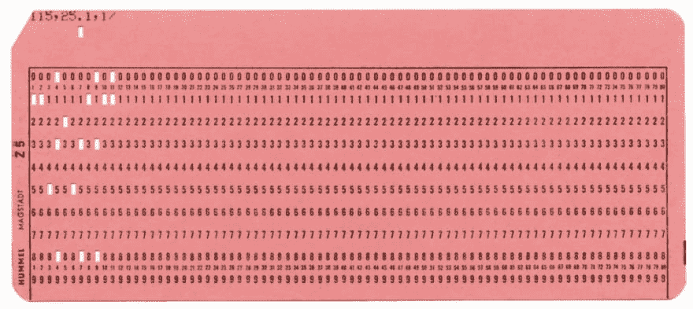

# 2022 年列宽 80 的编码有意义吗？

> 原文：<https://dev.to/javinpaul/does-coding-with-column-width-of-80-make-sense-in-2019-1kbg>

*披露:这篇文章包括附属链接；如果您从本文提供的不同链接购买产品或服务，我可能会收到报酬。*

最古老的[编码实践之一](https://javarevisited.blogspot.com/2014/10/10-java-best-practices-to-name-variables-methods-classes-packages.html)是保持行宽 80，我们许多人都盲目地遵循它，但是你有没有想过我们最初为什么有这个实践？

我相信这是为了让你的代码在小显示器时代更具可读性，以便整个内容可以适合屏幕，或者它可能起源于穿孔卡时代，过去穿孔卡有 80 列宽。

当我们想起过去的日子时，这听起来很合理，但你认为这条规则在 2022 年有意义吗？

我们现在生活在这样一个时代，大多数开发者都有[大显示器](https://www.amazon.com/LG-32MP58HQ-P-32-Inch-Monitor-Screen/dp/B01BV1X9DG?tag=javamysqlanta-20)，可以显示多达 180 个字符，**这难道不是浪费宝贵的显示器空间吗？**它还会使您的代码变得不必要的长，实际上也是如此。

我第一次知道换行是在 80 岁的时候，当时我正在阅读 Java 编程语言的 Oracle 代码约定，它的最后一次修订是在 1999 年 4 月 20 日，在缩进下面写着

> *4.1 行长度\
> 避免长度超过 80 个字符的行，因为许多终端和工具都不能很好地处理它们。*
> 
> *注意:文档中使用的示例应具有较短的行长度——通常不超过 70 个字符。*

来源:[http://www . Oracle . com/tech network/Java/javase/documentation/code conventions-136091 . html # 248](http://www.oracle.com/technetwork/java/javase/documentation/codeconventions-136091.html#248)

如果我理解正确的话(我可能错了)，这个规则的一个目标是**一致性**。我曾经认为 80 是愚蠢的，但是能够浏览过去 7 年中由十几个不同团队编写的源代码，并且不需要重新调整我的窗口大小，这是一件非常好的事情。一致的列宽有助于加快阅读代码的速度。

由于我主要使用大型显示器，如 LG 32MP58HQ-P 32 英寸 IPS 显示器，带屏幕分割，我也意识到我们正在浪费大量宝贵的空间。80 的一致列宽简直太少了。

我个人使用 120，除非我工作的项目已经确定了列宽，在这种情况下，我会保持一致。

杰佛森·桑多斯在 [Unsplash](https://unsplash.com?utm_source=medium&utm_medium=referral) 上拍摄的照片

人们给出的仍然使用 80 列的另一个原因是，现在他们同时处理多个文件，大多数是在 [VIM](http://bit.ly/2yboQ5S) 或他们的 ide 中，如 [Eclipse](http://bit.ly/2hiXebL) 或 [IntelliJ IDEA](http://bit.ly/2CSO36A) 。

例如，如果您使用标准列宽，您可以将几个文件放入一个原因中，并可以逐行比较它们，我认为这是一个真正的好处。

你甚至可以在一个屏幕上进行三向合并检查，而不用横向滚动。顺便说一句，这不应该以过度包装为代价。

我知道一致的栏目更容易浏览和阅读文本，但不管是 80 还是 120。

最后，我要说的是，一致性很好，你必须坚持，但是 80 甚至 100 都太短了。

尽管许多开发人员可能接受 120 甚至 150。我们现代的宽屏高清液晶显示器可以轻松处理更多内容。

它比过多的换行更具可读性，因为我个人觉得读一行换行要比在一行中看到全部内容困难得多。当然，这只是偏好，别人会有不同的感受。

> 那么，你们是怎么想的，这条规则还有效吗，还是你已经向前看了？

其他**编程文章**你可能喜欢的
[2022 年 Web 开发者路线图](https://hackernoon.com/the-2019-web-developer-roadmap-ab89ac3c380e)
[10 门数据结构和算法课程破解编程面试](https://hackernoon.com/10-data-structure-algorithms-and-programming-courses-to-crack-any-coding-interview-e1c50b30b927)
[2022 年 Java 程序员应该学会的 10 件事](https://javarevisited.blogspot.com/2017/12/10-things-java-programmers-should-learn.html#axzz5atl0BngO)
[2022 年你可以学会的 10 种编程语言](http://www.java67.com/2017/12/10-programming-languages-to-learn-in.html)
[10 种工具每个 Java 开发者都应该知道的](http://www.java67.com/2018/04/10-tools-java-developers-should-learn.html)
[学习 Java 编程语言的 10 个理由](http://javarevisited.blogspot.sg/2013/04/10-reasons-to-learn-java-programming.html) 2022 年
[成为更好的 Java 开发者的 10 个技巧 2022 年](http://javarevisited.blogspot.sg/2018/05/10-tips-to-become-better-java-developer.html)
[2022 年要学习的 5 大 Java 框架](http://javarevisited.blogspot.sg/2018/04/top-5-java-frameworks-to-learn-in-2018_27.html)
[2022 年要学习 Python 的 10 个理由](https://javarevisited.blogspot.com/2018/05/10-reasons-to-learn-python-programming.html)
[每个 Java 开发者都应该知道的 10 个测试库](https://javarevisited.blogspot.sg/2018/01/10-unit-testing-and-integration-tools-for-java-programmers.html)

感谢你阅读这篇文章直到最后。如果你喜欢这篇文章，那么请考虑在 medium 上关注我( [javinpaul](https://twitter.com/javinpaul) )。如果你想在每篇新帖子上得到通知，别忘了在 Twitter 上关注[**javarevited**](https://twitter.com/javarevisited)！