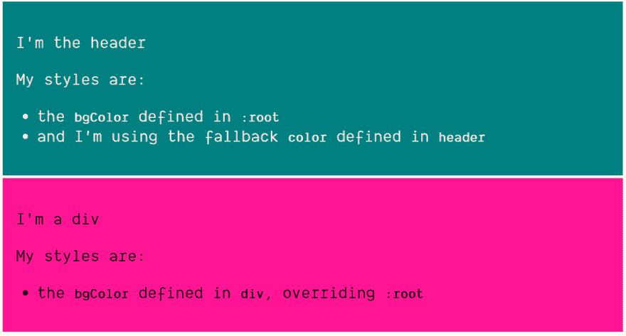
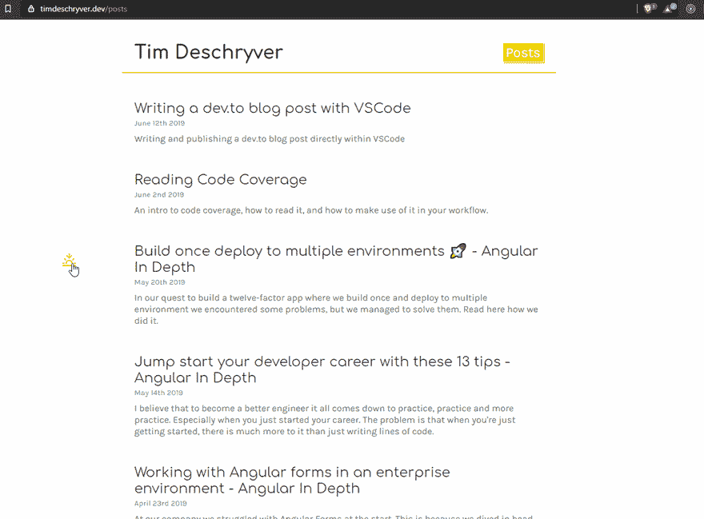

# 不要错过 css 变量

> 原文：<https://dev.to/timdeschryver/don-t-miss-out-on-css-variables-4708>

起初当我听说 [css 变量](https://www.w3.org/TR/css-variables/)被引入时，我有点怀疑。如果有 scss，sass，less，stylus 这样的扩展语言，为什么还会有人用。几年后，我开始注意到越来越多的人使用它，写它，谈论它。我错过了一些东西...它花了一段时间，但在这里和那里使用后，我被迷住了。在这篇文章中，我将讲述是什么说服我进一步探索 css 变量，并开始在项目中使用它们。

### 用法

要声明变量，在选择器中定义它们，并在变量名前加上两个破折号(`--` ):

```
div {
  --bgColor: deeppink;
} 
```

Enter fullscreen mode Exit fullscreen mode

一种流行的方法是用`:root`选择器定义变量，这样你就定义了一个全局变量:

```
:root {
  --bgColor: teal;
} 
```

Enter fullscreen mode Exit fullscreen mode

要使用变量，使用`var()`函数:

```
div {
  background: var(--bgColor);
} 
```

Enter fullscreen mode Exit fullscreen mode

`var()`函数接受第二个参数，如果变量尚未声明，该参数用作后备:

```
header {
  background: var(--bgColor);
  color: var(--color, beige);
} 
```

Enter fullscreen mode Exit fullscreen mode

上面的片段导致:

[](https://res.cloudinary.com/practicaldev/image/fetch/s--fRmQWmgd--/c_limit%2Cf_auto%2Cfl_progressive%2Cq_auto%2Cw_880/https://timdeschryver.dev/posts/do-not-miss-out-on-css-variablimg/0.png)

### 主题

有了 css 变量，创建主题就变得简单了。

根据`body`的类，我们可以将变量设置为合适的值:

```
body.sunrise {
  --background-color: #fff;
  --text-color: #333;
}

body.sunset {
  --background-color: #333;
  --text-color: #fff;
} 
```

Enter fullscreen mode Exit fullscreen mode

我们可以在设计元素样式时使用这些变量:

```
html,
body {
  background: var(--background-color);
  color: var(--text-color);
} 
```

Enter fullscreen mode Exit fullscreen mode

如果`body`的类更改为`sunrise`或`sunset`，css 变量将级联到所有的选择器。
在我们的例子中，我们将过渡到一个亮或暗的主题:

[](https://res.cloudinary.com/practicaldev/image/fetch/s--vz6Vb-5R--/c_limit%2Cf_auto%2Cfl_progressive%2Cq_66%2Cw_880/https://timdeschryver.dev/posts/do-not-miss-out-on-css-variablimg/1.gif)

### JavaScript API

在我看来，这是最好的部分。CSS 变量有一个 JavaScript API 来获取和设置变量。

要获得一个变量，使用 [`getPropertyValue`方法](https://developer.mozilla.org/en-US/docs/Web/API/CSSStyleDeclaration/getPropertyValue) :

```
getComputedStyle(document.documentElement).getPropertyValue('--color') 
```

Enter fullscreen mode Exit fullscreen mode

要从元素中获取值，首先用 [`querySelector`](https://developer.mozilla.org/en-US/docs/Web/API/Document/querySelector) :
选择该元素

```
getComputedStyle(document.querySelector('h1')).getPropertyValue('--color') 
```

Enter fullscreen mode Exit fullscreen mode

要设置变量值，使用 [`style.setProperty`](https://developer.mozilla.org/en-US/docs/Web/API/CSSStyleDeclaration/setProperty) :

```
document.documentElement.style.setProperty('--color', 'red') 
```

Enter fullscreen mode Exit fullscreen mode

在元素上设置值:

```
document.querySelector('h1').style.setProperty('--color', 'blue') 
```

Enter fullscreen mode Exit fullscreen mode

这个 API 提供了一些以干净的方式使用 css 变量的机会。

几天前， [David K.](https://twitter.com/DavidKPiano) 在 https://codepen.io/davidkpiano/pen/zWrRye 的 [XState](https://xstate.js.org) 演示中遇到了这个用例。当用户在屏幕上拖动鼠标时，他使用 css 变量创建一个选择框。

selectbox 的 css 使用变量来知道盒子的四个角(基于起点和鼠标的当前位置):

```
.selectbox {
  left: calc(var(--mouse-x1));
  top: calc(var(--mouse-y1));
  width: calc((var(--mouse-x2) - var(--mouse-x1)));
  height: calc((var(--mouse-y2) - var(--mouse-y1)));

  color: rgba(255, 255, 255, 0.5);
  background: rgba(0, 0, 0, 0.1);
  border: 2px solid currentColor;
  position: absolute;
  transition: opacity 0.3s ease-in-out;
} 
```

Enter fullscreen mode Exit fullscreen mode

监听鼠标事件，并相应地更新鼠标指针:

```
document.documentElement.style.setProperty(
  '--mouse-x1',
  ctx.selectArea.x1 + 'px',
)
document.documentElement.style.setProperty(
  '--mouse-y1',
  ctx.selectArea.y1 + 'px',
)
document.documentElement.style.setProperty(
  '--mouse-x2',
  ctx.selectArea.x2 + 'px',
)
document.documentElement.style.setProperty(
  '--mouse-y2',
  ctx.selectArea.y2 + 'px',
) 
```

Enter fullscreen mode Exit fullscreen mode

[](https://res.cloudinary.com/practicaldev/image/fetch/s--5enlqxuM--/c_limit%2Cf_auto%2Cfl_progressive%2Cq_66%2Cw_880/https://timdeschryver.dev/posts/do-not-miss-out-on-css-variablimg/2.gif)

### 结尾词

如果你和我一样，没有看到 css 变量的用处，或者不知道这些变量的存在。我希望这篇文章打开了探索它们的用例的大门。
我偶然发现了 JavaScript API，但这个 API 让我看到了它们在现实世界中的用法，我期待着在未来更多地使用和看到它们。