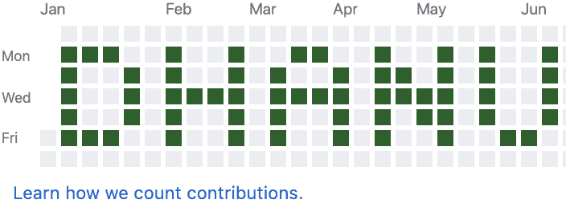
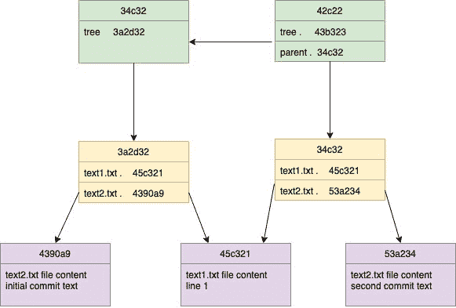

# 在 Github 贡献图上绘制图像

> 原文：<https://dev.to/dhanushkadev/drawing-image-on-github-contribution-graph-iif>

你看到我的 Github 账号 2016 年的 Git 贡献图了吗？看看这个[这里](https://github.com/madushadhanushka?tab=overview&from=2016-12-01&to=2016-12-31)。上面印着我的名字。这篇博文将告诉你我是如何做到的，以及一些可能对你有帮助的底层 Git 概念。

[](https://res.cloudinary.com/practicaldev/image/fetch/s--VD4iRgTQ--/c_limit%2Cf_auto%2Cfl_progressive%2Cq_auto%2Cw_880/https://cdn.hashnode.com/res/hashnode/image/upload/v1560240824616/pJLAEMLzz.png)

Github 提供了一种用图表来表示您日常工作的方式。Github 引入了这个贡献图作为每日贡献度量。对我来说，我把这个特性作为做更多提交的动机因素。大量的贡献并不意味着这些贡献是有价值的。但不知何故，它让我们了解了你对开源社区所做的贡献。

## Git 内部如何工作

作为程序员，我们使用 Git 来保存代码的最后成功状态。Git 有一种简单的方式在 Git 存储库中保存和版本控制历史。Git 将数据保存为以下对象的组合。

*   Blob:这个对象用来存储单个文件的内容
*   树:引用另一个博客或子树
*   提交:提交数据(Auther、Commiter 等)和对树对象的引用
*   标签:提交对象的引用。

Blob 只不过是您更改过的文件。每当您将内容提交到 Git 存储库中时，它会将更改后的文件压缩到一个 Blob 类型的对象中。然后它为它生成哈希值。同时，Git 还创建了另一个名为 Tree 对象，并保存对 Blob 对象的引用。如果有许多文件发生了更改，那么 Git 会为每个发生更改的文件生成许多 Blob 和 hash 值。它还生成另一个名为 tree 的对象来跟踪所有更改过的文件。一旦你提交了，它就会生成另一个对象，叫做提交对象。该提交对象将保持对树对象的引用。

一旦在第一次提交后更改了另一个文件，Git 将再次检查更改的文件，并为更改的文件创建新的 Blobs 和树。然后它创建指向树对象新提交对象。它还通过使用名为 parent 字段来保持对先前提交的引用。

这里有一个例子。

[](https://res.cloudinary.com/practicaldev/image/fetch/s--2rAAxVy5--/c_limit%2Cf_auto%2Cfl_progressive%2Cq_auto%2Cw_880/https://cdn.hashnode.com/res/hashnode/image/upload/v1560240518713/6VeexTnO7.jpeg)

在这个例子中，我们有两个文件(text1.txt 和 text2.txt)。提交用绿色表示。树和斑点分别用黄色和紫色表示。对于第一次提交(34c32)，有一个树(3a2d32)与它相关联以跟踪文件。在此提交中，有两个文件可用(4390a9 和 45c321)。对于下一次提交，我们将更改 text2.txt 文件。由于其内容已更改，它会生成具有新哈希 id 的新 blob(53a 234)。新的提交具有新的树(34c32 ),并且提交还通过父提交散列指向先前的提交。

如果您使用下面的命令读取提交对象内容，内容将如下所示。

`git cat-file -p 1658642a6c164700c880d499da0b874c18829883`

这里“1658642 a6c 164700 c 880d 499 da 0b 874 c 18829883”是提交哈希 id。

```
tree 03de692bf6a38ac9c98bac37dc27534fbaf020b6
parent 5436b80815fde902030d71f08957f68a366dd91f
author Dhanushka Madushan <dhanu@gmail.com> 1559998289 +0530
committer Dhanushka Madushan <dhanu@gmail.com> 1559998289 +0530
Initial commit 
```

这里，Git 维护作者姓名和标记的提交时间。如您所见，提交对象中有两个时间戳。

*   作者日期:这是提交消息时的时间戳。作者日期一旦确定，就不会再改变。
*   提交日期:当您重新确定提交日期时，该日期可能会改变。

## 如何绘制像素

图像是由许多像素组成。我们来看看，如何在贡献图中画一个像素。您需要做的第一件事是选择一个 git 存储库。这不应该是一个分叉的知识库。Github 不会计算分叉存储库的贡献，除非更改合并到原始存储库中。因此，请记住使用原始存储库。
Github 根据以下事实衡量贡献。

*   提交到存储库的默认分支或 gh-pages 分支
*   打开一个问题
*   提出拉取请求
*   提交拉动式请求审核
*   在存储库的默认分支或 gh-pages 分支中共同创作提交

这里我使用了第一种方法，因为我可以通过更改提交来更改历史。首先，我在存储库中创建了一个新文件，并添加了一些随机单词。然后它提交。然后，我通过运行`git log`命令获取最后一个提交散列 id。现在，我可以通过运行以下命令将任意日期放入提交消息中。它用先前提取提交散列替换提交散列。

```
git filter-branch -f --env-filter \
    'if [ $GIT_COMMIT = 943f032ac12f386ae6e9e9d14f9e1a4e269a16a4 ]
     then
         export GIT_AUTHOR_DATE=“Fri Jun 03 21:38:53 2016 -0800"
         export GIT_COMMITTER_DATE="Fri Jun 03 21:38:53 2016 -0800"
     fi' 
```

当`git log`再次执行时，我们可以看到相关的提交消息改变了它的作者和提交日期。
现在可以将这些更改推送到远程分支机构。因为我们更改了提交历史，所以不能用`git push origin master`来推送更改。应该使用“-f”选项强制进行更改。因此，命令应该是`git push origin master -f`

> 警告:一旦你把你的修改推送到 Github，贡献图会根据整个提交历史绘制。请始终记住，您不能从提交历史中删除贡献。也就是说，你只能给 Github 添加贡献。您不能删除摊缴。贡献将是永久的。

## 在已经贡献的图形上绘图

Github 贡献图通过从深绿色到浅绿色色阶来表示贡献。深绿色表示贡献较高，浅绿色表示贡献较低。基于所选一年期内完成的贡献数量，动态生成色标。在我今年的贡献图中，我有 2000 左右的贡献。为了在我的贡献图中打印一个黑点，我需要单日至少 40 次贡献。这意味着，我需要运行 40 次以上的脚本。所以我创建了一个脚本，用下面的脚本生成许多提交。这个脚本将生成 100 条提交消息。

```
#!/bin/bash
# Basic while loop
counter=1
while [ $counter -le 100 ]
do echo $counter>>file.txt
echo $counter
git add file.txt
git commit -m "commit $counter"
((counter++))
done echo All done 
```

我运行以下脚本来为同一天生成许多提交消息。每天的提交次数可以用脚本中的`modcommit`变量来改变。十天十次提交意味着 100 次提交。该脚本读取在`arr[i]`数组中定义的前 100 次提交和更改提交时间戳历史。

```
modcommit=10
arr[0]="Mon Jul 16 21:38:53 2018 -0800"
arr[1]="Fri Jul 20 21:38:53 2018 -0800"
arr[2]="Thu Jul 19 21:38:53 2018 -0800"
arr[3]="Wed Jul 18 21:38:53 2018 -0800"
arr[4]="Fri Jul 27 21:38:53 2018 -0800"
arr[5]="Mon Jul 23 21:38:53 2018 -0800"
arr[6]="Mon Jul 30 21:38:53 2018 -0800"
arr[7]="Fri Sep 28 21:38:53 2018 -0800"
arr[8]="Thu Sep 27 21:38:53 2018 -0800"
arr[9]="Wed Sep 26 21:38:53 2018 -0800"

fix_commit_date() { 
    echo "commit id $1"
    echo "date $2"
    git filter-branch --env-filter \
    "if [ \$GIT_COMMIT =  ${1} ]
     then
         export GIT_AUTHOR_DATE=\"${2}\"
         export GIT_COMMITTER_DATE=\"${2}\"
     fi" -f
}

rm commit.txt
git log --pretty=%H>commit.txt
COUNTCOMMITS=$(awk 'END {print NR}' commit.txt)
echo $COUNTCOMMITS
input="commit.txt"
count=0
while IFS= read -r line
do
  dateid=$((count / modcommit))
  AUDATE=${arr[dateid]}
  echo "$line"
  DATE2="$( echo "${AUDATE}")"
    fix_commit_date $line "$AUDATE"

     ((count++))
  if [[ "$count" == '100' ]]; then
    break
  fi
  echo $TODO
  $($TODO)
echo "" 
```

您可以更改这个脚本，因为您想要为一组日期添加许多贡献。如果你正在尝试这样做，我建议你做一个更老的年度贡献图。如果你在图表上添加一个贡献，它将是永久的。希望这篇文章也能帮助你理解 Git 的基本概念。在 twitter 上与我一起阅读更多有趣的科技文章。下一篇文章再见。干杯:)