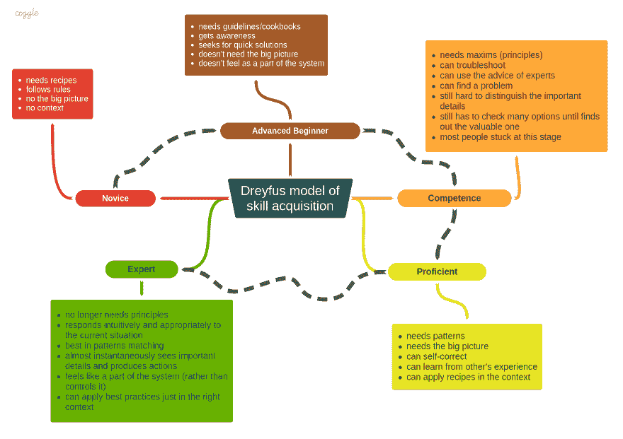

# 德莱弗斯技能习得模型

> 原文：<https://dev.to/vorakl/dreyfus-model-of-skill-acquisition-1n72>

有一个专门的术语来描述计算机的智能，事实上，它只是在某种程度上模仿了人类的智能。它被称为人工智能(AI)，以强调它带有合成性质。回到 1980 年，军方已经支持人工智能研究 20 多年了，现在是时候问一问为什么几乎所有构建人工智能系统的努力都失败了，这些系统能够*“提供专家医疗建议，展示常识，在危急的军事情况下自主运行”*。

1980 年 2 月，Dreyfus 兄弟(Stuart E .和 Hubert L .)在美国空军科学研究办公室的支持下，在加州大学伯克利分校提交了他们的研究报告——“定向技能习得所涉及的心理活动的五阶段模型[”。这个模型显示了人类如何通过指令和经验获得新技能。出版后，他们继续研究这个模型，并做了一些修改和扩展，结果发表在他们的书*“机器思维”中。《计算机时代人类直觉和专业知识的力量》*，1986 年。正如兄弟们在书中所说，*‘我们的意图更谦虚但更基本’*-*‘我们可以从计算机智能中合理期待的东西’*。](https://vorakl.com/files/dreyfus/skill-acquisition-1980.pdf)

一个技能获得的过程通常要经过五个发展阶段(**新手**、**高级初学者**、**能力**、**精通**、**专家**)。每个阶段都表现了某种行为和对某种情况的心理反应。从一个阶段到另一个阶段的成功过渡与四种心理功能的适当转换有关:**回忆**、**识别**、**决定**、**意识**。对发展阶段的理解对于任何技能训练程序都是至关重要的，因此它可以促进获得新技能的过程，并推进到下一个阶段。对于人类来说，从新手到专家的整个过程平均需要 10 年。或者，更现实的是，10 000 小时的学习和实践。一些研究还表明，不管专家的专业领域是什么，这个星球上最多只有 5%的专家。

报告中还指出*‘随着学生变得熟练，他更少依赖抽象的原则，更多依赖具体的经验’*，只有*‘最简单形式的技能是通过遵循抽象的形式规则产生的’*。因此，更高水平的表现取决于*‘日常的、具体的、解决问题的经验’*。通过获得经验，学生能够通过遵循在与上下文无关的情况下行动的规则从零开始。然后，有了一点经验，学生能够使用指南对情境方面作出反应。进一步的实践导致能够使用准则(原则)来决定一个适当的行动。所有这三个转变都与前三个阶段相对应，并且总是代表着某种*分析*决策过程，这是*将他对总体情况的把握与具体行动*联系起来所需要的。

重大变化发生在第 4 阶段，此时*所经历的情况数量如此之大，以至于通常每个特定的情况都会立即指示一个直觉上适当的行动*。这里的关键点是*‘从分析思维到直觉反应’*。只有当专家*“不再需要原则”*并且能够*“几乎瞬间产生适当的视角及其相关动作”*时，才能实现最高水平的专业技能和精湛的表演。这是最重要的观察结果之一:专家的表现超出了规则，当他们受到任何形式的规则或流程的限制时，他们的表现会显著下降。2008 年，实用主义书架出版了安迪·亨特(Andy Hunt)撰写的优秀著作《[实用主义思维与学习](https://pragprog.com/book/ahptl/pragmatic-thinking-and-learning)》。它提供了许多关于人类大脑及其工作方式的见解，许多学习更多更快的技巧，包括对 Dreyfus 模型的详细回顾(第 2 章)。

理解人类思维和推理机器如何“思考”之间的差异有助于满足开发人工智能系统的现实期望。为了定义计算机*应该*做什么，首先需要明确计算机*可以*做什么。在这方面，计算机是一个**分析引擎**，因此它可以**应用规则**并做出**逻辑推理**。显然，以极高的速度，高等级的准确性，和非凡的再现性，但它仍然遵循一定的逻辑。事实证明，也许永远有限的“推理机器”和人类思维的直觉专业知识之间的这种关键差异，不可简化为规则，似乎是找到人类和计算机之间平衡的良好起点。

其他格式: [PDF](https://vorakl.com/files/dreyfus/dreyfus.pdf) ， [PNG](https://vorakl.com/files/dreyfus/dreyfus.png) ， [TXT](https://vorakl.com/files/dreyfus/dreyfus.txt)