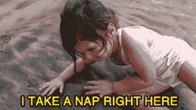

# 喝消防水管里的水，避免精疲力竭

> 原文：<https://dev.to/bluesbaka/drinking-from-the-firehose-and-avoiding-burnout-5e5l>

### 世卫组织用三个标准来定义倦怠

#### 感觉精力耗尽或耗尽

#### 与工作的心理距离或对职业的负面感受增加

#### 职业生产力降低。

你通常可以确定它的结束阶段——曾经高效的团队成员现在一天中大部分时间盯着他们的屏幕；人际互动的精力减少，完成的工作质量明显下降。不仅仅是感到疲倦或没有效率，倦怠会持续几周甚至几个月。

这是一个在我们的现代世界如此普遍的问题，世卫组织更新他们的定义是为了更好地承认和支持我们社会的这一特征。

作为一名软件开发人员，工作中的一个现实是精疲力竭——但人们通常不会真正谈到这一点。能够推动一个项目通过，或者只是不停地解决一个问题，直到它完成，美国人已经掌握了疲惫伸缩的艺术，这是很有价值的。回想一下你最近一次提到睡眠的对话——有人在大声疾呼他们睡眠不足吗？他们的努力工作和奉献精神是否会同时受到称赞？

我在 Flatiron 的训练营经历令人难以置信——我从来不会相信我能在 3 个月内学会两种不同的语言和每种语言的库，并精通为现代网络创建前端和后端应用程序。然而，在过去的几周里，我注意到我曾经快乐而充满活力的伙伴们的热情正在减退。我们都在坚持，我们每天都去学校——我们中的大多数人都提前一两个小时，然后呆一个小时左右，完成额外的阅读。我们的奉献是显而易见的，我们所做的承诺正在帮助我们渡过难关。

这是一个紧张的项目，我们所有人都在学习处理永无止境的学习过程，每三周就要生产出另一个产品。我们都逐渐意识到，这实际上是我们选择从事的工作的关键部分。因此，从长远来看，解决这个问题就是现在就培养好习惯，并把它们融入到我们的生活和事业中。老实说，通过我在这个问题上所做的所有阅读，关键点是一致的——像对待你最喜欢的宠物一样对待你自己！

1.  给自己喂食——最好是富含健康脂肪的食物——比如鱼、坚果、奶酪，或者我个人最喜欢的早餐——鸡肝慕斯。

2.  锻炼——即使是 20 分钟的散步也有助于降低你的压力水平，但是一周几次一小时的有氧运动/负重训练将会极大地改善你的生活和从压力环境中恢复的能力

3.  水-我知道你知道这一点，但仍然-得到一个水瓶，并把它放在你的桌子上。每天 32 盎司对保持你的快乐和功能有很大帮助。

4.  睡眠——即使在正常情况下，成年人每晚也需要 6-8 小时的睡眠。越来越多的研究明确发现了睡眠不足和慢性病之间的联系。如果你没有时间睡觉——你可能是在欺骗自己，你的工作质量有多差。

5.  社交——我们是哺乳动物，当我们与和我们一起互动和工作的人建立有意义的情感联系时，我们处于最佳状态。你不需要和你的同桌成为最好的朋友，但是花 15 分钟交流一下你一天的故事或者你生活中的趣闻会让每个人都感觉被看到了。尽可能多地安排时间和对你重要的人在一起，找些有趣的事情做，确保你每周至少有一两个小时。

6.  自我保健——我通常把这列为卫生保健，并提醒人们每天早上洗澡，但它真的不止于此，还包括任何你觉得有恢复力的身体/修饰/补充个人护理。如果你想不出这一类的东西，那就一定要每天洗个澡，或许穿上你喜欢的新衬衫。

7.  向你的团队寻求帮助——和你的团队谈谈你正在经历的事情，最多不要超过一两个星期。

资源:

[https://www.projectmanager.com/blog/avoid-burn-out](https://www.projectmanager.com/blog/avoid-burn-out)

[https://www . health line . com/health/mental-health/burnout-definition-world-health-organization # 1](https://www.healthline.com/health/mental-health/burnout-definition-world-health-organization#1)

[https://www . health line . com/health/tips-for-identifying-and-preventing-burnout](https://www.healthline.com/health/tips-for-identifying-and-preventing-burnout)

[https://www . sleep foundation . org/extreme-sleep/support/how-much-sleep-do-we-really-need](https://www.sleepfoundation.org/excessive-sleepiness/support/how-much-sleep-do-we-really-need)

[https://www . health line . com/health/tips-for-identifying-and-preventing-burnout # how-you-can-help](https://www.healthline.com/health/tips-for-identifying-and-preventing-burnout#how-you-can-help)

[https://www . the Zen teacher . com/overflow-or-drinking-from the fire hose/](https://www.thezenteacher.com/overwhelm-or-drinking-from-the-firehose/)