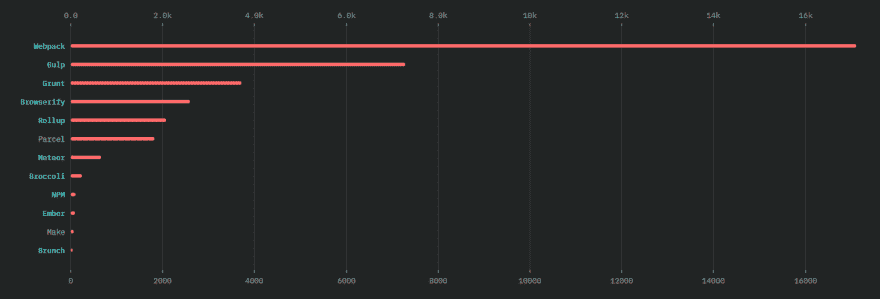

# React.js 应用程序的简单自定义 Webpack 设置

> 原文：<https://dev.to/jscrambler/easy-custom-webpack-setup-for-react-js-applications-35f8>

不言而喻，web 应用程序在其功能方面一直在增长。

网络应用接近或比桌面应用更强大。伴随着这种力量而来的是很多复杂性。对于一个简单的应用程序，其中的一些复杂性包括:CSS 和 JavaScript 缩小、JavaScript 和 CSS 代码连接、JavaScript 文件中的图像加载、文件监视和自动编译。我们将在后面更详细地讨论这些。

有鉴于此，已经创建了几个工具来使开发和发布更加容易和高效。一个这样的工具是 [webpack](https://webpack.js.org/) 。在这个领域有许多竞争者，[吞](https://gulpjs.com/)和[浏览](http://browserify.org/)是两个。在本教程中，我们将演示如何为一个 [React.js 应用程序](https://reactjs.org)设置 webpack。我们使用 webpack 的原因是许多主要的 web 框架都使用它，包括官方的 React.js 编译器， [create-react-app](https://reactjs.org/docs/create-a-new-react-app.html#create-react-app) 。根据 2018 年 JavaScript State 调查，Webpack 实际上是最受欢迎的构建工具，如下图所示:

[](https://res.cloudinary.com/practicaldev/image/fetch/s--cYmjZjDp--/c_limit%2Cf_auto%2Cfl_progressive%2Cq_auto%2Cw_880/https://blog.jscrambler.com/conteimg/2019/07/jscrambler-blog-easy-custom-webpack-setup-react-applications-webpack-popularity.png)

请在这个 [GitHub repo](https://github.com/JscramblerBlog/Jscrambler-Webpack-React) 中找到完成的项目代码。

## 简单 Web 应用程序的编译要求

*   缩小:这是减少代码文件大小的过程。这是通过删除不必要的空白来实现的。其他技术包括重命名函数和变量名。
*   串联:这是将几个文件合并成一个文件的方法。
*   JavaScript 和 CSS 文件中的图像加载:这是一种用于根据图像文件的配置位置为图像文件生成 URL 的方法。
*   文件监视和自动编译:这是一种方法，当文件内容发生变化时，指定的进程将自动运行。
*   自动重新加载:这与文件监视和自动编译齐头并进。它增加的唯一额外步骤是，在编译之后，页面被自动重新加载。

## web pack 概念概述

Webpack 使用入口点和输出的概念。入口和输出设置在名为`webpack.config.js`的文件中进行配置。在这个文件中，其他配置也是可能的，我们将看看一些常见的配置。

### 进入点

入口点是一个 JavaScript 文件。它是主文件，将导入所有其他所需的文件。使用 [JavaScript 导入语法](https://developer.mozilla.org/en-US/docs/Web/JavaScript/Reference/Statements/import)，webpack 知道如何读取这个条目文件。它还会连接那里所有的其他文件。

### 输出

这是一个单独的 JavaScript 文件。它将是 webpack 在读取条目文件后设法处理的所有文件的总数。例如，这通常是我们将使用`<script src="somepath/output.js"></script>`在网页上结束加载的脚本。我们最终得到单个文件的过程称为捆绑。产生的单个文件通常称为包。

### 模块

这些是控制 webpack 行为的规则集。例如:连接 JavaScript 代码时要考虑哪些文件扩展名。

### 插件

插件为 webpack 添加了额外的默认功能。

## 为简单的 Web 应用程序设置 webpack

我们将从一个简单的 React.js 应用程序开始。

使用
初始化 npm 项目

```
npm init -y 
```

在下面安装几个 npm 包

```
npm install --save react react-dom prop-types // react stuff
npm install --save-dev webpack webpack-cli // webpack and it's cli
npm install --save-dev css-loader mini-css-extract-plugin // css compilation
npm install --save-dev babel-loader @babel/core @babel/preset-env @babel/preset-react // es6 and jsx stuff
npm install --save-dev html-webpack-plugin //  inserts output script to index.html file
npm install --save-dev clean-webpack-plugin // to cleanup(or empty) the dist(or output) folder before compilation
npm install --save-dev sass-loader node-sass // sass to css compilation
npm install --save-dev file-loader // loading files, e.g. images, fonts
npm install --save-dev papaparse csv-loader xml-loader // xml, csv and tsvs loading
npm install --save-dev webpack-dev-server // webpack development server 
```

在一个空文件夹中，创建一个名为`webpack.config.js`的 webpack 配置文件，插入以下内容；

```
const path = require('path');
const HtmlWebpackPlugin = require('html-webpack-plugin');
const { CleanWebpackPlugin } = require('clean-webpack-plugin');
const MiniCssExtractPlugin = require("mini-css-extract-plugin");

module.exports = {
 mode: "development",
 entry: {
   app: "./src/main.js"
 },
 devtool: 'inline-source-map',
 devServer: {
   contentBase: path.join(__dirname, './'), // where dev server will look for static files, not compiled
   publicPath: '/', //relative path to output path where  devserver will look for compiled files
 },
 output: {
   filename: 'js/[name].bundle.js',
   path: path.resolve(__dirname, 'dist'), // base path where to send compiled assets
   publicPath: '/' // base path where referenced files will be look for
 },
 resolve: {
   extensions: ['*', '.js', '.jsx'],
   alias: {
     '@': path.resolve(__dirname, 'src') // shortcut to reference src folder from anywhere
   }
 },
 module: {
   rules: [
     { // config for es6 jsx
       test: /\.(js|jsx)$/,
       exclude: /node_modules/,
       use: {
         loader: "babel-loader"
       }
     },
     { // config for sass compilation
       test: /\.scss$/,
       use: [
         {
           loader: MiniCssExtractPlugin.loader
         },
         'css-loader',
         {
           loader: "sass-loader"
         }
       ]
     },
     { // config for images
       test: /\.(png|svg|jpg|jpeg|gif)$/,
       use: [
         {
           loader: 'file-loader',
           options: {
             outputPath: 'images',
           }
         }
       ],
     },
     { // config for fonts
       test: /\.(woff|woff2|eot|ttf|otf)$/,
       use: [
         {
           loader: 'file-loader',
           options: {
             outputPath: 'fonts',
           }
         }
       ],
     }
   ]
 },
 plugins: [
   new HtmlWebpackPlugin({ // plugin for inserting scripts into html
   }),
   new MiniCssExtractPlugin({ // plugin for controlling how compiled css will be outputted and named
     filename: "css/[name].css",
     chunkFilename: "css/[id].css"
   })
 ]
}; 
```

### 输入 JS 文件

在`src/main.js`中创建一个输入 JavaScript 文件，并粘贴到以下内容中；

```
import React from "react";
import ReactDOM from "react-dom";
import Main from "@/components/Main";
import  "./style.scss";

ReactDOM.render(<Main/>, document.getElementById('app'));

if (module.hot) { // enables hot module replacement if plugin is installed
 module.hot.accept();
} 
```

用内容在`src/components/Main.jsx`中创建一个 React 组件文件；

```
import React, { Component } from "react";

export class Main extends Component {
 render() {
   return (
     <div>
       <p className="hello-text">Hello from react!</p>
     </div>
   )
 }
}

export default Main 
```

### 编译反应 JSX 到 JavaScript(预置)

在`.babelrc`处创建一个文件，放入以下内容；

```
{
 "presets": ["@babel/preset-env", "@babel/preset-react"]
} 
```

这将设置为 React.js 加载 ES6 的哪些特性。不要忘记文件名中的句点`.`。它允许我们在本地 JavaScript 代码中使用 React 的特殊语法。比如:

```
import Main from "@/components/Main";

<Main/> 
```

### 输出单个 CSS 文件

在`src/style.scss`中创建一个 Sass 文件，内容如下:

```
.hello-text {
 color: red;
} 
```

### 输出单个 JavaScript 文件

在`package.json`中，将以下内容添加到脚本部分；

```
"dev":  "webpack-dev-server"  "production":  "webpack --mode production" 
```

当我们运行命令`npm run dev`时，开发服务器将被启动。我们可以在`http://localhost:8080/`看到运行项目的结果。运行`npm run production`在生产模式下编译文件，并将结果放在`dist`目录中。

### 输出图像

在文件`src/components/Main.jsx`中，使用行
导入您选择的图像

```
import imagename from img/imagename.jpg"; 
```

确保将图像存储在文件夹`simg/imagename.jpg`中。

使用
在组件渲染功能中使用图像

```
<p></p> 
```

现在，图像应该在浏览器中可见。

### 输出字体

对于字体，在文件`src/style.scss`中，使用类似如下的语法加载字体；

```
@font-face {
 font-family: "Advent Pro";
 font-style: normal;
 font-weight: 400;
 src: url("./fonts/advent-pro-v9-latin-regular.woff2") format("woff2"),
   url("./fonts/advent-pro-v9-latin-regular.woff") format("woff");
} 
```

在上面的例子中，我们使用两个字体文件加载一个字体，并给它命名为`Advent Pro`

在`hello-text`类中使用新字体:

```
font-family: "Advent Pro"; 
```

### 设置文件观看

由于我们正在使用`webpack-dev-server`，我们自动获得文件监视和自动重载。

## 为更高级的 Web 应用程序设置 webpack

除了上面的简单设置，让我们为稍微复杂一点的应用程序添加更多的特性。

### 设置热模块更换

这类似于自动重载，只是它不重载页面。相反，它聪明地只注入文件中已经改变的部分。

要添加该功能，请将以下内容添加到 webpack 配置文件`webpack.config.js`中的`devServer`配置中:

```
hot: true 
```

### 将输出的 JavaScript 文件拆分成单独的文件

有时，出于某种原因，我们可能需要许多输出文件。一个例子是减少由于文件经常改变而造成的缓存破坏的影响。在`src/print.js`中创建另一个文件入口文件，并添加以下内容:

```
console.log("This comes from print file"); 
```

这只是控制台中的一条简单日志消息。但是在实际的应用程序中，我们可能会有更多的代码。

然后，更改条目配置，如下所示；

```
entry: {
 app: "./src/main.js",
 print: "./src/print.js"
}, 
```

现在，我们有两个输出脚本文件。

### 创建生产文件

现在，您会注意到，当我们运行`npm run dev`时，在输出文件夹`dist`中没有编译过的文件。这是因为我们正在使用开发服务器。如果我们想要分发文件，我们需要使用 webpack 的内置编译器。我们可以把这个添加到`package.json` :
的脚本部分

```
"build":  "webpack", 
```

现在，当我们运行`npm run build`时，将会创建一个包含发行版文件的`dist`文件夹。为了准备生产，添加如下的标志:

```
"production":  "webpack --mode production", 
```

### 重新生成前清除输出文件夹

有时，我们可能希望在创建生产文件之前清除`dist`文件夹。一个例子是当你有随机生成的文件名。在这种情况下，某些文件夹中会有重复的内容。

为此，将以下内容添加到配置文件的插件列表中；

```
new CleanWebpackPlugin({
 cleanOnceBeforeBuildPatterns: ["css/*.*", "js/*.*", "fonts/*.*", "images/*.*"]
}), 
```

这将清除所有名为`js`、`fonts`和`images`的文件夹。为了测试它的工作情况，向`dist/js`添加一个随机的 JavaScript 文件。比如说`randomfile.js`。

用上面注释掉的插件配置运行`npm run build`。您会注意到该文件仍然存在。

现在取消插件配置的注释并重新运行`npm run build`。该文件现在将会消失。

### 自定义 HTML 模板

在`src/index.html`中创建一个文件，内容如下:

```
<!DOCTYPE html>
<html lang="en">
<head>
   <meta charset="UTF-8">
   <meta name="viewport" content="width=device-width, initial-scale=1.0">
   <meta http-equiv="X-UA-Compatible" content="ie=edge">
   Learn Webpack
</head>
<body>
   <div id="app"></div>
</body>
</html> 
```

现在运行`npm run build`。看看`dist/index.html`中文件的输出。你会注意到它没有使用`src/index.html`中的 HTML 源文件作为模板，因为标题不同。要进行配置，通过传入如下所示的对象来更改 webpack 配置文件中的`HtmlWebpackPlugin`插件:

```
new HtmlWebpackPlugin({
 template: "./src/index.html",
 filename: "index.html",
 title: "Learning Webpack"
}), 
```

现在重新运行`npm run build`。你会注意到标题现在是一样的。

### 服务于其他静态资产类型

您会注意到，当我们构建项目时，图像和字体被复制到`dist`文件夹中。我们不仅可以复制图像和字体，还可以在代码中访问其他文件类型，如 csv。

要添加对 csv 的支持，创建一个名为`src/mycsv.csv`的文件，粘贴一些 csv as so

```
name,company,email,date
Raja,Sem Corporation,pede.ultrices.a@tinciduntpedeac.co.uk,"January 21st, 2019"
Aladdin,Ut Nulla Corp.,hendrerit.consectetuer@interdumSed.ca,"November 21st, 2018"
Plato,Fermentum Fermentum Limited,semper.egestas@massaMauris.net,"October 7th, 2019"
Anthony,Fringilla Est Consulting,luctus.ut@tortornibhsit.co.uk,"April 18th, 2018" 
```

然后，将以下设置添加到 webpack 配置文件中的加载器规则列表:

```
{
 test: /\.(csv|tsv)$/,
 use: ["csv-loader"]
} 
```

现在我们可以在代码中直接导入 csv 文件。在`src/main.js`中，添加这两行代码:

先导入 csv 文件:

```
import CsvData from "./mycsv.csv"; 
```

然后，在文件的底部，添加`console.log(CsvData);`

现在，运行`npm run dev`。打开浏览器，在控制台中观看。您应该会看到记录的 csv 内容。

## 保护 webpack 捆绑文件

使用 webpack 构建应用程序后，如果您打开其中一个包文件，您会发现可以轻松访问整个代码逻辑。虽然如果您正在构建小型项目，这可能不是一个问题，但是如果您正在开发商业 web 应用程序，您应该特别注意。

通过对应用程序的源代码进行逆向工程，恶意行为者可能会滥用应用程序，篡改代码，甚至发现重要的业务逻辑(在企业中，这既是一种趋势，也是一种担忧[)。](https://blog.jscrambler.com/enterprise-javascript-opportunities-threats-solutions/?utm_source=dev.to&utm_medium=referral)

Webpack 插件，如 Uglify 或 webpack obfuscator，仅提供基本的缩小/模糊处理，可以通过自动化工具快速恢复，因此无法正确保护 webpack 捆绑文件。相反，Jscrambler 提供了自动化工具无法逆转的企业级 [JavaScript 保护](https://jscrambler.com/code-integrity?utm_source=dev.to&utm_medium=referral),并提供了几层安全性，而不仅仅是混淆。

要使用 Jscrambler webpack 插件，首先你必须安装它:

```
npm i --save-dev jscrambler-webpack-plugin 
```

然后，在`webpack.config.js`文件中，添加这一行:

```
const JscramblerWebpack = require('jscrambler-webpack-plugin'); 
```

最后将 Jscrambler 插件添加到同一个`webpack.config.js`文件中的插件数组:

```
plugins: [
    new JscramblerWebpack({
      enable: true, // optional, defaults to true
      chunks: ['app', 'print'], // optional, defaults to all chunks
      params: [], 
      applicationTypes: {}
      // and other jscrambler configurations
    })
  ] 
```

在 webpack 构建过程中，Jscrambler 客户端将使用`.jscramblerrc`配置文件。更多细节，参见完整的[集成教程](https://blog.jscrambler.com/protectyourcodewhileusingwebpack/)。

## 结论

到目前为止，我们已经介绍了 webpack 的几个方面。这是一个非常动态的脚本和资产管理工具。

我们还没有使用它的所有功能，但这些功能对于您的一般应用程序来说应该足够了。对于更高级的工具，请参考官方的 [webpack 文档](https://webpack.js.org/)。

最初发表在 Lamin Sanneh 的 Jscrambler 博客上。