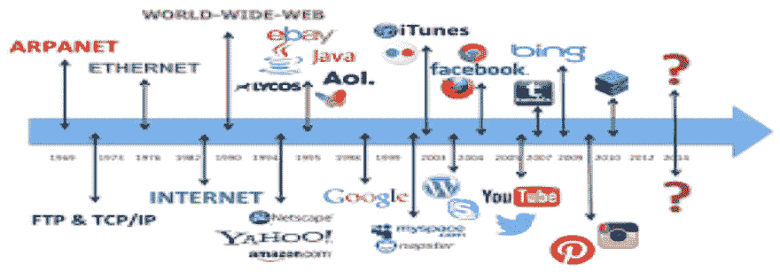
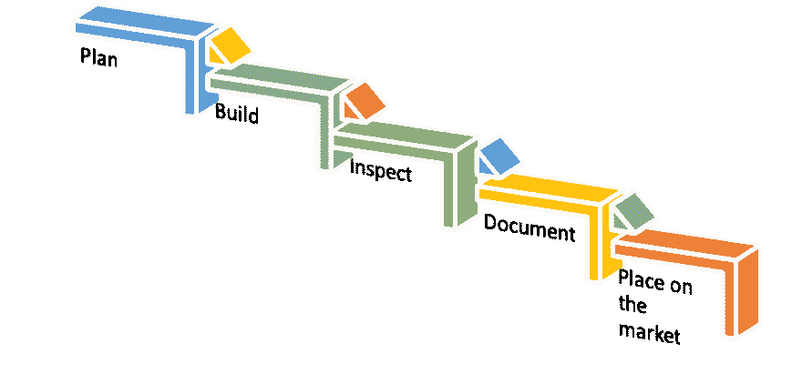
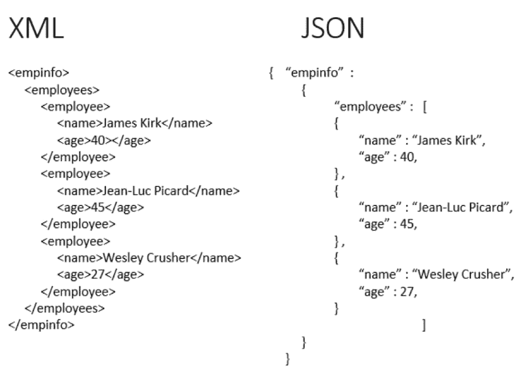

# API 的简单介绍

> 原文：<https://dev.to/serdarmustafa1/easy-intro-to-api-s-5b10>

真正有用的 API 指南

**('{"API 101"}')**
不，它不是一种啤酒，API，也称为应用程序(ing)接口，以其最简单的形式，允许应用程序与其他应用程序进行通信。也就是说，一旦你进一步探索他们的能力，他们会有更多的东西。API 正在慢慢渗透到我们个人和商业生态系统的每一个方面，甚至经常是在我们没有意识到的情况下。如果你曾经在网上冲浪，使用智能手机，那么很可能你已经遇到了多个 API。

谁使用 API？

你用过手机上的应用程序查看邮件吗？天气应用？或者在 Reddit 或 Pinterest 上浏览无尽的帖子/图片？这些都是 API 的常见例子。在浩瀚的 API 海洋中，还有一些可能不那么明显的更微妙的 API。

好的，它是如何工作的？

想象一个餐厅的服务员。作为顾客，你坐在餐桌旁，手里拿着菜单，厨房将为你完成订单。

你需要一个链接将你的订单传达给厨房，然后将你的食物送回你的餐桌。不可能是厨师，因为她正在厨房做饭。你需要把点餐的顾客和准备食物的厨师联系起来。这就是服务员——或者 API——介入的地方。

服务员接受你点的菜，送到厨房，告诉厨房该做什么。然后，它会将响应(在本例中是食物)反馈给你。而且，如果设计正确，希望你的订单不会崩溃！

但是他们在现实世界中是什么样子的呢？

曾经在网上预订过假期吗？一旦你从众多可用的网站中做出选择，你就有了一个可供选择的菜单。您可以选择出发城市和日期、返程城市和日期、舱位等级等

要订票，你需要与航空公司的网站沟通，以便访问他们的数据库，并检查这些日期是否有座位，费用可能是多少，飞行时间等。

你需要从航空公司的数据库中获取这些信息，无论你是通过网站还是通过一个汇集了多家航空公司信息的在线旅游服务与它进行互动。或者，在任何情况下，您都需要获取信息，因此应用程序必须与航空公司的 API 进行交互，让它能够访问航空公司的数据。

API 是一个接口，就像你的服务员一样，运行并通过互联网将数据从你正在使用的应用程序传送到航空公司的系统。然后，它还接收航空公司对您的请求的响应，并直接发送回您正在使用的旅行应用程序。此外，通过流程的每一步，它促进了应用程序和航空公司系统之间的交互——从座位选择到支付和预订。

如何制作一个 API？

像建造任何东西一样，需要几个步骤、意想不到的挑战和大量的计划。

**计划**
o 是为了谁？
o 您将提供什么产品？【阿 T4】它需要做什么？
o 他们的使用案例？他们将使用什么技术？你在建造什么类型的建筑？SOAP/RPC/REST…
o 可伸缩性和寿命
o 认证？
o 安全/GDPR

**建造**

你已经花费了数小时、数天、数周、数月来完善你的 API 的完美设计，现在终于到了开始构建的时候了。建造房屋时，为你的项目选择合适的团队以及合适的工具非常重要。构建 API 也是如此。有许多工具可以帮助您以简单有效的方式构建 API。

为工作准备合适的工具项目管理工具 CLI/代码编辑器 T2 调试工具 T4 操作系统和浏览器兼容性

**检查**

这一步对成功至关重要。非常重要的是，你的项目，不管是 home 还是 API，都要测试和检查是否有 bug 和缺陷。当进行家庭检查时，通常需要满足一系列要求才能通过检查。

有很多公司不测试他们的 API。类似地，我们假设建筑检查员应该确保新房子的建设正在进行。但现实中并不总是这样。创造“足够好”和“完美”的东西各有利弊在软件中，交付第一个“足够好”的产品对某些人来说是完全可以接受的工作流程，但是你应该确保它“足够好”可以使用。

**文件**

编写文档应该花费最少的时间和精力，并且应该最小化维护。你必须找到一种好的方法来为你的 API 编写最少的文本解释，这样才能为文档的用户提供最高价值的实用指南。需要考虑的一些事情有:

例子
o 包括一些样本请求对象，或一些代码样本等。

请求、文件夹、收藏的描述

可移植性这是指自动生成的代码既可以显示为页面，也可以显示为嵌入的信息窗口。这也意味着文档的结果是可重用的。

部署
o 这实际上取决于如何管理这部分流程的个人偏好——可能的解决方案包括，使用 GH pages 或 Heroku 直接从您的存储库中进行部署。

为什么要记录 API？

在 API 生命周期的所有阶段中，文档可能是增长最快的领域。围绕文档的工具生态系统尤其如此。注意到这种趋势很有意思，因为传统上开发人员在启动代码时很少关注文档。事实上，实现代码比编写好的文档要容易得多。但这是因为它对采用和使用有直接影响。你可以拥有最好的、功能最强的产品，但是如果不知道如何使用，没有人会使用它。文档是良好开发体验的基础。

**那么，你有你的网站或 APP，你现在如何使用别人的 API 呢？**

我曾经在一家技术公司的客户支持部门工作，从其他程序中提取用户数据的 API 连接是产品不可或缺的一部分。当我向客户解释为什么我们不能访问某个特定的数据时，开发人员通常会推荐这样的答案，“它不能通过 API 获得。”

当时，我认为 API 就像一个 USB 端口，通过连接到那个端口，我们就可以访问另一个程序中的所有东西。事实证明，我错了。

一个 API 不会给你一个程序的所有信息或代码，因为；什么会阻止你复制所有的代码？取而代之的是，一个 API 向你提供它的程序员向外部用户提供的数据。即便如此，为了处理这些数据，你必须懂得这门语言，并提出正确的问题。当编写一个 API 的代码时，程序员会暴露代码的一部分，称为“端点”。

这些随后被用于构建 URL，以请求数据。然后，URL 将返回供计算机阅读的文本，通常使用可扩展标记语言(XML)，或者最近，大多数程序员更喜欢使用 JavaScript 对象符号(JSON)。

JSON:有时被称为“XML 的无脂肪替代品”,下面是一个例子。

**一个 API 的架构**

API 由三部分组成:

一、用户:提出请求的人。客户端:向服务器
III 发送请求的计算机。服务器:响应请求的计算机

迷茫？让我们用一个真实的例子:一个通讯录。

在模拟时代，你会收到一本黄页电话簿，上面按字母顺序列出了你所在城镇的每个人的姓名和地址。如果你需要一个朋友的地址，你可以根据他们的姓氏查找，找到地址，然后在后面的地图上查找他们的街道。

这是有限的信息量，需要很长时间才能获取。现在，通过神奇的技术，所有的信息都可以在数据库中找到。

让我们建立一个数据库，其中包含一个名为斯普林菲尔德的虚构城镇的黄页。斯普林菲尔德黄页公司的人决定，当他们建立数据库时，他们将创建一些信息类别，并在下面嵌入数据。这些是我们的端点，它们将包含 API 将向外部用户发布的所有信息。

以下是斯普林菲尔德黄页文档中列出的端点:

姓名/姓名
o/名字，/姓氏
/地址
o/街道地址，/电子邮件地址/
/电话
o/家庭电话，/移动电话

显然，这不是可以收集到的关于一个人的所有信息。即使斯普林菲尔德黄页收集了关于斯普林菲尔德居民的更多私人信息(如出生日期和 ID/国民保险号)，如果不知道这些端点的语言或根据适用的数据保护法规所需的权限，这些数据也不会提供给外部程序员/用户。

这些端点告诉您从数据库请求信息时必须使用的语言。如果您想要斯普林菲尔德所有姓史密斯的人的列表，您可以做两件事之一:

1.  在浏览器中对该信息提出 URL 请求。这使用您的互联网浏览器作为客户端，您将得到一个编码语言的文本文档进行排序(记住上面的 XML/JSON 示例)。那个网址可能看起来像这样:[http://API . happy ville _ WP . com/names？姓氏=史密斯](http://api.happyville_wp.com/names?last_name=smith)

2.  使用一个请求信息并将其转换成可用形式的程序。你可以自己编写程序，也可以使用现成的 HTTP 客户端。

第一个选项非常适合于发出只有少量响应的简单请求(例如，Happyville 中的所有人都姓 xar lax——我非常确定 Happyville 中只有六户人家有这个名字)。第二个选项要求更高的编码流畅性，但是对于想要使用另一个程序的数据库来增强他们自己的应用程序的程序员来说是很棒的。

许多公司使用谷歌和脸书等大公司的开放 API 来访问可能无法获得的数据。在这种情况下，API 大大降低了小公司的准入门槛，否则它们将不得不汇编自己的数据。