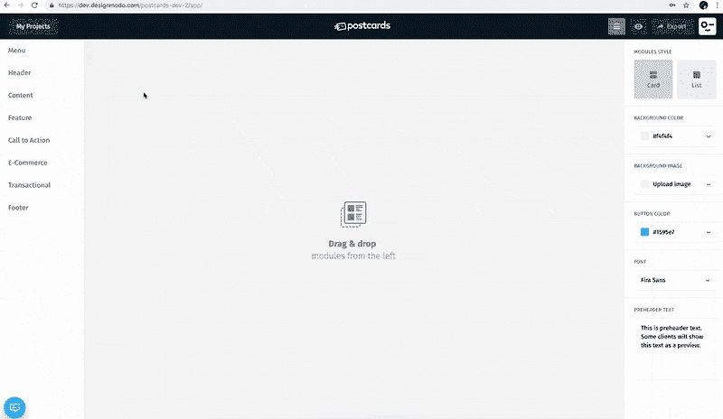
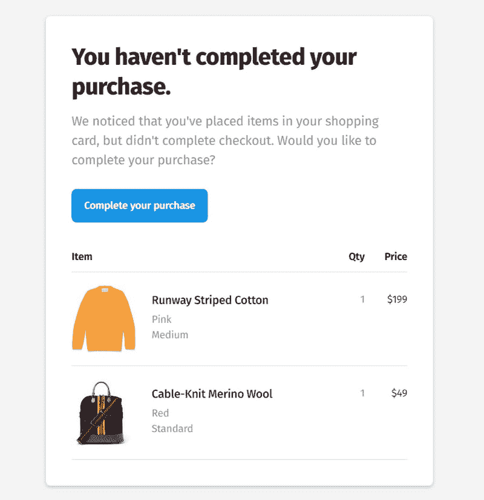

# 电子商务交易电子邮件你需要知道什么

> 原文：<https://dev.to/andrewdejackson/ecommerce-transactional-emails-what-you-need-to-know-5a5o>

每一个电子商务网站都是一个成熟的业务，没有一个好的业务没有一个好的营销策略。

当谈到电子商务领域的营销策略时，首先想到的当然是促销电子邮件简讯。它们是吸引用户进入网站和增加你收入的强大工具。然而，他们并不是唯一能将订户转化为忠诚客户的人。交易邮件也是无价的。这里有一篇关于[最佳电子邮件模板构建者](https://andrewlaurentiu.medium.com/best-responsive-email-templates-builder-2018-9dedb6883783)的精彩评论。

记住，你可以免费试用最好的 Mailchimp 模板生成器之一。Mailchimp 集成[你可以在这里找到](https://mailchimp.com/integrations/postcards/)。

[阅读:2021 年电子邮件设计趋势](https://designmodo.com/email-design-trends-2021/)和 2021 年 UI 设计趋势】(【https://designmodo.com/web-design-trends-2021/】T2

# 事务性邮件

[交易邮件](https://designmodo.com/transactional-emails/)是主要自动生成的时事通讯。它们用于通知用户他们在网站上的操作。对于电子商务平台至关重要的交易电子邮件的简明列表如下所示:

*   电子邮件地址确认邮件
*   购物车放弃电子邮件
*   订单确认电子邮件
*   发货通知
*   顾客
*   反馈电子邮件
*   感谢电子邮件
*   购买收据电子邮件
*   客户信息电子邮件
*   售后电子邮件
*   欢迎电子邮件
*   交叉销售/追加销售电子邮件
*   销售线索培育电子邮件
*   客户反馈电子邮件
*   重新聘用的电子邮件

我相信每个人一生中都会遇到一两次。一般来说，我们很高兴在收件箱里看到它们。有些甚至被寄予厚望。你是否曾经在网上购买了一件商品，然后发现你的卡已经被充值，但是你的付款收据还没有到？啊，等待的美妙时刻(暗含讽刺)。

因此，关键的一点是，交易性电子邮件是可以预见的。研究表明，它们的打开率和点击率都非常高。所以为什么不利用这一点呢？

## 如何从电子商务交易邮件中获益

有很多事务性的电子邮件，如果你有热情，那么你可以让所有的邮件都为你服务。然而，如果不是这样，那么你应该把重点放在基本的交易电子邮件通讯上。让我们来看看它们。

## 欢迎消息和邮件地址确认邮件

这两个电子邮件通讯处理新人到您的网站。第一个是每当新客户购买时生成的(可能是一次性购买，也可能是长期关系的开始)，而第二个是用户准备成为你的客户的信号。

在欢迎信息的情况下，是时候留下第一印象了。正如我们所知，我们永远不会有第二次机会，所以我们需要在这里多做一点。它应该建立一个适当的氛围，展示你公司最好的一面，并包含一些讨好用户的东西。此外，它应该有所有的联系信息和一些有用的链接，例如你的博客，最喜欢的产品，或一些说明。不要忘记使它个性化，并增加一些支持。

地址确认邮件是你可以尝试一些销售技巧的地方。你可以提供折扣券，新人免费送货等。

## 感谢邮件

感谢邮件是在企业和客户之间建立健康关系不可或缺的一部分。它们是必须的，即使你可能认为它是微不足道的。这样的小细节可以让人们开心，所以用它们来巩固你独特的友谊。在这里，你可以写一个简单的文字版本来表达你的感激之情，用 gif 来让事情变得开心，甚至用 Bonjoro 制作一个短视频。你可以很容易地采用明信片中的[神奇模板之一来产生持久的印象。](https://designmodo.com/postcards/)

## 订单确认邮件

这是百分之百的电子商务邮件。虽然这是不言自明的，但是，有一些细节你需要记住。首先也是最重要的，是被寄予厚望的。人们刚刚付了钱，所以他们需要知道另一边发生了什么。所以明确的告诉他们。因此，这将有助于提高你的可信度，巩固你们的关系，让他们放心，一切都很好。在这里，您需要提供所有有用的信息，例如订单何时准备好，订单何时发货等。更重要的是，研究表明，你更有机会向现有客户而不是普通旁观者推销，所以是时候运用一些营销技巧了。你可以试着

*   建议相关产品
*   让客户熟悉推荐计划
*   或者为他们的下一个订单发放奖金

然而，不要强求。记住这位顾客已经在你的店里买过东西，所以给他或她时间来享受你的产品。总是让他们想要更多。

## 发货通知

尽管我们都有忙碌的生活，有很多事情要做，然而当等待我们已经买了的东西时，很难隐藏兴奋以及转移你的注意力。因此，装运通知受到高度赞赏。它们可以让我们的固恋不那么令人恼火。利用顾客的兴奋感。例如，您可以

*   鼓励他们为他们所爱的人买一份礼物
*   鼓励他们通过社交媒体分享新闻
*   参与推荐计划
*   向他们提供特别优惠
*   建议补充先前购买的产品等

另外，请记住发货通知需要一些定制。它们不是常规警报；它们是时事通讯，所以需要小心对待。它们应该包括一个突出的行动号召，使你的产品更强大，建立你的品牌形象，一个格式良好的信息等等。如果你不使用像明信片一样的在线电子邮件时事通讯生成器，只需拖放和编辑，一切都可以在几分钟内完成，那么准备好埋头编码吧。这封邮件需要你全神贯注。

## 购物车废弃邮件

弃车邮件是练习销售技巧的平台。这些简讯用于吸引客户回头客，鼓励他们完成订单。准备好提出一些有助于重新点燃客户兴趣的东西。那么你在这里能做什么呢？

*   使时事通讯具有视觉吸引力。记住，人是用眼睛吃饭的。带有难以察觉的链接的苍白的文本不能达到目的。让客户觉得他们现在就想点击查看订单按钮。
*   提醒顾客他们留下的产品。将它们组织成一个列表，包括图像和名称。让它们成为引人注目的产品，以其梦幻般的外观吸引顾客。如果你使用明信片，那就充分利用那些为顾客设计的手工模板。选择最佳选项，并使用直观的界面快速定制。
*   提供奖励:订单折扣、免费送货或下一个订单的一些奖励。然而，小心过度。你可以提出一个提议，但不要把它变成一个惯例。人们很聪明，会意识到“出价”是否只是一种常态。
*   树立紧迫感。不要咄咄逼人，相反，让人们相信他们可能会错过。例如，通知用户产品缺货、季中销售结束或当前折扣对时间敏感。

## 复婚邮件

也被称为“回来”或“我们想念你”的电子邮件，它们是赢回客户和恢复你的关系的好工具。营销人员一直在使用它们，因为它们被证明是有效的。在这里，您可以使用各种销售技巧来吸引客户。你可以从一些不显眼的东西开始，比如根据客户以前的购买发送交叉销售产品，以奖金和时间敏感的优惠结束。

## 其他事务性邮件简讯

正如我们前面提到的，有几十种电子商务电子邮件简讯。虽然我们关注的是最受欢迎的工具，但还有一些其他有价值的工具可以帮助您改善在线业务。举个例子，

*   客户反馈电子邮件是提升您的公司、产品选择和整体体验的绝佳机会。
*   购买后电子邮件让你不引人注目地提醒客户，你仍然关心他们。
*   收据电子邮件向客户表明，您紧跟潮流，更喜欢数字购买凭证，而不是纸质凭证。

根据你的策略和你想要达到的目标，你可以利用其中的一些甚至全部。

## 如何定制电子商务事务性邮件简讯

如果你使用某种 CMS -像 WordPress-woo commerce 站在每一个电子商店的后面，那么一切都是用这个工具完成的。即使电子邮件是自动创建和发送的，您仍然可以与它们进行交互。这需要一些编码技巧，当然也需要大量的时间。如果你不想浪费你的宝贵时间，或者只是缺乏编码技能，那么你可以将你的问题提交给一个像明信片一样的[电子邮件时事通讯构建器。它会解决你所有的问题。直观的拖放界面将帮助您立即建立一个理想的电子商务电子邮件简讯。](https://designmodo.com/postcards/)

## 最后的准备

你可以做几件事来改善你的电子商务电子邮件营销策略。瞄准你的受众

首先，正确定位你的受众。客户分几类:
●新客户:
o 新订户
o 客买家
o 首次买家
●活跃客户:
o 稳定买家
o 偶尔买家
●衰退客户(已经停止互动的客户)。

每个群体都应该区别对待。因此，拥有新客户的群体需要一份手工制作的、人性化的欢迎电子邮件简讯来吸引他们。之后，给他们发一封友好的电子邮件地址确认邮件，以及一封客户信息邮件和销售线索培育邮件。

拥有活跃客户的群体是最大的，通常会看到许多标准的交易电子邮件简讯，包括促销电子邮件、愉悦电子邮件、提醒电子邮件、反馈电子邮件等。

最后但并非最不重要的一点是，包括下降客户在内的群体需要你的适当关注，因为在这里你需要想出如何赢回客户。这意味着您需要首先从重新参与电子邮件简讯中寻求帮助。

## 计时

正确的时机总是成功的关键。虽然抓住每个人的最佳时机是相当棘手的，因为客户的偏好和行为各不相同，但还是有一些技巧。举个例子，

*   等待 12-24 小时后再发送购物车放弃邮件。
*   等待 30 天后再发送重新聘用电子邮件。
*   等待几天再发送交叉销售电子邮件。
*   在发送订单确认电子邮件和发货通知时，立即行动。