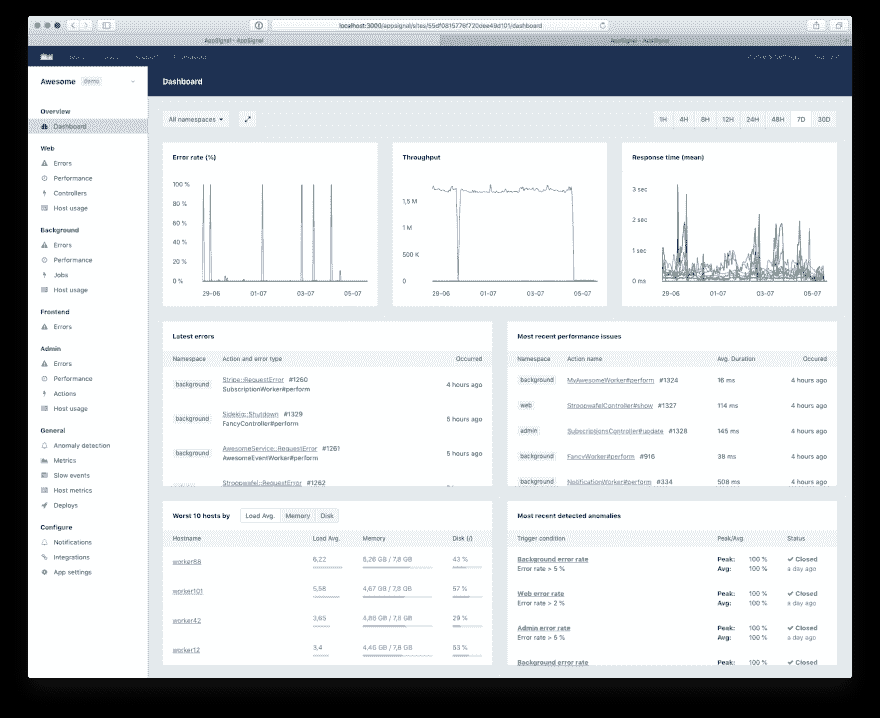
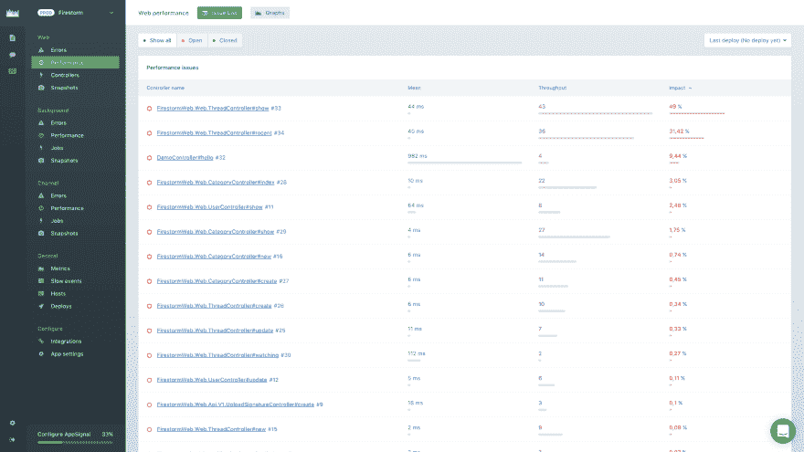
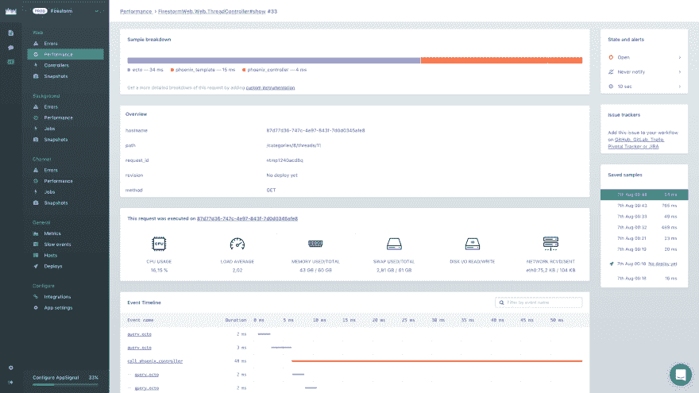
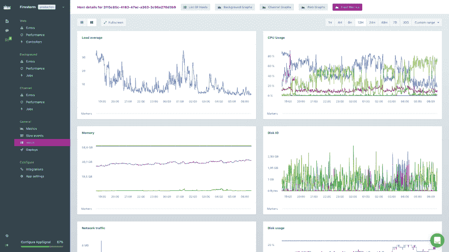
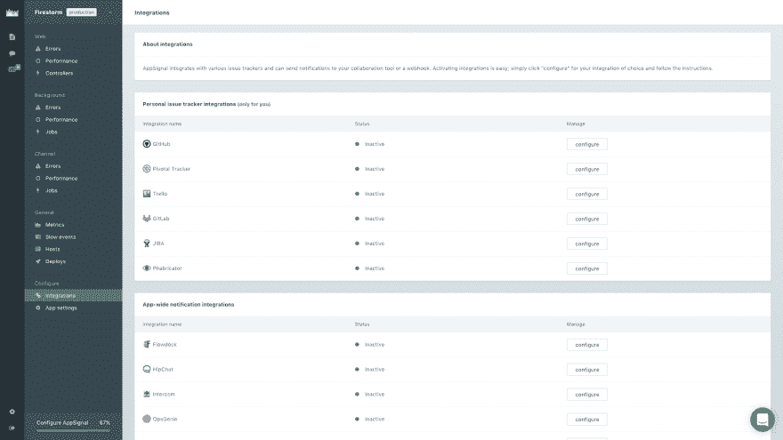

# 通过 AppSignal 进行有效的性能监控

> 原文：<https://dev.to/vinayhegde1990/effective-performance-monitoring-via-appsignal-536i>

*本文原帖 [**Bizongo 工程**](https://hustle.bizongo.in/effective-performance-monitoring-via-appsignal-c3fef2cd4e04)T5】*

* * *

作为一名 DevOps 工程师，人们经常好奇地问我们每天都做些什么。我的第一反应是尽一切努力确保组织的基础架构完美运行。其中之一是提供一个仪表板，帮助每个人都可以鸟瞰重要指标。

如果你不知道东西什么时候坏了，你就不能保证可靠性。

# **那么，什么是性能监控呢？**

简而言之，观察应用程序的关键参数并核对数据，以发现和排除任何错误和缓慢，从而提高正常运行时间，遵守服务级别协议。

# **我们为什么需要这个？**

监控光谱中的关键参数，如

1.  主机指标( *CPU、内存、负载、磁盘 IO、网络 IO 等*
2.  API 的应用程序指标(*吞吐量、响应时间、异常、后台作业，如 Sidekiq、错误率等*
3.  在时间序列仪表板中收集数据以分析趋势。
4.  如果任何指标超过或低于特定阈值，则触发警报。

# **一些知名的监控平台:**

*   [全天候站点](https://www.site24x7.com)
*   新遗迹
*   [信号 FX](https://www.signalfx.com)
*   [AppSignal](https://appsignal.com)
*   [DataDog](https://www.datadoghq.com)

# **这个系统背后的标准是什么？**

为了实现以上任何一点，我们意识到我们需要有严格的特性标准来快速启动和运行。以下是我们寻找的要点:

*   易于查看的控制面板中的主机/应用程序指标等功能。
*   通过电子邮件、Slack 和其他第三方集成(如 JIRA、GitHub 和自定义网络挂钩)发出警报。
*   数据保留和隐私符合法规。
*   定价模型以及适用的税收。

# **当前监控平台的问题:**

Bizongo 以前的 24x7 供应商网站虽然功能全面，但从长远来看并不符合我们的要求，并且存在多个问题。

考虑到上面部分列出的标准，我们排除了开源、自托管的解决方案，如 **[【普罗米修斯】](https://prometheus.io)****[Netdata](https://my-netdata.io/)**，因为这将是一个额外的开销来构建、调试&改进它们。

# **为什么是 AppSignal？**

在此活动过程中，我们与上述几个 SaaS 提供商进行了广泛的讨论，还进行了概念验证演示。我们最初的反应是用软件行业强烈推荐的 **NewRelic** 做实验。然而，尽管 Bizongo 拥有同类最佳的特性，但对其基础设施进行扩展在经济上是不可行的。

我们考虑的下一个选项是 **DataDog** ，它几乎解决了我们的问题，但随后引起了类似 NewRelic 的担忧，所以从长远来看，我们并没有积极地追求它。

最终，我们发现了 **AppSignal** ，在与他们的团队进行了初步交谈后，我们开始以 30 天的试用模式对其进行评估。我们将它安装在我们的试运行环境中，随后安装在我们的一个生产服务后端。这样做是为了检查它与我们的应用程序的兼容性，谢天谢地，没有出什么差错。同时，我们也定期提出支持问题，就像我们对上述所有提供商所做的那样。

在试用期结束时，我们得出结论，它满足了我们对性能监控的所有要求。一个显著的缺点是它目前只支持 **Ruby/Elixir** 应用程序，但是因为我们主要是一个 Ruby-on-Rails 工作室，我们觉得它可以被忽略。

然而，诸如价格合理的 **[、基于请求的](https://appsignal.com/plans)** 而不是服务器、新版本的频繁发布、最少 30 天的保留期和一流的支持(*查询直接发送给构建它的工程师，而不是技术帮助台*)等功能让我们感到满意。

# **&是如何安装配置的？**

*   对于后端 Ruby 应用——通过 AppSignal Gem 认证通过 push API key ( *他们推荐的最佳实践是不通过代码提交，而是定义为环境变量**app signal _ PUSH _ API _ KEY***)
*   可以通过每个应用程序中的`config/appsignal.yml`进行进一步的调整，以定义应该包括或排除的环境( *qa、准备、生产*)和参数。
*   一旦应用服务器( *Puma、Unicorn、Passenger 等*)重启，作为 Gem 扩展的代理服务就开始转发指标。
*   对于前端/非 Ruby 应用——通过使用操作系统包管理器的代理(*我们已经通过 Ansible 为新配置的服务器自动化了这一点*
*   这可以通过`/etc/appsignal-agent.conf`进行修改，其中代理在本地主机 UDP 端口 8125 上运行，以中继指标。
*   此外，从 Ruby Gem 的 1.0 版本开始，可以创建 YAML 格式的定制仪表板( *v2.8.x 提供 Puma、Sidekiq 的现成指标，无需任何设置*)
*   一旦你设置好了，下面是界面的样子(*图片仅供参考*

# **结果如何？**

紧接着 AppSignal 之后，我们发现了几个性能缓慢的 API，它们被修复以将性能从几秒提高到几毫秒。此外，我们现在有一个平台来监控我们的基础架构，而不管服务器的数量，因为我们只负责流量。所有这些都需要精确的警报、历史数据、漂亮的第三方集成( *Slack、JIRA、Github、PagerDuty 等* ) &可操作的指标。

#### 您使用什么来监控您的基础架构，为什么？

* * *