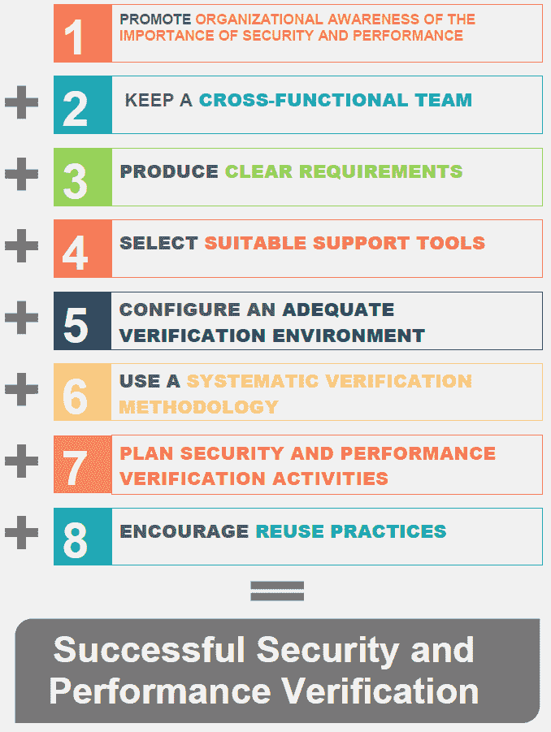

# 安全性和性能验证的八个调节因子

> 原文：<https://dev.to/victorvr/eight-moderator-factors-of-security-and-performance-verification-3jm8>

大家好！我想和你分享我博士研究的一个发现。

在这里，我提出了一组影响安全性和性能验证的调节因素。*如果您想在您的组织中包含安全性和性能验证测试，您应该考虑这样的调节因素*。

此外，我明白知识是活的。因此，我想邀请您回答我的调查。它旨在发展*安全性和性能验证(测试和评审)*的调节因素。

这对我很重要。所以，如果你能把我调查的链接公布给你工作的单位的人，我将永远感激不尽！调查的主要目标是从事安全或性能测试的人员:[http://spvsurvey.com/](http://spvsurvey.com/)