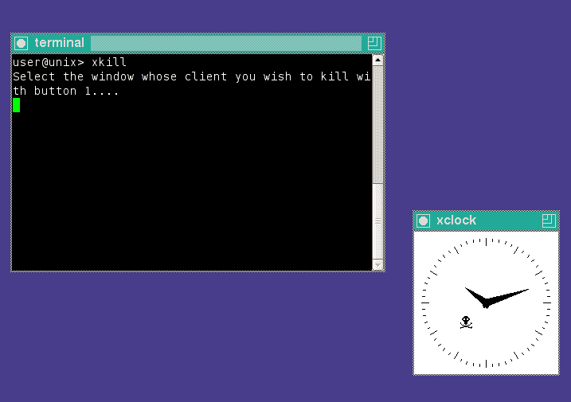

# ekill - nuke 恼人的页面元素

> 原文：<https://dev.to/rhardih/ekill-nuke-annoying-page-elements-4npj>

在大多数运行 [X Window 系统](https://en.wikipedia.org/wiki/X_Window_System)的*nix 系统上，你有一个用来杀死没有反应的窗口的小工具，叫做[xfill](https://en.wikipedia.org/wiki/Xkill):

基本上，它的工作原理是定位窗口的所属进程，当窗口被点击时，forcefull 会杀死它。

本着 xkill 的精神，我为 Chrome 和 Firefox 建立了一个开源的 webextension，让你只需点击它们就可以摆脱网页上令人讨厌的元素。想想侵入性的 cookie 弹出窗口、聊天窗口或简讯提示。

下面是网上商店的宣传视频，来看看它的实际效果:

[https://www.youtube.com/embed/pD9lt4sfdBQ](https://www.youtube.com/embed/pD9lt4sfdBQ)

相关链接:
[Chrome 网络商店](https://chrome.google.com/webstore/detail/lcgdpfaiipaelnpepigdafiogebaeedg/publish-accepted?authuser=0&hl=en-GB)
[火狐插件](https://addons.mozilla.org/en-GB/firefox/addon/ekill/)
[GitHub](https://github.com/rhardih/ekill)

干杯！