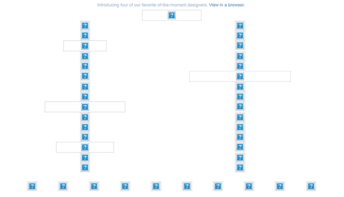
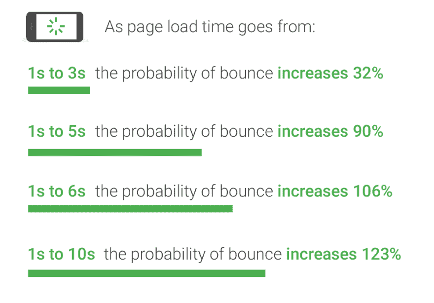
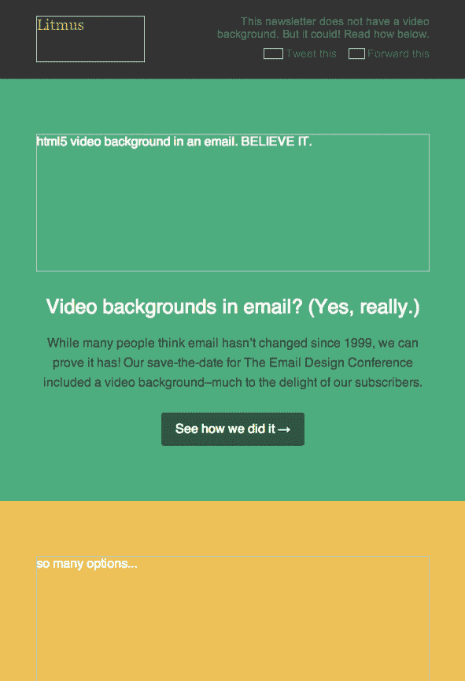
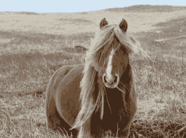

# 电子邮件活动。当几乎 90%的网络都是由图像组成时，为什么电子邮件仍然如此不同？(提示:怪伟哥)

> 原文：<https://dev.to/thomaswebdevboy/email-campaigns-when-almost-90-of-the-web-is-made-up-of-images-why-are-emails-still-so-different-hint-blame-viagra-106d>

在今天的工作场所中，成为一名 web 开发人员有许多不同的方面。有些人会独自负责将设计师的概念和想法转化为现实，而其他人会将大量的设计过程融入到他们自己的个人工作流程中。其他人可能会发现，作为开发人员角色的一部分，他们需要戴上几顶不同的帽子，包括 SEO 专家和电子邮件活动向导。

本着包容的精神，知道这么多人想到这么多不同的事情，当谈到对我们作为开发人员所做的事情的想法时，我想我应该花一些时间来谈论一些我们中的一些人可能没有想到的事情...电子邮件。对于那些坚持到最后的人，我还附上了一张马的照片。

发送电子邮件营销活动时，我们需要考虑以下几点:

1.  会显示在查看者的邮件客户端上吗？
2.  文本/图像比例是否意味着它会被作为垃圾邮件拦截？
3.  客户能够理解电子邮件的要点吗？

会显示在观众的邮件客户端吗？

很有可能不会。一般来说，最常用的商务电子邮件客户端是 Outlook(编者注:这是根据我当前工作场所内各种来源的客户数据得出的观察结果。这将默认阻止附加到电子邮件的任何和所有图像内容。这进一步加剧了这一事实，即它将自己的 alt 文本应用到电子邮件中，声明“右键单击或点击并按住此处下载图片”。为了帮助保护您的隐私，Outlook 禁止从 Internet 自动下载此图片。

不过这也不完全是个坏消息，因为 Gmail 等网络邮件客户端支持默认图片(因为你为什么不让谷歌拥有更多你的信息？)，这是目前最常用的网络邮件应用程序之一(除非浏览者改变了他们的设置，不显示图片)。

虽然移动设备很大程度上对图像很满意(我说的满意是指他们会将加载图像作为日常功能的一部分)。我不代表所有移动蜂窝设备的情绪状况)，基于大量图像的电子邮件通常会过于密集，以至于不能足够快地呈现，以保持浏览者的兴趣。与网页一样，根据谷歌完成的一项研究，如果一个页面的加载时间超过 3 秒，你很可能会失去 70%的潜在客户。2017).

文本/图像比例是否意味着它会被作为垃圾邮件拦截？

你可以感谢早期的互联网和那些老掉牙的垃圾邮件。

通常，垃圾邮件过滤器会评估图像，以确定其中有多少是由文本组成的。根据一般经验，mailchimp([https://mailchimp.com/help/common-html-mistakes/](https://mailchimp.com/help/common-html-mistakes/))建议在广告活动中把文字和图片按 80/ 20 的比例分开，这样电子邮件就不会被扔进垃圾邮件箱。

脸书(标签不推广，停止听我马克。变得越来越奇怪)实际上有一个很好的小工具，任何人都可以使用它来确定他们的图像是否可能在他们的页面上被视为“垃圾邮件”。这也适用于电子邮件垃圾邮件过滤器，因此，如果结果不是“Ok ”,它很可能不会靠近主邮箱。

**客户能够理解电子邮件的要点吗？**

大概不会…

然而，对于 80/20 文本到图像的方法:

这封电子邮件结合了风格化的 alt 标签、防弹按钮和文本，能够在不依赖图像的情况下吸引眼球。如果客户愿意，他们可以下载图片并完整地体验邮件。

**延伸阅读**

[https://www . pin pointe . com/blog/text-based-vs-image-based-emails-孰优孰劣](https://www.pinpointe.com/blog/text-based-vs-image-based-emails-which-does-better)
[https://www . tower marketing . net/blog/html-email-best-practices/](https://www.towermarketing.net/blog/html-email-best-practices/)
[https://litmus . com/blog/why-you-should-send-image-only-emails](https://litmus.com/blog/why-you-shouldnt-send-image-only-emails)
[https://organic web . com . au/marketing/text-image-spam-mail](https://organicweb.com.au/marketing/text-image-spam-mailchimp/)

*我应该指出，我在这里说的很多事情都取决于你是否是原超级流浪者队的粉丝*

*我还应该指出，有时候我只是把东西打出来，然后把它们留在里面，给人一种我比实际情况更机智的印象*

如约而至。