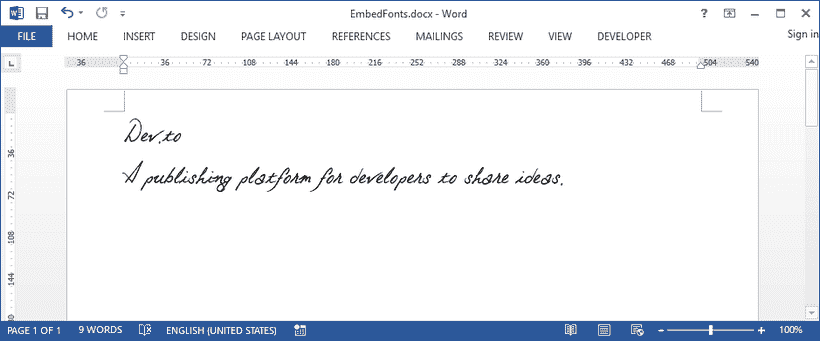
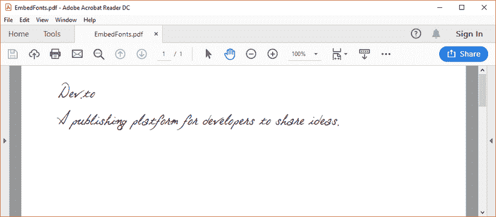

# 用 Java 在 Word 文档中嵌入字体

> 原文：<https://dev.to/eiceblue/embed-fonts-in-word-documents-in-java-3lmp>

如果在文档中使用自定义字体(除 Word 内置字体之外的任何字体)，嵌入这些字体可以确保任何查看文档的人都能看到您想要的效果。在本文中，我们将向您展示如何使用 [Free Spire 在创建 Word 文档或将 Word 文档保存为 PDF 文件时嵌入 true type 字体。Java 的 doc](https://www.e-iceblue.com/Introduce/free-doc-for-java.html)。

## 在 Word 文档中嵌入字体

```
import com.spire.doc.Document;
import com.spire.doc.FileFormat;
import com.spire.doc.PrivateFontPath;
import com.spire.doc.documents.Paragraph;
import com.spire.doc.fields.TextRange;

public class EmbedPrivateFont {

    public static void main(String[] args) {

        //create a Word document 
        Document document = new Document();

        //add a paragraph 
        Paragraph paragraph = document.addSection().addParagraph();

        //load the private font
        PrivateFontPath fontPath = new PrivateFontPath();
        fontPath.setFontName("Otto");
        fontPath.setFontPath("C:\\Users\\Administrator\\Desktop\\Otto.TTF");

        //embed a private font in Word document
        document.setEmbedFontsInFile(true);
        document.getPrivateFontList().add(fontPath);

        //add text to the paragraph and apply the embedded font
        TextRange tr = paragraph.appendText("Dev.to \nA publishing platform for developers to share ideas.");

        //apply font to text range
        tr.getCharacterFormat().setFontName("Otto");
        tr.getCharacterFormat().setFontSize(34f);

        //save to file
        document.saveToFile("EmbedFonts.docx", FileFormat.Docx_2013);
    }
} 
```

[](https://res.cloudinary.com/practicaldev/image/fetch/s--0OrHCnNp--/c_limit%2Cf_auto%2Cfl_progressive%2Cq_auto%2Cw_880/https://thepracticaldev.s3.amazonaws.com/i/k8gfs06iiuffyq9bk76b.png)

## 在转换后的 PDF 文档中嵌入字体

```
import com.spire.doc.Document;
import com.spire.doc.PrivateFontPath;
import com.spire.doc.ToPdfParameterList;
import com.spire.doc.documents.Paragraph;
import com.spire.doc.fields.TextRange;

import java.util.*;

public class EmbedPrivateFontInConvertedPDF {

    public static void main(String[] args) {

        //create a Word document 
        Document document = new Document();

        //add a paragraph 
        Paragraph paragraph = document.addSection().addParagraph();

        //load the private font
        PrivateFontPath fontPath = new PrivateFontPath();
        fontPath.setFontName("Otto");
        fontPath.setFontPath("C:\\Users\\Administrator\\Desktop\\Otto.TTF");

        //add text to the paragraph
        TextRange tr = paragraph.appendText("Dev.to \nA publishing platform for developers to share ideas.");

        //apply font to text range
        tr.getCharacterFormat().setFontName("Otto");
        tr.getCharacterFormat().setFontSize(34f);

        //create a list and add the font path as an element
        List<PrivateFontPath> pathList = new LinkedList<>();
        pathList.add(fontPath);

        //create a ToPdfParameterList object and set the private font paths
        ToPdfParameterList toPdfParameterList = new ToPdfParameterList();
        toPdfParameterList.setPrivateFontPaths(pathList);

        //save the document to PDF
        document.saveToFile("EmbedFonts.pdf",toPdfParameterList);
    }
} 
```

[](https://res.cloudinary.com/practicaldev/image/fetch/s---kXT15c8--/c_limit%2Cf_auto%2Cfl_progressive%2Cq_auto%2Cw_880/https://thepracticaldev.s3.amazonaws.com/i/ybpt8rxma6r5u36v5xly.png)