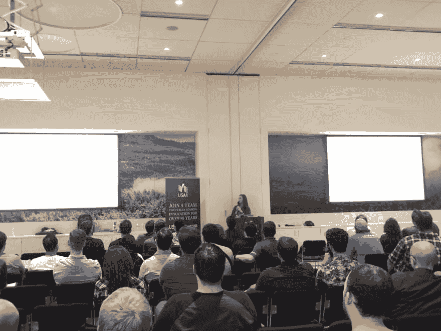
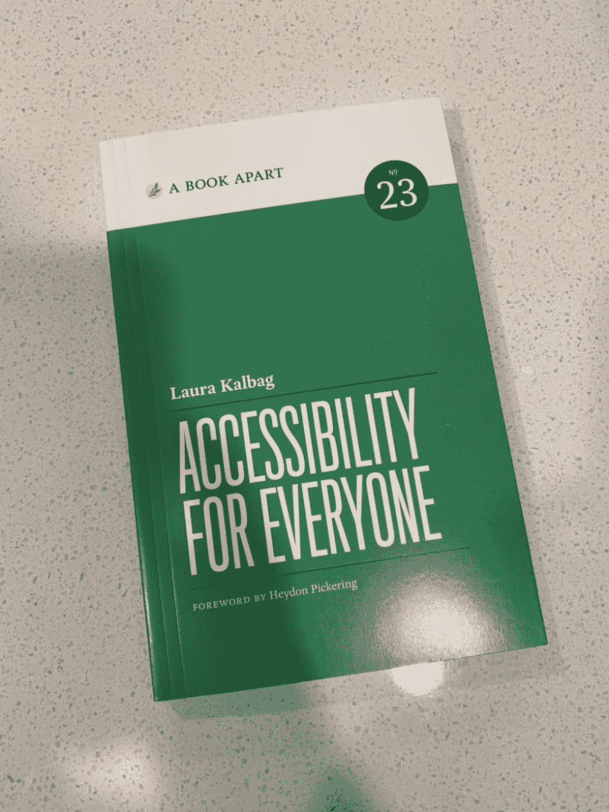
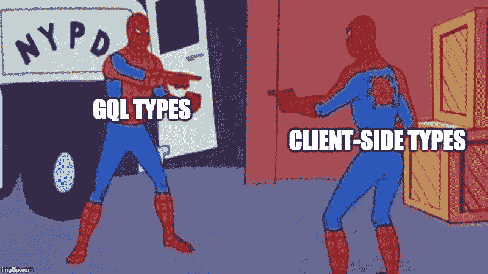

# 艾玛·布里尔哈特谈科技的多样性:这不是一个选择，而是一个道德问题

> 原文：<https://dev.to/gitnation/emma-brillhart-on-diversity-in-tech-it-is-not-a-choice-it-s-the-ethical-thing-2o8j>

### 我们采访了艾玛·布里尔哈特(Emma Brillhart)，她是[强大](https://formidable.com/)公司的工程经理&地区负责人，团队技能&沟通倡导者，对科技领域的多样性和包容性充满热情。

Emma Brillhart 在她的职业生涯中从一名软件工程师迅速而优雅地成长为一名成熟的工程经理。在这次采访中，她分享了她的 web 开发之旅，对沟通和团队技能的重要性的热情，以及她对支持工程师职业发展的真诚奉献。艾玛将于 2019 年 10 月 25 日来到伦敦，在 [React 高级会议](https://reactadvanced.com/?utm_source=blogpost&utm_medium=devto&utm_campaign=interview)上发表演讲。

[](https://res.cloudinary.com/practicaldev/image/fetch/s--3zyRo7Eh--/c_limit%2Cf_auto%2Cfl_progressive%2Cq_auto%2Cw_880/https://thepracticaldev.s3.amazonaws.com/i/yj9uxsnwtjlcxw7gp26a.png)

#### 艾玛你好，欢迎来到 React Advanced 的访谈！请介绍一下你自己。你毕业时获得了政治和国际关系学士学位，但最终却没有入主白宫，这是怎么发生的？

嗨！我是一名工程经理，住在亚利桑那州的凤凰城。我曾计划成为一名律师，但在大学毕业第一年在洛杉矶的一家律师事务所工作后，我意识到这并不适合我。我知道我想搬回西雅图的家，但不知道我的下一步会是什么，我爸爸提到了这个城市周围出现了多少编码训练营。我最终报名参加了为期 12 周的大会训练营，并从那里开始了我的发展生涯！

#### 能不能请你给我介绍一下你以前的工作经历？

离开训练营后，我在一家初创公司工作了大约五个月，该公司在 React 和 Meteor.js 中开发了一款应用程序。该公司无法获得资金，我很快就在 calendar 结束了工作。我从 2016 年 5 月起就在威猛公司工作，我看不到自己会很快离开！

#### 在你在威猛公司的三年任期中，你的职业发展迅速，从一名软件工程师到一名工程经理。你是怎么做到的？

我很幸运在强大。我们真的投资于员工的成长，我是该计划的主要受益者。我们的工作是以客户为基础的，继续提高我的沟通技巧对我的职业发展帮助很大。我个人也投资于强大的内部文化和公司的成功，并与我的同事建立了非常牢固的关系。

[](https://res.cloudinary.com/practicaldev/image/fetch/s--dHHW-Pyt--/c_limit%2Cf_auto%2Cfl_progressive%2Cq_auto%2Cw_880/https://i.ibb.co/BVHtW7x/image-2.png) 
*艾玛在凤凰城 React 聚会上谈论奇观*

我不觉得我能指出一件事让我在强大的公司茁壮成长，但我认为在我职业生涯的这个阶段，整体环境非常适合我。

我也为自己创造了机会——我和一位同事有兴趣在凤凰城招聘员工，我们都在那里，领导层非常支持和鼓励我们追求这一目标，但我们必须积极主动地创造机会。

我认为寻找既是我职业发展的垫脚石又有利于公司目标的项目，并在这些项目上采取主动，对我来说非常有价值。这里有一个我在强大公司工作的项目的案例研究:[星巴克渐进式网络应用](https://formidable.com/work/starbucks-progressive-web-app)。

#### 做工程经理意味着什么？

作为一名工程经理，我认为我的职责主要是为我的下属提供资源。我想确保我管理的人能够像工程师一样成长和进步，无论是在总体上还是在强大的内部。一般来说，我喜欢这种关系尽可能由我管理的人来推动，因为自我导向的目标通常更有意义。我是来征求意见的，或者是来当传声筒的，或者是在适当的时候提建议的。作为一个组织，我们重视自主权，所以平衡是确保我管理的人感到支持，而不会感到窒息。

[](https://res.cloudinary.com/practicaldev/image/fetch/s--eGl9LGsX--/c_limit%2Cf_auto%2Cfl_progressive%2Cq_auto%2Cw_880/https://i.ibb.co/tZxzgLT/emma-at-chain-react.png) 
*艾玛连锁反应 2017*

#### 你还形容自己是团队技能&的沟通倡导者。标题暗示了什么？

就成为团队技能和沟通倡导者而言，这并不是一个与我在“强大”的工作相关的头衔，或者任何一个头衔，真的。我对科技行业中沟通和团队技能的重要性充满热情，有时也被称为软技能。我认为这些技能的重要性已经被越来越广泛地认识到，但是很长一段时间以来，人们都强调“唯一重要的是你写的代码有多好，即使你很难共事。”这对工程师、客户、用户/顾客或整个行业都没有好处。我觉得我对这些技能的重视基本上体现了我作为一名工程师和经理所做的一切。

【Emma 在 React Europe 2018 上共同主持的研讨会回购:

## [formiblelabs](https://github.com/FormidableLabs)/[react-欧洲-车间](https://github.com/FormidableLabs/react-europe-workshop)

<article class="markdown-body entry-content container-lg" itemprop="text">

# React 欧洲 React.js 工作坊

### 2018 年 5 月 15 日至 16 日

### 由肯·惠勒、布兰登·戴尔和艾玛·布里尔哈特创作和导演

欢迎来到中级 React.js！我们很高兴你能来。在接下来的几天里，我们将讨论各种主题，包括上下文、通用组件、异步安全模式、门户等等。[点击此处查看完整日程](https://raw.githubusercontent.com/FormidableLabs/react-europe-workshop/master/./SCHEDULE.md)。

## 设置

### 你需要什么

要安装和运行这些练习，您需要:

1.  [节点](https://nodejs.org/en/)(请 v8.0 或更高版本)
2.  [纱线](https://yarnpkg.com/)
3.  Git (你可能已经有了)

### 装置

请将回购克隆到您的个人电脑上。如果你以后想乱搞的话，可以先把它叉开。我们将在接下来的两天中涉及的所有练习和解答都包含在子文件夹中。

```
git clone https://github.com/aweary/react-europe-workshop
cd react-europe-workshop 
```

为每个练习安装依赖项。**这可能需要很长时间**

```
yarn
node install.js 
```

当我们要开始一项运动的时候…

</article>

[View on GitHub](https://github.com/FormidableLabs/react-europe-workshop)

#### 你认为自己更像经理还是工程师？

两者都一样。在我职业生涯的这个阶段，我觉得这两个角色非常纠结。

#### 职场中多元化的优势是什么？

简而言之，拥有一支多元化的员工队伍是合乎道德的，仅此而已。更长的答案是，归根结底，我们构建的一切都是为了某种最终用户。我们的最终用户是多样化的！他们对任何给定的产品都有广泛的需求。你的开发团队越接近你的目标用户群，你就越有机会为这些用户提供价值。你的产品团队带来的背景和生活经验越多越好。这超越了女性，延伸到了科技行业中所有代表性不足的群体。也有几项研究表明，公司内部的多元化，尤其是高层领导的多元化，会带来更高的盈利能力——因此，如果有人需要冰冷、坚硬的数字来相信多元化很重要，那就来吧！

> 艾玛·布瑞尔哈特@ emmabrillhart昨天从 [@abookapart](https://twitter.com/abookapart) 的邮件中收到这个——好激动开始阅读！2019 年 5 月 20 日下午 16:22[](https://twitter.com/intent/tweet?in_reply_to=1130509122204573697)[](https://twitter.com/intent/retweet?tweet_id=1130509122204573697)[](https://twitter.com/intent/like?tweet_id=1130509122204573697)

#### 为了包容和多元化，威猛做了些什么？

强大公司一直努力将来自代表名额不足的群体的人作为员工所经历的摩擦降至最低。作为一名从事科技行业的女性，我个人一直觉得强大很受支持和重视，我知道并非所有科技公司都是如此。

我们仍有工作要做，但政策，如强调每周工作 40 小时，坚实的育儿假，慷慨的 PTO 和无限的病假时间，以及良好的健康计划都有助于员工的灵活性，这反过来又允许各种类型的人感觉像在工作之外与他们作为一个人和他们的余生一起工作。

我们雇佣了许多没有接受过传统技术教育的人，这绝对有助于我们公司的多元化，我们也认为这创造了一个更强大的团队，因为有如此广泛的过去经验可供借鉴。

#### 你有什么爱好吗？

> 艾玛·布瑞尔哈特@ emmabrillhart狮子座无畏的冒险 boi 亮相夏季理发下午 17:39-06 2019 年 4 月[](https://twitter.com/intent/tweet?in_reply_to=1114583316739420160)[](https://twitter.com/intent/retweet?tweet_id=1114583316739420160)[](https://twitter.com/intent/like?tweet_id=1114583316739420160)

我确实喜欢烹饪，实际上我去年写了一段时间的烹饪博客。我考虑过重新开始！

我也尽量挤出时间偶尔画水彩画。

住在亚利桑那州，有很多徒步旅行的机会，我想在这个冬天和春天好好利用，夏天我会在游泳池里呆相当长的时间。

#### 你对即将在伦敦召开的会议感到兴奋吗？你将谈论什么，你对这次活动有什么期望？

> 艾玛·布瑞尔哈特@ emmabrillhart刚刚做了这个我正在做的演讲的迷因，所以我要说我过了一个富有成效的周六感谢晚上 22:20-2019 年 6 月 29 日[](https://twitter.com/intent/tweet?in_reply_to=1145094720915292161)[](https://twitter.com/intent/retweet?tweet_id=1145094720915292161)[](https://twitter.com/intent/like?tweet_id=1145094720915292161)

我太激动了！拥有会议提供的社区体验总是很有趣，这实际上是我第一次在会议上发言！我以前主持过研讨会，但从未单独展示过。

我的演讲将是一个案例研究，关于我们如何通过在重写过程中利用 TypeScript、GraphQL 和 React hooks 等技术，使 React 代码库更具可读性，并提高团队的沟通和生产力。这为团队提供了很多好处，我们根本没有预料到我们选择的技术会影响到这些好处。

我非常兴奋地听到所有其他高级主题，这些主题将在会议的讲座和研讨会中出现。我也对咨询室组件很感兴趣——我认为这是一个很酷的附加功能！

### [不要错过在 React Advanced 见到艾玛的机会](https://reactadvanced.com/?utm_source=blogpost&utm_medium=devto&utm_campaign=interview)

* * *

来自[Soshace.com](https://soshace.com/)的文案玛丽娜·沃龙索娃协助准备了这次采访。Soshace 是一个面向 web 开发人员的招聘平台:雇佣一名开发人员或申请一份远程工作。

* * *

## 关于 GitNation

GitNation 是一个通过组织关注开源软件的活动来促进技术发展的基金会。我们组织有意义且有趣的 JavaScript 会议，将有才华的工程师、研究人员和重要库和技术的核心团队联系起来。

除了提供[单个会议门票](https://gitnation.org/#events)，该组织还出售 GitNation Multipass，提供对多个[远程 JavaScript 会议和研讨会](https://portal.gitnation.org/multipass)的折扣访问。