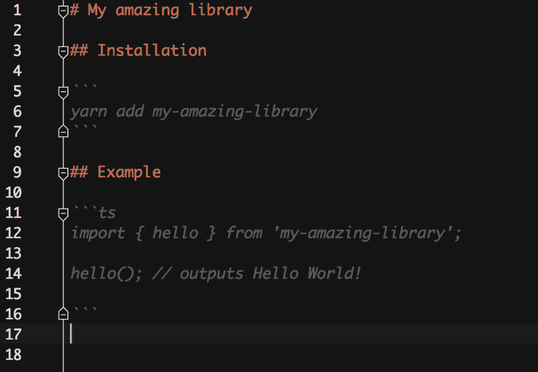
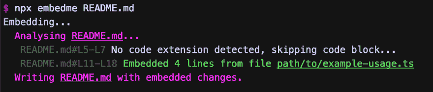
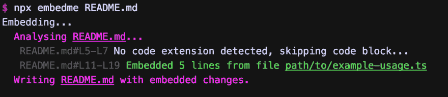
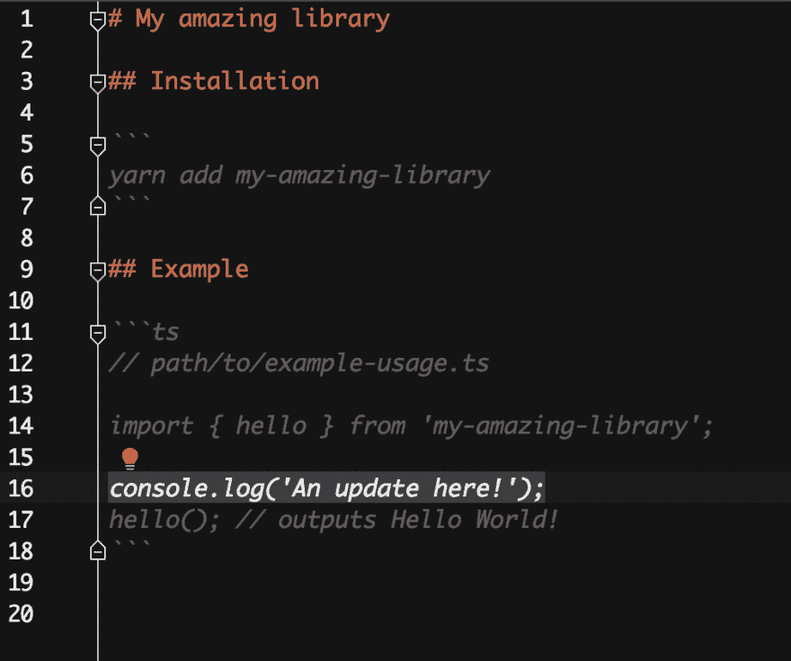

# 确保自述代码片段的准确性

> 原文：<https://dev.to/zakhenry/ensuring-accuracy-of-readme-code-snippets-525p>

## 问题

这是开发者与你的库的第一次互动。他们通过各种方式了解这个库，但是在某个时候，他们最终都会阅读自述文件。他们的第一印象良好是至关重要的，没有什么比自述文件中的示例代码块实际上不工作更能让开发人员放弃库了。

Markdown 本身对我们没有太大帮助——它是一种简单的标记语言，对我们正在构建的库一无所知，当然也不能编译我们创建的代码片段中的代码。

一般来说，这留给我们两个选择:

1.  我们直接在 markdown 中编写代码，然后祈祷一切都会好的
2.  我们将代码写在一个单独的文件中，我们可以对库进行测试，然后将代码复制粘贴到 markdown 文档中

这两种选择都有很大的出错空间。在第一种情况下，我们的代码甚至可能无效！在第二，有一些文件要记得更新，然后记得复制粘贴内容。

在这两种情况下，我们可能会在稍后引入对库的突破性改变，并且完全忘记更新文档，然后我们处于最坏的情况——文档不能反映库。

我为开源做了一点贡献，并设法遇到了所有这些案例，虽然它们最终被发现了，但这相当令人尴尬。

## 解

受够了这种烦恼，我决定自动化管理从源代码片段更新自述文件的过程。我已经构建了一个小小的 nodejs 命令行实用程序，它消除了维护 README(以及其他 markdown 文档)的所有麻烦！).

假设您已经安装了 nodejs，您可以简单地运行

```
npx embedme README.md 
```

首先，你可能不会得到非常有用的输出；您需要注释您的代码块，以便`embedme`可以找到合适的文件来插入

让我们来看一个例子:

假设我有以下 README.md:

[](https://res.cloudinary.com/practicaldev/image/fetch/s--jsPHrYNB--/c_limit%2Cf_auto%2Cfl_progressive%2Cq_auto%2Cw_880/https://thepracticaldev.s3.amazonaws.com/i/uoxlzyidms7p10xpqomz.png)

您可以用`embedme`在代码块的第一行插入一个注释:

[](https://res.cloudinary.com/practicaldev/image/fetch/s--tOBnVuWl--/c_limit%2Cf_auto%2Cfl_progressive%2Cq_auto%2Cw_880/https://thepracticaldev.s3.amazonaws.com/i/8odzyzsuyis00jqyxth1.png)

接下来，如果您现在运行以下命令:

[](https://res.cloudinary.com/practicaldev/image/fetch/s--YSXlSMN5--/c_limit%2Cf_auto%2Cfl_progressive%2Cq_auto%2Cw_880/https://thepracticaldev.s3.amazonaws.com/i/7ngzgcbls8n5l8ynm759.png)

您将看到库的输出，指出它在哪里找到代码块以及它对它们做了什么(即，在本例中，插入了来自`path/to/example-usage.ts`的内容)。

接下来，为了证明这个库的实用性，对您的源代码进行修改

```
import { hello } from 'my-amazing-library';

console.log('An update here!');
hello(); // outputs Hello World! 
```

然后重新运行`embedme`:

[](https://res.cloudinary.com/practicaldev/image/fetch/s--OUyGmrAR--/c_limit%2Cf_auto%2Cfl_progressive%2Cq_auto%2Cw_880/https://thepracticaldev.s3.amazonaws.com/i/t3x278265yvs2dlffdcx.png) 
你会看到你的自述文件已经更新:

[](https://res.cloudinary.com/practicaldev/image/fetch/s---UURdm8x--/c_limit%2Cf_auto%2Cfl_progressive%2Cq_auto%2Cw_880/https://thepracticaldev.s3.amazonaws.com/i/xnc97apz4qqfqi3ykf2w.png) 
所以，正如你现在所看到的，我们的示例代码不在 README 的范围内，但是我们可以用一个简单的实用程序来更新它。不仅如此，我们可以(也应该！)针对我们的库对这个示例代码进行单元测试，这将确保如果我们对我们的库进行了重大更改，我们可以保证文档将会保持最新的正确代码片段。

Embedme 还有许多其他特性，包括...

*   提取特定行(`//path/to/your/file.ts#L10-L20`)
*   `--verify`该标志实际上不写入文件，但检查是否有更改(适用于 CI 脚本！)
*   `--stdout`将更改输出到 stdout 的标志，以便重定向到另一个文件
*   使用 markdown 注释语法定义代码块，而无需在代码块中插入注释。(`<!-- embedme path/to/your/file.ts -->`)
*   和一些其他方便的功能...

我鼓励你查看该库以获得更多信息-[https://github.com/zakhenry/embedme](https://github.com/zakhenry/embedme)，并将其添加到你的自动化工作流程中，以获得既令人愉快又保证有效的文档。

* * *

[<sub>安德里亚·松达在 Unsplash</sub> 上的照片](https://unsplash.com/@andreasonda?utm_medium=referral&utm_campaign=photographer-credit&utm_content=creditBadge)