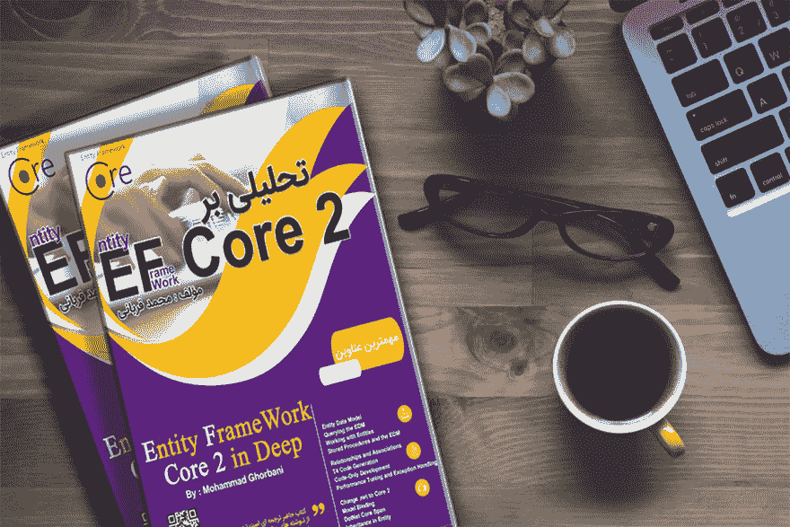

# کتاب تحلیلی بر entity framework core 2

> 原文：<https://dev.to/ghorbani77/entity-framework-core-2-197h>

## کتاب تحلیلی بر entity framework core 2

کتاب تحلیلی بر entity framework core 2

امروز توی وبلاگ گردیم یه مطلبی دیدم که نظرمو جلب کرد .

یکی از خوانندگان کتاب نقدی در حدود جند خط برای کتابم نوشته بود . البته بیشتر تجربه ی خودش بود از کتاب . دیدم خالی از لطف نیست که انتشارش بدم .

کتاب [تحلیلی بر entity framework core2](https://dev.to/ghorbani77/entity-framework-core-2-21k1-temp-slug-5352185) نوشته محمد قربانی یکی از کتابهای کاربردی است که در زمینه برنامه نویسی نوشته شده. من قبلا کتابی با عنوان اصول پایه ای asp.net core در یک پروژه عملی رو از اقای محمد قربانی خونده بودم .نوع نکارش متون بسیار تخصصی و خوب انتخاب شده مثالهای زده شده توی کتاب به صورت سلسله مراتب بالا رفته و باید دقیقا از اول کتاب رو به دقت بخونید تا بتونید در آخر هر فصل نتیجه گیری هایی که باید رو بگیرید .

من بخش دورم کتاب که مربوط به authentication ها بود رو زیاد نتونستم متوجه بشم ایمیل زدم به نویسنده محترم کتاب و از ایشون دلیلش رو ئرسیدم . در جواب فقط این رو شنیدم که بخش اول رو به دقت بخونید و چون بخش اول رو من اصلا نخونده بودم نمی تونستم نتیجه گیری خوبی از بخش دوم داشته باشم .

علی هذا خوندن کتاب های آقای محمد قربانی رو به همه ی برنامه نویسان محترم توصیه میکنم .

امید وارم که شاهد موفقیت های روز افزون [برنامه نویسان](http://www.itpeta.com) ایرانی باشیم .

تحلیلی بر实体框架核心 2

帖子 [کتاب تحلیلی بر实体框架核心 2](https://ghorbani.dev/%da%a9%d8%aa%d8%a7%d8%a8-%d8%aa%d8%ad%d9%84%db%8c%d9%84%db%8c-%d8%a8%d8%b1-entity-framework-core-2-2/) 首先出现在[穆罕默德·古尔巴尼](https://ghorbani.dev)上。