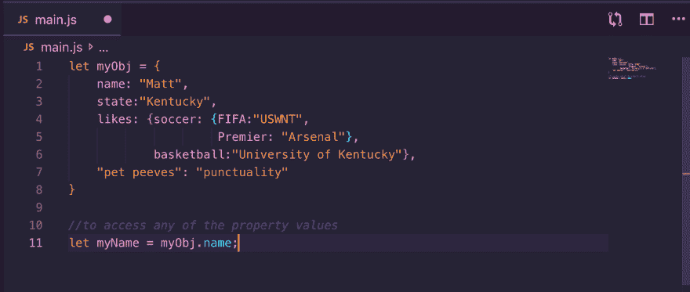
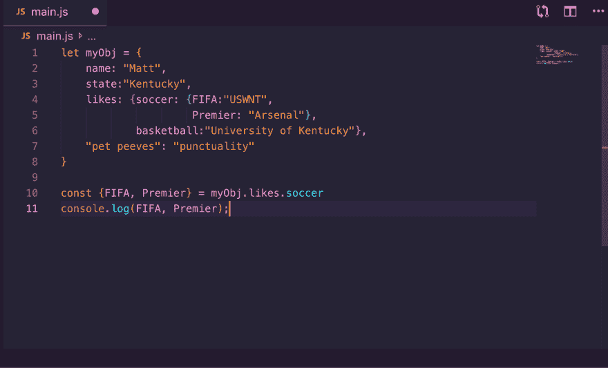
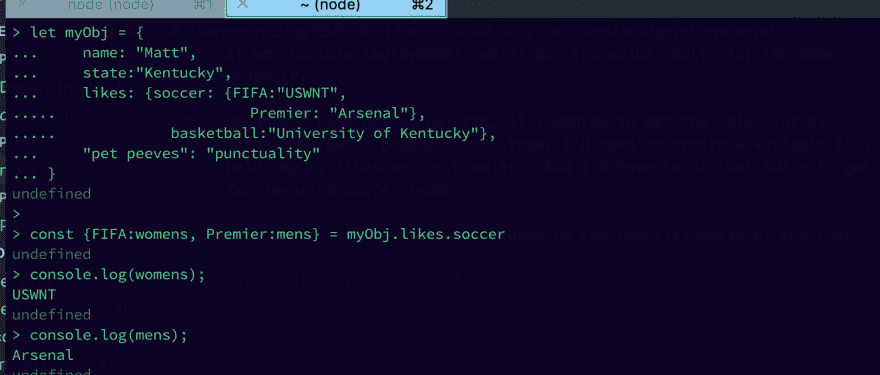

# ES6-*破坏好的部分！*

> 原文：<https://dev.to/mthacker09/es6-destructuring-the-good-parts-37ci>

我学习 JavaScript 已经有几个月了。为了打破教程和阅读，我喜欢尝试编码挑战。我在完成挑战方面取得了相当大的成功，但是，我的代码通常会比其他人提出的解决方案长 3 到 4 倍。老实说，我一点也不知道大多数解决方案的代码库在做什么。

最近，我开始学习 ES6 的一些附加功能，我不知道在不知道其中一些功能的情况下，我是如何做到这一步的。有些我真的很难理解，我可能仍然没有完全掌握技术方面或全部功能，但这就是为什么我写这篇文章。我最后一次发帖说我想用我的学习作为一种资源来帮助那些和我一样努力学习的人。

我为开始发布什么而争论，我最终决定开始发布一系列我认为是 ES6 最好的部分的帖子。

## 让我们得到*毁灭{Objects}* ！

什么是解构？它本质上是一个花哨的术语，指的是能够从一个数组中取出一个值或从一个对象中取出属性，并将其保存到一个变量中。我完成的许多编码挑战都有一些变化，需要这个任务来满足它的需求。

我以前总是这样从数组和对象中提取值:

如果我们`console.log(myName)`我们将获得 name 属性的值“Matt”。

因为我有嵌套对象，如果我想获得我最喜欢的英超足球队的值，我需要创建一个保存`myObj.likes.soccer.Premier`的变量。我要做两次才能得到我最喜欢的两个足球队。

通过析构，我们可以减少代码的重复性。

这里，我实际上创建了两个变量`FIFA`和`Premier`，它们是嵌套对象中的属性名。我们可以更进一步，通过在属性名之后指定变量名来为我们自己创建的变量名赋值:`const {propertyName:newVar} = object`

析构是一种更有效的从对象中提取值的方式。

希望这能帮助到一些人，因为我觉得现在坐下来写这篇文章后，我更明白了。编码快乐！